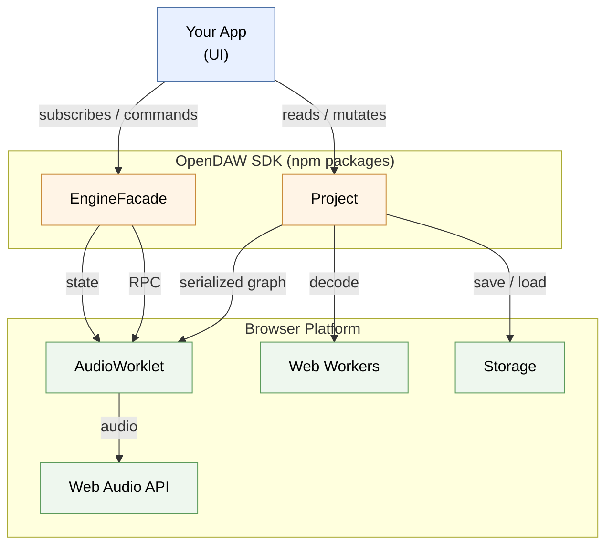
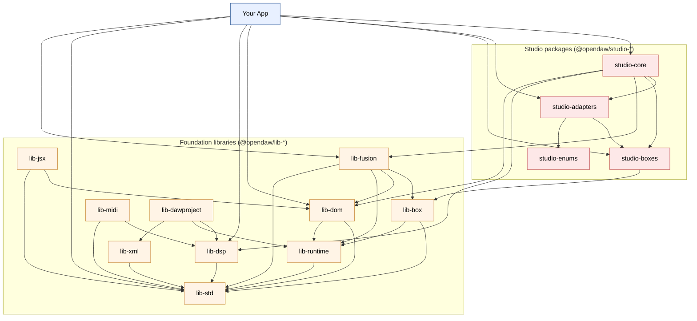
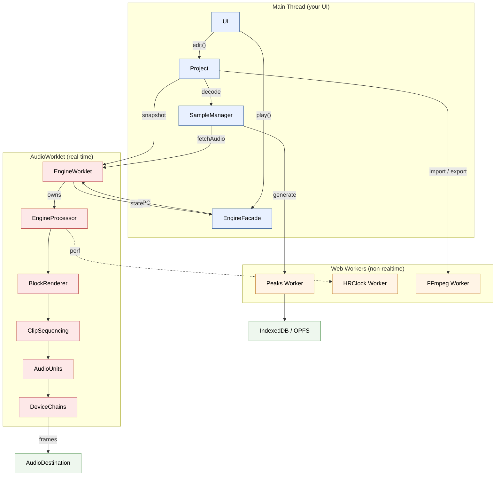

# System Architecture

> **Skip if** you already know how the SDK is laid out and which thread runs what. Otherwise this chapter gives you the map before you dive into the rest of the handbook.

This chapter is a visual tour of how the pieces fit together — what's in your app, what's in the SDK, and what runs where in the browser. Three diagrams, each adding more detail.

## 1. High-Level View

At the top level, your app sits on top of OpenDAW, which sits on top of the browser's audio platform. You build the UI and own all the rendering; the SDK owns the data model, timing, and audio.



**What's in each box:**

- **Your App** — the UI you build: React/JSX, canvas-based timeline, mixer, transport controls.
- **`Project`** — the in-memory box graph, editing API, sample manager. Everything you read or mutate lives here.
- **`EngineFacade`** — observable wrapper around the audio engine: `isPlaying`, `position`, `bpm`, `play()`, `stop()`.
- **AudioWorklet** — the real-time audio thread that runs the actual engine processor.
- **Web Workers** — non-realtime helpers for peaks generation, OPFS I/O, FFmpeg encode/decode.
- **Storage** — IndexedDB and OPFS for cached audio files and peaks.

**How they talk:**

- `Project` → AudioWorklet: serialized box-graph snapshot on play.
- `EngineFacade` ↔ AudioWorklet: `MessagePort` RPC for commands, `SharedArrayBuffer` for high-frequency state (position, meters).
- AudioWorklet → `Web Audio API`: rendered audio frames out to the destination.

**Three takeaways:**

- Your app never touches Web Audio directly — `Project` and `EngineFacade` are the only two SDK surfaces you call.
- The SDK is two layers glued together: a *data layer* (the box graph + adapters) and a *playback layer* (the engine facade that talks to the AudioWorklet).
- Heavy non-realtime work (peaks, file decoding, FFmpeg) lives in plain Web Workers so it never blocks audio.

The rest of the handbook expands on these surfaces: timing (Ch. 2), reactive updates (Ch. 3), the box graph (Ch. 4), and the render pipeline (Ch. 6).

## 2. Package Layout

OpenDAW ships as a set of independent npm packages under the `@opendaw/` scope. The split lets you import only what you need (e.g. just `lib-std` and `lib-dsp` for offline analysis) and keeps the audio engine separate from the data model.



**Reading guide:**

- **`lib-std`** is the foundation — `Option<T>`, `UUID`, `Observable`, `tryCatch`, type guards. Almost everything depends on it.
- **`lib-runtime`** holds the cross-thread plumbing — `Messenger`, `Communicator` for typed RPC over `MessagePort`, plus other runtime helpers.
- **`lib-dsp`** holds the things you compute with: `PPQN` constants, `AudioData`, sample format helpers.
- **`lib-dom`** is the only library that touches browser APIs (notably `AnimationFrame` — see [Ch. 3](./03-animation-frame.md)).
- **`lib-jsx`** is the lightweight JSX runtime used by openDAW Studio's UI. Not needed if you're building with React/Vue/Svelte.
- **`lib-box`** is the graph primitive library — boxes, fields, transactions. See [Ch. 4](./04-box-system-and-reactivity.md).
- **`lib-xml`** is a small typed XML reader/writer used by `lib-dawproject`.
- **`lib-midi`** parses and emits Standard MIDI Files; used by MIDI import/export.
- **`lib-fusion`** is the rendering toolkit — `PeaksPainter` for waveforms — built on top of the lower libs.
- **`lib-dawproject`** is the importer/exporter for the cross-DAW [DAW Project](https://github.com/bitwig/dawproject) interchange format.
- **`studio-enums`** holds the shared enum values used across box definitions and adapters (e.g. `Pointers`).
- **`studio-boxes`** is the box catalog (the data shapes): `AudioFileBox`, `AudioRegionBox`, `ValueEventCollectionBox`, etc.
- **`studio-adapters`** wraps boxes with typed accessors and factories (`InstrumentFactories.Tape`).
- **`studio-core`** is the engine: `Project`, `EngineFacade`, sample loading, offline rendering. Most apps import this one and let it pull the rest transitively.

**Typical import set for a simple DAW UI:**

```typescript
import { UUID, Progress } from "@opendaw/lib-std";
import { AnimationFrame } from "@opendaw/lib-dom";
import { PPQN, AudioData } from "@opendaw/lib-dsp";
import { PeaksPainter } from "@opendaw/lib-fusion";
import { AudioFileBox, AudioRegionBox, ValueEventCollectionBox } from "@opendaw/studio-boxes";
import { InstrumentFactories } from "@opendaw/studio-adapters";
import { Project, GlobalSampleLoaderManager } from "@opendaw/studio-core";
```

## 3. Engine and Audio Processing

This is what's really happening when you press play. The engine spans three execution contexts that talk to each other through `MessagePort` RPC and `SharedArrayBuffer` state.



**Inside each thread:**

- **Main** — `UI` components, the `Project` box graph, `EngineFacade` observables, and `SampleManager` for decoding.
- **AudioWorklet** — `EngineWorklet` (an `AudioWorkletNode`) owns `EngineProcessor` (the `AudioWorkletProcessor`). The processor runs `BlockRenderer` → `ClipSequencing` → per-channel `AudioUnits` → effect `DeviceChains` once per 128-frame render quantum.
- **Workers** — `Peaks Worker` for min/max waveform compression, `HRClock Worker` for high-resolution perf timing, `FFmpeg Worker` for import/export encode/decode.

**Threads at a glance:**

| Thread | What lives there | Allowed to block? |
|---|---|---|
| **Main** | UI, `Project`, `EngineFacade`, sample decoding kickoff | No (jank kills UX) |
| **AudioWorklet** | `EngineProcessor` and its graph of `AudioUnits`, `BlockRenderer`, `ClipSequencing` | Never (drops audio) |
| **Workers** | Peaks generation, HR clock, FFmpeg, OPFS I/O | Yes — they exist precisely so audio doesn't have to wait |

**Communication channels:**

- **`MessagePort` RPC** — Main ↔ AudioWorklet for commands ("play", "set tempo") and async requests (`fetchAudio`). Asynchronous, message-passing.
- **`SharedArrayBuffer`** — AudioWorklet → Main for high-frequency state (playhead position, meters). The main thread polls these via `AnimationFrame` (see [Ch. 3](./03-animation-frame.md)). Requires the page to be cross-origin isolated (COOP/COEP headers — see [Ch. 12](./12-browser-compatibility.md)).
- **Snapshot serialization** — When you press play, `Project` serializes its box graph to an `ArrayBuffer` and the AudioWorklet rebuilds the audio graph from it.

**The process loop (inside `EngineProcessor`):**

1. **Block tick** — every 128 audio frames (one render quantum), the processor wakes up.
2. **Timeline advance** — `BlockRenderer` advances the PPQN position, handling loop boundaries and tempo automation.
3. **Clip sequencing** — `ClipSequencing` decides which regions are active at the new position.
4. **Per-unit processing** — each `AudioUnit` runs its device chain (instruments → effects → sends) in topological order.
5. **Mix and output** — channels sum into the master and are handed back to the Web Audio graph.
6. **State publish** — the processor writes position, meters, and perf data to the `SharedArrayBuffer` for the UI to pick up next animation frame.

**Where to go next:**

- **[Ch. 2 — Timing & Tempo](./02-timing-and-tempo.md)** explains the PPQN system that the block renderer advances.
- **[Ch. 3 — AnimationFrame](./03-animation-frame.md)** explains how the UI polls the SharedArrayBuffer without thrashing.
- **[Ch. 4 — Box System & Reactivity](./04-box-system-and-reactivity.md)** expands the data model boxes shown above.
- **[Ch. 6 — Timeline & Rendering](./06-timeline-and-rendering.md)** covers the UI side of the render pipeline.
