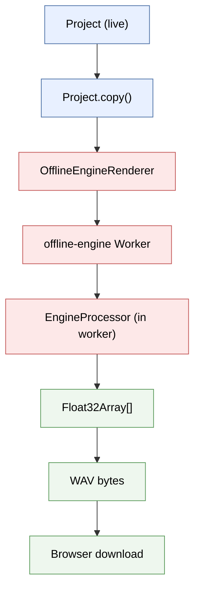

# Export & Offline Rendering

> **Skip if:** you're not implementing audio export
> **Prerequisites:** Chapter 07 (Building a Complete App)

Comprehensive guide to exporting audio from OpenDAW projects, including full mix exports and individual stems with effects, plus advanced offline rendering patterns.

Everything below uses the OpenDAW SDK directly: `AudioOfflineRenderer` / `OfflineEngineRenderer` from `@opendaw/studio-core`, `WavFile` from `@opendaw/lib-dsp`, and the `ExportConfiguration` type from `@opendaw/studio-adapters`. The only browser API involved is the anchor-click used to save the encoded bytes.

## Table of Contents

- [Overview](#overview)
- [Quick Start](#quick-start)
- [Core API](#core-api)
- [Full Mix Export](#full-mix-export)
- [Stems Export](#stems-export)
- [Export Options](#export-options)
- [Effects Rendering](#effects-rendering)
- [File Formats](#file-formats)
- [Examples](#examples)
- [Best Practices](#best-practices)
- [Troubleshooting](#troubleshooting)
- [Advanced: Offline Rendering Patterns](#advanced-offline-rendering-patterns)
  - [Background: Two Offline Render Paths in OpenDAW](#background-two-offline-render-paths-in-opendaw)
  - [Range-Bounded Export with OfflineEngineRenderer (current API)](#range-bounded-export-with-offlineenginerenderer-current-api)
  - [The OfflineAudioContext Approach (metronome renders)](#the-offlineaudiocontext-approach-metronome-renders)
  - [Key Concepts](#key-concepts)
  - [Export Modes](#export-modes)
  - [Range Selection: Bars to PPQN](#range-selection-bars-to-ppqn)
  - [Encoding and Download](#encoding-and-download)
  - [In-Browser Preview](#in-browser-preview)
  - [Future: Worker-Based Rendering](#future-worker-based-rendering)
  - [Reference](#reference)

---

## Overview

OpenDAW provides powerful audio export capabilities through its offline rendering engine. You can export:

- **Full Mix** - All tracks mixed down to a single stereo file
- **Individual Stems** - Separate files for each track
- **With Effects** - All audio effects fully rendered in the export
- **High Quality** - 48kHz sample rate, 32-bit float WAV files

**Key Features:**
- Offline rendering (non-real-time, accurate processing)
- Progress tracking and cancellation support
- Per-stem control of effects inclusion
- Automatic browser downloads
- WAV, MP3, and FLAC format support (WAV built-in, others require FFmpeg)

### How offline rendering works

Export doesn't touch the live audio engine. Instead, the SDK clones your project and runs a copy through a separate worker thread, calling `step()` repeatedly to produce audio frames as fast as the CPU can crunch them:



The worker runs the same `EngineProcessor` class as the realtime audio worklet — same effects, same automation, same DSP. The only difference is the driver: in realtime, the audio thread calls `process()` 375 times a second; offline, the worker calls `step()` as quickly as possible until the silence detector says the mix has finished decaying. That's why export is *bit-exact* with realtime playback: it's literally the same code path.

The diagram above depicts `OfflineEngineRenderer`, the current worker-based path. The simpler one-shot calls that lead the examples below use the deprecated `AudioOfflineRenderer`, which drives the same `EngineProcessor` through a main-thread `OfflineAudioContext` instead of a worker — same DSP, same bit-exact result, different driver. See [Core API](#core-api) for both.

---

## Quick Start

The SDK exposes two one-shot renderers — pick one, encode the result with `WavFile`, and save it with a small anchor-click helper. Both take the same arguments; they differ in their `progress` type and return type (see [Core API](#core-api)).

### Render a full mix to WAV

```typescript
import { AudioOfflineRenderer } from "@opendaw/studio-core";
import { WavFile } from "@opendaw/lib-dsp";
import { Option, Progress } from "@opendaw/lib-std";

// Render the whole project to a stereo AudioBuffer.
// Option.None = full mix (the metronome is included on this path).
const progress: Progress.Handler = (value) => console.log(`${Math.round(value * 100)}%`);

const audioBuffer = await AudioOfflineRenderer.start(
  project,
  Option.None,   // no stem config → full mix
  progress,
  undefined,     // optional AbortSignal
  48000          // sample rate
);

// Encode to 32-bit float WAV and download.
downloadWav(WavFile.encodeFloats(audioBuffer), "my-mix.wav");
```

### Render stems to WAV

```typescript
import { AudioOfflineRenderer } from "@opendaw/studio-core";
import { WavFile } from "@opendaw/lib-dsp";
import { Option } from "@opendaw/lib-std";
import type { ExportConfiguration } from "@opendaw/studio-adapters";

// A non-empty `stems` map takes the stem branch: one stereo pair per track.
// `fileName` is required on each entry; the other flags control what's baked in.
const exportConfig: ExportConfiguration = {
  stems: {
    [drumsUUID]: { includeAudioEffects: true, includeSends: false, useInstrumentOutput: false, fileName: "drums" },
    [bassUUID]:  { includeAudioEffects: true, includeSends: false, useInstrumentOutput: false, fileName: "bass" },
  },
};

const audioBuffer = await AudioOfflineRenderer.start(
  project,
  Option.wrap(exportConfig),
  (value) => console.log(`${Math.round(value * 100)}%`),
  undefined,
  48000
);

// Channels are interleaved by stem order: [s1_L, s1_R, s2_L, s2_R, ...]
Object.values(exportConfig.stems!).forEach((stem, i) =>
  downloadWav(WavFile.encodeFloats(sliceStem(audioBuffer, i)), `${stem.fileName}.wav`)
);
```

The `downloadWav` and `sliceStem` helpers are defined in [Core API](#core-api).

---

## Core API

### AudioOfflineRenderer

The original offline rendering entry point from `@opendaw/studio-core`. It is `@deprecated`
(since studio-core@0.0.93) — prefer `OfflineEngineRenderer` for new code — but it remains
the simplest one-shot call, returning a ready-to-play `AudioBuffer`:

```typescript
import { AudioOfflineRenderer } from "@opendaw/studio-core";
import { Option, Progress } from "@opendaw/lib-std";

// progress is a Progress.Handler: (value: number) => void, value in 0.0–1.0
const progressHandler: Progress.Handler = (value) => {
  console.log(`${Math.round(value * 100)}%`);
};

// Full mix
const audioBuffer = await AudioOfflineRenderer.start(
  project,
  Option.None,      // No stem config = full mix
  progressHandler,
  undefined,        // AbortSignal (optional)
  48000             // Sample rate
);

// Stems
const audioBuffer = await AudioOfflineRenderer.start(
  project,
  Option.wrap(exportConfiguration),
  progressHandler,
  undefined,
  48000
);
```

**Signature:** `AudioOfflineRenderer.start(source, optExportConfiguration, progress, abortSignal?, sampleRate?)` → `Promise<AudioBuffer>`.

**How it works:**
1. Creates an `OfflineAudioContext` with the specified sample rate
2. Copies the project and disables looping
3. Creates audio worklets for offline processing
4. Renders all audio with effects
5. Returns an `AudioBuffer` with the rendered audio

**For stems export:**
- Each stem is rendered to separate channels in the AudioBuffer
- Channel layout: `[stem1_L, stem1_R, stem2_L, stem2_R, ...]`
- Effects are optionally included per stem

### OfflineEngineRenderer

The current, non-deprecated renderer. It runs the engine in a dedicated worker rather than
on a main-thread `OfflineAudioContext`. Install its worker once at startup, then call `start`
with the same `(source, optExportConfiguration, progress, abortSignal?, sampleRate?)` shape:

```typescript
import { OfflineEngineRenderer } from "@opendaw/studio-core";
import { WavFile } from "@opendaw/lib-dsp";
import { DefaultObservableValue, Option } from "@opendaw/lib-std";
import type { AudioData } from "@opendaw/lib-dsp";

// Once, during bootstrap (the worker URL is provided by your bundler):
OfflineEngineRenderer.install(offlineEngineWorkerUrl);

// progress is a DefaultObservableValue<number> (NOT a Progress.Handler) — subscribe to it
const progress = new DefaultObservableValue(0);
const sub = progress.subscribe((o) => console.log(`${Math.round(o.getValue() * 100)}%`));

const audioData: AudioData = await OfflineEngineRenderer.start(
  project,
  Option.None,        // or Option.wrap(exportConfiguration) for stems
  progress,
  undefined,          // AbortSignal (optional)
  48000
);
sub.terminate();

// WavFile.encodeFloats accepts AudioData directly (AudioData | AudioBufferLike)
downloadWav(WavFile.encodeFloats(audioData), "my-mix.wav");
```

**Differences from `AudioOfflineRenderer`:**

| | `AudioOfflineRenderer` (deprecated) | `OfflineEngineRenderer` (current) |
|---|---|---|
| Returns | `Promise<AudioBuffer>` | `Promise<AudioData>` |
| `progress` arg | `Progress.Handler` (a function) | `DefaultObservableValue<number>` (subscribe) |
| Driver | main-thread `OfflineAudioContext` | dedicated worker |
| Range export | not supported by `start()` | `ExportConfiguration.range` is honored |
| Setup | none | `OfflineEngineRenderer.install(url)` at startup |

`OfflineEngineRenderer` also exposes lower-level entry points for full control:
`.create(source, optConfig, sampleRate?)` (then `play()`, `step(samples)`, `setPosition`,
`waitForLoading`, `terminate`) and `.render(config, startPosition, endPosition, progress, abortSignal?)`
for arbitrary ranges (where `config` is an `OfflineEngineRenderConfig`, not an `ExportConfiguration`).

> **Live-project caveat:** both renderers connect the source project's
> `liveStreamReceiver`, which throws "Already connected" if the live engine already holds
> it. Render from a `project.copy()`. See
> [Advanced: Offline Rendering Patterns](#advanced-offline-rendering-patterns) for
> exact-range export via `step()`, `render()`'s silence-bounded (not end-bounded) loop,
> and the metronome export configuration (WASM offline worker only).

### WavFile

WAV file encoding/decoding from `@opendaw/lib-dsp`:

```typescript
import { WavFile } from "@opendaw/lib-dsp";

// Convert AudioBuffer or AudioData to a WAV ArrayBuffer (32-bit float)
const wavArrayBuffer = WavFile.encodeFloats(audioBuffer);

// Decode a WAV ArrayBuffer to AudioData
const audio = WavFile.decodeFloats(arrayBuffer);
// Returns AudioData: { sampleRate: number, numberOfFrames: number, numberOfChannels: number, frames: Float32Array[] }
```

`WavFile.encodeFloats(audio: AudioData | AudioBufferLike, maxLength?)` returns the encoded
bytes, so it works with the `AudioBuffer` from `AudioOfflineRenderer` and the `AudioData`
from `OfflineEngineRenderer` alike.

**Encoders:**
- `encodeFloats` — 32-bit IEEE float (lossless, the default used throughout this chapter)
- `encodeInts16` — 16-bit PCM (same input shape; float samples clamped to [-1, 1])

Both accept `AudioData | AudioBufferLike`, mono or stereo. There is no 24-bit encoder.

### Saving and slicing the result

The renderers return audio in memory; these two small helpers turn it into downloads. They
use only standard Web Audio + DOM APIs — no SDK or framework dependency:

```typescript
// Save an encoded WAV ArrayBuffer as a browser download.
function downloadWav(bytes: ArrayBuffer, fileName: string): void {
  const blob = new Blob([bytes], { type: "audio/wav" });
  const url = URL.createObjectURL(blob);
  const link = document.createElement("a");
  link.href = url;
  link.download = fileName;
  link.click();
  URL.revokeObjectURL(url);
}

// Extract stem `index` (a stereo pair) from a multi-channel stems render.
function sliceStem(audioBuffer: AudioBuffer, index: number): AudioBuffer {
  const left = index * 2;
  const right = index * 2 + 1;
  if (right >= audioBuffer.numberOfChannels) {
    throw new Error(`Stem ${index} needs channel ${right}, buffer has ${audioBuffer.numberOfChannels}`);
  }
  const stem = new AudioBuffer({
    length: audioBuffer.length,
    numberOfChannels: 2,
    sampleRate: audioBuffer.sampleRate,
  });
  stem.copyToChannel(audioBuffer.getChannelData(left), 0);
  stem.copyToChannel(audioBuffer.getChannelData(right), 1);
  return stem;
}
```

---

## Full Mix Export

### Use Cases

**When to use full mix export:**
- Final master for distribution
- Sharing your complete mix
- Archiving finished projects
- Creating reference mixes
- Testing mix decisions

### Example

`Option.None` selects the mixdown branch — all tracks, all effects, all automation, and the
metronome (if enabled in preferences) are mixed into one stereo buffer:

```typescript
import { AudioOfflineRenderer } from "@opendaw/studio-core";
import { WavFile } from "@opendaw/lib-dsp";
import { Option } from "@opendaw/lib-std";

async function exportMix(project: Project, fileName = "mix"): Promise<void> {
  const audioBuffer = await AudioOfflineRenderer.start(
    project,
    Option.None,
    (value) => console.log(`Rendering ${Math.round(value * 100)}%`),
    undefined,
    48000
  );
  downloadWav(WavFile.encodeFloats(audioBuffer), `${fileName}.wav`);
}
```

**What gets exported:**
- All tracks mixed together
- All audio effects rendered
- All automation applied
- Master output effects included
- Final stereo mixdown

---

## Stems Export

### Use Cases

**When to use stems export:**
- Sharing individual tracks for collaboration
- Sending to mixing/mastering engineer
- Remixing or rearranging
- Creating sample packs
- Archiving project components
- A/B testing with and without effects

### Effect Inclusion Control

A stems export is driven by an `ExportConfiguration` whose `stems` map is keyed by audio-unit
UUID. Each entry controls what gets baked into that stem:

```typescript
import type { ExportConfiguration } from "@opendaw/studio-adapters";

const exportConfig: ExportConfiguration = {
  stems: {
    // Vocals: include all audio effects (Reverb + Compressor)
    [vocalsUUID]: { includeAudioEffects: true,  includeSends: false, useInstrumentOutput: false, fileName: "vocals" },
    // Drums: include compression, export a tight sound
    [drumsUUID]:  { includeAudioEffects: true,  includeSends: false, useInstrumentOutput: false, fileName: "drums" },
    // Guitar: export dry for re-amping later
    [guitarUUID]: { includeAudioEffects: false, includeSends: false, useInstrumentOutput: false, fileName: "guitar" },
  },
};
```

**Per-stem flags** (the `ExportStemConfiguration` type):
- `fileName` *(required)* — display name for the stem; the SDK also uses it when naming output
- `includeAudioEffects` — bake the track's audio-effect chain into the stem
- `includeSends` — include aux/send returns (reverb/delay buses) in the stem
- `useInstrumentOutput` — **keep this `false`.** `true` wires the raw instrument output
  straight to the bus and returns early, bypassing audio effects, sends, **and** the channel
  strip — which makes `includeAudioEffects`/`includeSends` dead. (openDAW's own export dialog
  omits the flag for this reason.)
- `skipChannelStrip` *(optional)* — bypasses the channel-strip volume/pan/mute and, as a
  side effect of the same early return, drops aux sends regardless of `includeSends`.

### Channel layout and extraction

A stems render returns a single multi-channel buffer with one stereo pair per stem, **in the
order the `stems` map was iterated**:

```
channel:  0     1     2     3     4     5    ...
stem:     s1_L  s1_R  s2_L  s2_R  s3_L  s3_R ...
```

Slice each pair into its own stereo file (see `sliceStem` in [Core API](#saving-and-slicing-the-result)):

```typescript
const audioBuffer = await AudioOfflineRenderer.start(
  project, Option.wrap(exportConfig),
  (value) => console.log(`${Math.round(value * 100)}%`), undefined, 48000
);

// `Object.values` preserves insertion order, which matches the channel layout
Object.values(exportConfig.stems!).forEach((stem, i) =>
  downloadWav(WavFile.encodeFloats(sliceStem(audioBuffer, i)), `${stem.fileName}.wav`)
);
```

### Example

```typescript
const exportConfig: ExportConfiguration = {
  stems: {
    [vocalsUUID]: { includeAudioEffects: true,  includeSends: false, useInstrumentOutput: false, fileName: "vocals" },
    [drumsUUID]:  { includeAudioEffects: true,  includeSends: false, useInstrumentOutput: false, fileName: "drums" },
    [guitarUUID]: { includeAudioEffects: false, includeSends: false, useInstrumentOutput: false, fileName: "guitar-dry" },
  },
};

const audioBuffer = await AudioOfflineRenderer.start(
  project, Option.wrap(exportConfig),
  (value) => console.log(`${Math.round(value * 100)}%`), undefined, 48000
);

Object.values(exportConfig.stems!).forEach((stem, i) =>
  downloadWav(WavFile.encodeFloats(sliceStem(audioBuffer, i)), `${stem.fileName}.wav`)
);
```

**What gets exported:**
- One WAV file per stem
- Each rendered to its own stereo pair
- Effects optionally included per stem (via the flags above)

---

## Export Options

### Sample Rate

The fifth argument to `start()` sets the render sample rate.

**Common values:**
- `44100` - CD quality
- `48000` - Professional standard (recommended, the SDK default)
- `96000` - High resolution (larger files)

```typescript
await AudioOfflineRenderer.start(project, Option.None, progress, undefined, 48000);
```

### Progress Tracking

Both renderers report progress as a normalized `0.0–1.0` value, but through different types:

```typescript
// AudioOfflineRenderer: a Progress.Handler callback
import { Progress } from "@opendaw/lib-std";
const handler: Progress.Handler = (value) => setPercent(Math.round(value * 100));
await AudioOfflineRenderer.start(project, Option.None, handler, undefined, 48000);

// OfflineEngineRenderer: a DefaultObservableValue<number> you subscribe to
import { DefaultObservableValue } from "@opendaw/lib-std";
const progress = new DefaultObservableValue(0);
const sub = progress.subscribe((o) => setPercent(Math.round(o.getValue() * 100)));
await OfflineEngineRenderer.start(project, Option.None, progress, undefined, 48000);
sub.terminate();
```

Offline rendering runs as fast as the CPU allows and the end is determined by silence
detection, so the rate of progress updates is not uniform. For long renders, an
indeterminate indicator with a "may take a moment" note often reads better than a precise bar.

### Cancellation

Pass an `AbortSignal` as the fourth argument and abort it to cancel a render. The promise
rejects with an abort error — detect it with `Errors.isAbort`:

```typescript
import { Errors } from "@opendaw/lib-std";

const controller = new AbortController();
try {
  const audioBuffer = await AudioOfflineRenderer.start(
    project, Option.None, progress, controller.signal, 48000
  );
  downloadWav(WavFile.encodeFloats(audioBuffer), "mix.wav");
} catch (error) {
  if (Errors.isAbort(error)) {
    console.log("Export cancelled");
  } else {
    throw error;
  }
}
```

### Filenames

`downloadWav` takes whatever filename you pass. For names that come from user input, the SDK
ships a sanitizer — `ExportConfiguration.sanitizeFileName(name)`, plus
`ExportConfiguration.sanitizeExportNamesInPlace(config)` to fix every stem `fileName` in a
config at once:

```typescript
import { ExportConfiguration } from "@opendaw/studio-adapters";

downloadWav(WavFile.encodeFloats(audioBuffer), `${ExportConfiguration.sanitizeFileName(userTitle)}.wav`);
```

---

## Effects Rendering

### How Effects Are Rendered

When exporting, OpenDAW renders all effects **offline** (non-real-time):

**Advantages:**
- **Accurate processing** - No real-time constraints
- **High quality** - All effects rendered at full precision
- **Automation included** - Parameter changes over time preserved
- **Consistent results** - Same output every time

**What gets rendered:**
- ✓ Audio effects (Reverb, Delay, Compressor, EQ, etc.)
- ✓ Audio effect automation
- ✓ Volume and pan automation
- ✓ Master output effects
- ✗ Send effects (optional, controlled per stem via `includeSends`)

### Full mix — all effects always included

The mixdown branch renders the project exactly as it sounds in realtime, so every effect is
baked in automatically:

```typescript
const audioBuffer = await AudioOfflineRenderer.start(project, Option.None, progress, undefined, 48000);
downloadWav(WavFile.encodeFloats(audioBuffer), "mix-with-all-effects.wav");
```

### Per-stem effect control

For stems, the `includeAudioEffects` flag decides whether each track's effect chain is baked in:

```typescript
const exportConfig: ExportConfiguration = {
  stems: {
    // Wet: Reverb, Compressor, EQ rendered in order
    [vocalsUUID]: { includeAudioEffects: true,  includeSends: false, useInstrumentOutput: false, fileName: "vocals" },
    // Dry: instrument/clip signal only, no effects
    [guitarUUID]: { includeAudioEffects: false, includeSends: false, useInstrumentOutput: false, fileName: "guitar" },
  },
};
const audioBuffer = await AudioOfflineRenderer.start(project, Option.wrap(exportConfig), progress, undefined, 48000);
```

When `includeAudioEffects` is `true`, the full chain renders in order — a vocals track with
Compressor → Reverb → EQ produces a stem with Compressor → Reverb → EQ applied.

---

## File Formats

### WAV (Built-in)

**Format:** 32-bit IEEE float, WAV container
**Quality:** Lossless
**Use case:** Default, highest quality
**File size:** Large (~10 MB/minute stereo)

```typescript
import { WavFile } from "@opendaw/lib-dsp";

const audioBuffer = await AudioOfflineRenderer.start(project, Option.None, progress, undefined, 48000);
downloadWav(WavFile.encodeFloats(audioBuffer), "mix.wav");
```

### MP3 and FLAC (Via OpenDAW Studio)

`WavFile` only encodes WAV. For MP3/FLAC, use OpenDAW Studio's `Mixdowns` service:

```typescript
import { Mixdowns } from "@opendaw/studio/service/Mixdowns";

// MP3/FLAC export (requires FFmpeg)
await Mixdowns.exportMixdown({ project, meta });
// User selects format in dialog: WAV, MP3, or FLAC
```

**MP3:**
- Lossy compression
- Smaller files (~1 MB/minute)
- Requires FFmpeg (lazy-loaded)

**FLAC:**
- Lossless compression
- Medium files (~5 MB/minute)
- Requires FFmpeg (lazy-loaded)

---

## Examples

### Example 1: Full mix with a generated filename

```typescript
const audioBuffer = await AudioOfflineRenderer.start(
  project, Option.None,
  (value) => console.log(`${Math.round(value * 100)}%`), undefined, 48000
);
downloadWav(WavFile.encodeFloats(audioBuffer), `drum-pattern-${bpm}bpm.wav`);
```

### Example 2: Stems with effects baked in

```typescript
const exportConfig: ExportConfiguration = {
  stems: Object.fromEntries(
    tracks.map((t) => [t.uuid, { includeAudioEffects: true, includeSends: false, useInstrumentOutput: false, fileName: t.name }])
  ),
};
const audioBuffer = await AudioOfflineRenderer.start(project, Option.wrap(exportConfig), progress, undefined, 48000);
tracks.forEach((t, i) => downloadWav(WavFile.encodeFloats(sliceStem(audioBuffer, i)), `${t.name}.wav`));
// Result: one WAV per track, each with its effects rendered
```

### Runnable demos

These concepts ship as runnable demos in this handbook's companion app — see the
[Export Demo](https://opendaw-test.pages.dev/export-demo.html) for full-mix, stems, and
range export wired up to a UI.

---

## Best Practices

### 1. Stop playback before exporting

The renderer works on a copy, but stopping the live transport first avoids contention for
audio resources:

```typescript
if (project.engine.isPlaying.getValue()) {
  project.engine.stop();
}
const audioBuffer = await AudioOfflineRenderer.start(project, Option.None, progress, undefined, 48000);
```

### 2. Show progress and a long-render hint

```typescript
const progress = new DefaultObservableValue(0);
const sub = progress.subscribe((o) => setPercent(Math.round(o.getValue() * 100)));
try {
  const audioData = await OfflineEngineRenderer.start(project, Option.None, progress, undefined, 48000);
  downloadWav(WavFile.encodeFloats(audioData), "mix.wav");
} finally {
  sub.terminate();
}
```

### 3. Handle errors (and aborts) gracefully

```typescript
import { Errors } from "@opendaw/lib-std";

try {
  const audioBuffer = await AudioOfflineRenderer.start(project, Option.None, progress, undefined, 48000);
  downloadWav(WavFile.encodeFloats(audioBuffer), "mix.wav");
} catch (error) {
  if (Errors.isAbort(error)) return; // user cancelled
  console.error("Export failed:", error);
}
```

### 4. Use descriptive filenames

```typescript
// Good
"darkride-master-v3-with-compression.wav"
"vocals-dry-for-reamping.wav"

// Less helpful
"mix.wav"
"export1.wav"
```

### 5. Consider file sizes

**WAV files are large:**
- Stereo, 48kHz, 32-bit: ~10 MB per minute
- 3-minute song: ~30 MB
- 7 stems × 3 minutes: ~210 MB total

**Recommendations:**
- Use WAV for archival and processing
- Convert to MP3/FLAC for sharing (use OpenDAW Studio's `Mixdowns` service)
- Warn users about file sizes for long exports

---

## Troubleshooting

### Render throws "Already connected"

**Problem:** Rendering directly from the live project — both renderers connect the source
project's `liveStreamReceiver`, which the live engine already holds.

**Solution:** Render from a copy, or use the manual pipeline in
[Advanced: Offline Rendering Patterns](#advanced-offline-rendering-patterns).

```typescript
const audioBuffer = await AudioOfflineRenderer.start(project.copy(), Option.None, progress, undefined, 48000);
```

### No download triggered

**Problem:** Browser blocked the download.

**Solution:**
- A user gesture is required — trigger the export from a click handler
- Check the console for errors and verify a popup/download blocker isn't interfering

### Effects not rendered in a stem

**Problem:** `includeAudioEffects: false`, or `useInstrumentOutput: true` (which bypasses the
effect chain, sends, and channel strip entirely).

**Solution:**
```typescript
[uuid]: { includeAudioEffects: true, includeSends: false, useInstrumentOutput: false }
```

### Export takes a long time

**Explanation:** Offline rendering still processes every sample through the full DSP graph;
long tracks and heavy effect chains take proportionally longer. This is expected and is what
makes the export bit-exact with realtime.

**Solution:**
- Subscribe to the renderer's progress and show status to the user
- Test with a short range first (see [Range Selection](#range-selection-bars-to-ppqn))

### Volume too low/high in export

**Problem:** Gain staging or effect parameters.

**Solution:**
- Check the master volume level
- Verify effect parameters (especially Crushers and Compressors)
- Adjust levels before exporting and test with a short export first

### "Overlapping regions" warning and incomplete export

Overlapping regions on a single track are invalid by design in both timeBases. The
Seconds-timeBase path surfaces no warning for overlaps during editing — this is **not a bug**,
but it can truncate an export. Keep one region per position per track.

---

## Additional Resources

### Related Files

- **Drum Demo Integration:** `src/demos/playback/drum-scheduling-demo.tsx`
- **Effects Demo Integration:** `src/demos/effects/effects-demo.tsx`
- **Export Demo:** [opendaw-test.pages.dev/export-demo.html](https://opendaw-test.pages.dev/export-demo.html)

### OpenDAW Core Files

- **Offline Renderer (deprecated):** `@opendaw/studio-core/AudioOfflineRenderer.ts`
- **Offline Renderer (current):** `@opendaw/studio-core/OfflineEngineRenderer.ts`
- **WAV Encoding:** `@opendaw/lib-dsp/WavFile.ts`
- **Export Configuration type:** `@opendaw/studio-adapters/ExportConfiguration.ts`
- **Mixdowns Service:** `@opendaw/studio/service/Mixdowns.ts`
- **Engine Integration:** `@opendaw/studio-core-processors/EngineProcessor.ts`

### Documentation

- [Effects Documentation](./11-effects.md)
- [Timing & Tempo](./02-timing-and-tempo.md)
- [Box System & Reactivity](./04-box-system-and-reactivity.md)

---

## Advanced: Offline Rendering Patterns

> **Skip if:** the basic export API meets your needs

Range-bounded export, metronome rendering, and the OfflineAudioContext approach.

### Background: Two Offline Render Paths in OpenDAW

OpenDAW has two offline renderers:

| Renderer | Status | Limitation |
|----------|--------|------------|
| `AudioOfflineRenderer` | Deprecated — do not use ([openDAW#315](https://github.com/andremichelle/openDAW/issues/315) closed wontfix: use `OfflineEngineRenderer`; the TypeScript audio engine is slated for removal) | Uses `OfflineAudioContext` on main thread. No range support (always renders 0 to last region). Throws once the WASM engine has booted anywhere (its internal context is never registered — `WasmEngine.ensureReady` registers the processor only on the first context). |
| `OfflineEngineRenderer` | Current | Worker-based custom render loop. Connects the source's `liveStreamReceiver` — throws "Already connected" on a live project, so render from a `project.copy()`. Metronome config is honored by the WASM worker only — pass `variant: true` for click renders. |

**Path selection:** `ExportConfiguration.countStems(Option.None)` returns **1** (not 0), so the `numStems === 0` panic guard only fires for `Option.Some({stems: {}})` (an empty stems map). The `EngineProcessor` then branches on the **stems array** (`stemExports.length === 0`), which is empty for `Option.None`/undefined config — so it takes the **mixdown branch** and mixes the metronome into the main output. A non-empty `stems` map takes the **stem branch** (per-unit stereo pairs, metronome excluded). So:
- `Option.None` / undefined `exportConfiguration` = **mixdown path, metronome included**
- non-empty `stems` map = **stem path, metronome excluded**

**Range bounds:** the `start()` convenience method on both renderers relies on silence
detection or `maxDurationSeconds` for the end bound, and `OfflineEngineRenderer.render(config,
startPosition, endPosition, progress)` does NOT stop at `endPosition` either — the worker's
loop runs until silence/`maxDurationSeconds`; `endPosition` only drives the progress value.
For an **exact** range (precise sample count, stems of equal length), use the step API:

### Range-Bounded Export with OfflineEngineRenderer (current API)

`create → setPosition → play → waitForLoading → step(numSamples)` renders exactly the
requested frame count on the worker — no `OfflineAudioContext` involved:

```typescript
import { OfflineEngineRenderer } from "@opendaw/studio-core";
import { Option } from "@opendaw/lib-std";

const durationSeconds = project.tempoMap.intervalToSeconds(startPpqn, endPpqn);
const numSamples = Math.ceil(durationSeconds * sampleRate);
const projectCopy = project.copy(); // never the live project — liveStreamReceiver conflict
try {
  const renderer = await OfflineEngineRenderer.create(
    projectCopy,
    exportConfiguration ? Option.wrap({ stems: exportConfiguration }) : Option.None,
    sampleRate,
    false // pin the TS worker; `variant` defaults to WasmEngine.useForExports()
  );
  try {
    renderer.setPosition(startPpqn);
    await renderer.play();          // starts transport + one queryLoadingComplete
    await renderer.waitForLoading(); // NOTE: polls with no ceiling — add your own deadline
    const channels = await renderer.step(numSamples); // Float32Array[], exact length
    // stems config → channels interleaved [stem1_L, stem1_R, stem2_L, ...]
  } finally {
    renderer.stop();
    renderer.terminate();
  }
} finally {
  projectCopy.terminate();
}
```

**Metronome:** the click travels in the export configuration — no renderer wiring
([openDAW#316](https://github.com/andremichelle/openDAW/issues/316)):

```typescript
// click mixed into a (no-stems) stereo mixdown
{ metronome: { includeInMixdown: true, settings: { gain: -6 } } }
// click as its own stem, appended AFTER the unit stems (countStems counts the extra pair)
{ stems, metronome: { stem: { fileName: "Metronome" }, settings: { gain: -6 } } }
```

Enabled is implied by presence (`ExportConfiguration.isMetronomeAudible`); `settings`
overrides gain/beatSubDivision/monophonic; `clickSounds: {downbeat?, beat?}` supplies
custom PCM in place of the synthesized 880/440 Hz defaults. **Only the WASM offline worker
consumes `config.metronome`** — the TS worker ignores it silently — so metronome renders
must run `variant: true` (the `useForExports()` default in the studio). A metronome render
on the TS engine remains possible only via the `OfflineAudioContext` approach below, and
per upstream the TypeScript audio engine will be removed soon.

### The OfflineAudioContext Approach (metronome renders)

> **Superseded** by `ExportConfiguration.metronome` (see above). This pattern remains
> only for a metronome render pinned to the TS engine — and upstream has announced the
> TypeScript audio engine's removal, so treat it as reference material.

This approach bypasses both renderers and uses the same building blocks they use internally: `project.copy()`, `OfflineAudioContext`, and `AudioWorklets.createEngine()`. Its `EngineWorklet` exposes `preferences`, which is what makes the metronome reachable on the TS engine.

```typescript
import { Project, AudioWorklets } from "@opendaw/studio-core";
import { ppqn } from "@opendaw/lib-dsp";
import { TimeSpan } from "@opendaw/lib-std";
import { Wait } from "@opendaw/lib-runtime";

async function renderRange(
  project: Project,
  startPpqn: ppqn,
  endPpqn: ppqn,
  sampleRate: number,
  exportConfiguration?: Record<string, ExportStemConfiguration>,
  mutateBeforeCopy?: () => void,
  restoreAfterCopy?: () => void,
  metronomeEnabled: boolean = false,
  metronomeGain: number = -6
): Promise<Float32Array[]> {
  // 1. Calculate exact sample count from PPQN range
  const durationSeconds = project.tempoMap.intervalToSeconds(startPpqn, endPpqn);
  const numChannels = exportConfiguration
    ? Object.keys(exportConfiguration).length * 2
    : 2;
  const numSamples = Math.ceil(durationSeconds * sampleRate);

  // 2. Mutate original (e.g., mute tracks), copy synchronously, restore immediately
  if (mutateBeforeCopy) mutateBeforeCopy();
  const projectCopy = project.copy();
  if (restoreAfterCopy) restoreAfterCopy();

  try {
    projectCopy.boxGraph.beginTransaction();
    projectCopy.timelineBox.loopArea.enabled.setValue(false);
    projectCopy.boxGraph.endTransaction();

    // 3. Create OfflineAudioContext with exact bounds
    const context = new OfflineAudioContext(numChannels, numSamples, sampleRate);
    const worklets = await AudioWorklets.createFor(context);
    const engineWorklet = worklets.createEngine({
      project: projectCopy,
      // undefined = mixdown (metronome included), {stems: …} = stem path (no metronome)
      exportConfiguration: exportConfiguration ? { stems: exportConfiguration } : undefined,
    });
    engineWorklet.connect(context.destination, 0); // output 0 = main audio (worklet has 2 outputs)

    // 4. Set preferences on the worklet (not the project copy)
    engineWorklet.preferences.settings.metronome.enabled = metronomeEnabled;
    engineWorklet.preferences.settings.metronome.gain = metronomeGain;

    // 5. Set position and render
    engineWorklet.setPosition(startPpqn);
    await engineWorklet.isReady();
    engineWorklet.play();

    const startTime = Date.now();
    while (!(await engineWorklet.queryLoadingComplete())) {
      if (Date.now() - startTime > 30_000) {
        throw new Error("Sample loading timed out after 30s");
      }
      await Wait.timeSpan(TimeSpan.millis(100));
    }

    const audioBuffer = await context.startRendering();

    // 6. Extract channels
    const channels: Float32Array[] = [];
    for (let i = 0; i < audioBuffer.numberOfChannels; i++) {
      channels.push(audioBuffer.getChannelData(i));
    }
    return channels;
  } finally {
    projectCopy.terminate();
  }
}
```

### Key Concepts

#### Mixdown vs Stem Path

The `EngineProcessor.render()` method has a hard branch:

```typescript
if (this.#stemExports.length === 0) {
  // Mixdown path: primary output + metronome
  this.#primaryOutput.unwrap().audioOutput().replaceInto(output)
  if (metronomeEnabled) { this.#metronome.output.mixInto(output) }
} else {
  // Stem path: individual AudioUnit outputs, NO metronome
  this.#stemExports.forEach((unit, index) => {
    const [l, r] = unit.audioOutput().channels()
    output[index * 2].set(l)
    output[index * 2 + 1].set(r)
  })
}
```

- **No `exportConfiguration`** passed to `createEngine()` → `stemExports.length === 0` → mixdown path → metronome included
- **With `exportConfiguration`** → per-track channels → metronome excluded

There is no way to get metronome in the stem path or individual stems in the mixdown path. This is a fundamental SDK design decision.

**Note:** `OfflineEngineRenderer` selects the same branch the same way. `countStems(Option.None)` returns 1 only to size the output (`numStems * 2` channels; with a `metronome.stem` the click pair counts too). Enabling the click is a property of the export configuration (`isMetronomeAudible`), not of engine preferences — honored by the WASM offline worker only. The demo renders everything through `OfflineEngineRenderer.step()` and drives `variant` with `isMetronomeAudible` (see `src/lib/rangeExport.ts`).

#### Mutate-Copy-Restore Pattern

`project.copy()` creates **new box instances** from the serialized box graph. You cannot modify the original project's boxes through the copy's `editing.modify()` — this throws "Modification only prohibited in transaction mode."

To capture muted state in a copy, mutate the **original** project, copy synchronously, then restore:

```typescript
// Save original state
const originalMutes = new Map<TrackData, boolean>();
for (const track of tracks) {
  originalMutes.set(track, track.audioUnitBox.mute.getValue());
}

// Mutate → copy (synchronous) → restore
project.editing.modify(() => {
  for (const track of tracks) {
    track.audioUnitBox.mute.setValue(true);
  }
});
const projectCopy = project.copy(); // synchronous — captures muted state
project.editing.modify(() => {
  for (const [track, wasMuted] of originalMutes) {
    track.audioUnitBox.mute.setValue(wasMuted);
  }
});

// projectCopy has muted state baked in, original is restored
```

The mute window is a single synchronous JS task — no audio blocks process in between, so there is no audible glitch during live playback.

#### project.copy() Behavior

`project.copy()` serializes the box graph via `toArrayBuffer()` and creates a new `Project` instance.

**What transfers:**
- Box graph state (track structure, regions, audio file references, mute/solo states)
- Sample manager reference (samples stay loaded — same `sampleManager` instance)

**What does NOT transfer:**
- Engine preferences (metronome enabled/gain, recording settings)
- Engine state (playback position, playing/recording flags)
- Live stream receiver connections
- Box instances (the copy has new instances with the same UUIDs)

Preferences must be set on `engineWorklet.preferences` after `createEngine()`.

#### Metronome Preferences

Metronome settings are stored in `EnginePreferences`, not the box graph:

```typescript
// Schema from EnginePreferencesSchema.ts
metronome: {
  enabled: boolean,          // default: false
  beatSubDivision: 1|2|4|8, // default: 1 (quarter notes)
  gain: number,              // default: -6 dB, range: -Infinity to 0
  monophonic: boolean        // default: true
}
```

The gain max is **0 dB** (unity), not +6 dB like track volume. There is no boost available.

Click sounds are built into the processor — no `loadClickSound()` call is needed for default clicks.

#### Rendering from a Copy

Two practical notes on driving `OfflineEngineRenderer` from an app with a live engine:

1. **`liveStreamReceiver` conflict**: `create()` calls `source.liveStreamReceiver.connect()` on the source project. If the live engine already has it connected, this throws "Already connected" — always render from a `project.copy()`.

2. **Worker sample fetching works through the copy**: the worker's `fetchAudio` callbacks resolve via `source.sampleManager.getOrCreate(uuid)` over the `MessageChannel`, and `project.copy()` shares the same `sampleManager` reference — samples stay loaded and resolve normally (the export demo renders Dark Ride stems this way).

### Export Modes

#### Export Mixdown (selected tracks + optional metronome)

Mute unselected tracks on the original, copy, restore, render the mixdown branch — with the click expressed in the export configuration.

```typescript
const channels = await renderRange(
  project, startPpqn, endPpqn, 48000,
  includeMetronome
    ? { metronome: { includeInMixdown: true, settings: { gain: -6 } } }
    : undefined, // mixdown branch either way; the click mixes into the stereo pair
  () => {
    project.editing.modify(() => {
      for (const track of tracks) {
        const uuid = UUID.toString(track.audioUnitBox.address.uuid);
        track.audioUnitBox.mute.setValue(!selectedUuids.includes(uuid));
      }
    });
  },
  () => {
    project.editing.modify(() => {
      for (const [track, wasMuted] of savedMutes) {
        track.audioUnitBox.mute.setValue(wasMuted);
      }
    });
  }
);
// Result: stereo mixdown of selected tracks (+ metronome when configured)
```

#### Export Stems (individual files + optional metronome stem)

One render for everything: per-track stereo pairs, and — when requested — the metronome as its own stem pair appended LAST (a metronome-only export is `{stems: {}, metronome: {stem}}`).

```typescript
const exportConfig: Record<string, ExportStemConfiguration> = {};
for (const track of selectedTracks) {
  const uuid = UUID.toString(track.audioUnitBox.address.uuid);
  exportConfig[uuid] = {
    includeAudioEffects: true,
    includeSends: true,
    useInstrumentOutput: false,  // true bypasses effects, sends, and the channel strip
    fileName: track.name,
  };
}

const channels = await renderRange(project, startPpqn, endPpqn, 48000, {
  stems: exportConfig,
  ...(includeMetronome
    ? { metronome: { stem: { fileName: "Metronome" }, settings: { gain: -6 } } }
    : {}),
});
// Split interleaved channels: [stem1_L, stem1_R, ..., metronome_L, metronome_R]
// (metronome pair LAST — matching ExportConfiguration.stemFileNames order)
```

### Range Selection: Bars to PPQN

```typescript
import { PPQN } from "@opendaw/lib-dsp";

// Assumes constant 4/4 time — for variable time signatures, accumulate per-bar
const BAR = PPQN.fromSignature(4, 4); // 3840 PPQN per bar in 4/4

// Bar numbers are 1-indexed
const startPpqn = ((startBar - 1) * BAR) as ppqn;  // bar 1 = position 0
const endPpqn = (endBar * BAR) as ppqn;              // bar 4 = position 15360

// Duration via tempo map (handles tempo changes)
const durationSeconds = project.tempoMap.intervalToSeconds(startPpqn, endPpqn);
const numSamples = Math.ceil(durationSeconds * sampleRate);
```

For projects with time signature changes, use `computeBarsFromSDK()` from `src/lib/barLayout.ts` to read bar positions from the SDK's signature track.

### Encoding and Download

```typescript
import { WavFile } from "@opendaw/lib-dsp";

// Channels → AudioBuffer → WAV (32-bit float)
const audioBuffer = new AudioBuffer({
  length: channels[0].length,
  numberOfChannels: channels.length,
  sampleRate,
});
channels.forEach((ch, i) => audioBuffer.copyToChannel(ch, i));

const wavArrayBuffer = WavFile.encodeFloats(audioBuffer);

// Trigger download
const blob = new Blob([wavArrayBuffer], { type: "audio/wav" });
const url = URL.createObjectURL(blob);
const link = document.createElement("a");
link.href = url;
link.download = "export.wav";
document.body.appendChild(link);
link.click();
document.body.removeChild(link);
URL.revokeObjectURL(url);
```

### In-Browser Preview

Play exported audio without the engine using a plain `AudioBufferSourceNode`:

```typescript
const source = audioContext.createBufferSource();
source.buffer = audioBuffer;
source.connect(audioContext.destination);
source.onended = () => {
  source.disconnect();
  // update UI state
};
source.start();

// Stop (guard against already-ended source):
try { source.stop(); } catch { /* already ended */ }
source.disconnect();
```

This is completely separate from the OpenDAW engine — no interference with live playback.

### Future: Worker-Based Rendering

#### Current Limitation

Our `OfflineAudioContext` approach works but runs on the main thread. The SDK's `OfflineEngineRenderer` runs in a dedicated Web Worker using a custom render loop (no Web Audio API), which is faster and non-blocking. Adopting it is blocked by the `liveStreamReceiver` conflict and the worker's inability to forward metronome preferences (see below).

#### How the SDK Worker Actually Renders

The offline engine worker does **not** use `OfflineAudioContext`. It polyfills AudioWorklet globals and calls `processor.process()` directly in a tight loop:

```typescript
// offline-engine-main.ts (simplified)
while (offset < numSamples) {
  updateFrameTime(engine.totalFrames, engine.sampleRate)
  engine.processor.process([[]], outputs)
  engine.totalFrames += RenderQuantum
  offset += RenderQuantum
}
```

The metronome is already wired into `EngineProcessor.process()` — it runs in the mixdown branch (`stemExports.length === 0`), which `Option.None` already selects. The only reason it stays silent in the worker is that the offline worker builds fresh `EnginePreferences` with the metronome disabled (see #1 below). Sample fetching, script device loading, and preference syncing all work over MessageChannel between main thread and worker.

#### SDK Changes Requested

**1. Accept engine preferences in `OfflineEngineInitializeConfig`**

`OfflineEngineRenderer` already takes the mixdown path for `Option.None` (so a metronome would mix in), but `project.toArrayBuffer()` serializes the box graph, not engine preferences — the offline worker creates fresh `EnginePreferences` with defaults (metronome disabled), and there is no way to enable it. Adding an optional `engineSettings` field would let the caller pass metronome state:

```typescript
export interface OfflineEngineInitializeConfig {
  // ... existing fields ...
  engineSettings?: Partial<EngineSettings>  // metronome, playback, recording prefs
}
```

**2. Range-bounded rendering** *(resolved upstream)*

`ExportConfiguration.range` is now a first-class field on the SDK config object — `range: "full" | { start: ppqn, end: ppqn }`. When set, `OfflineEngineRenderer.start()` seeks to `range.start` before playing and bounds the render at `tempoMap.intervalToSeconds(start, end)`. Our `renderRange()` helper predates this, still uses `setPosition` + `OfflineAudioContext` length for the same effect, and is retained because the `liveStreamReceiver` conflict (#3 below) and the missing metronome-preference forwarding (#1 above) remain.

**3. Resolve `liveStreamReceiver` conflict**

`OfflineEngineRenderer.create()` calls `source.liveStreamReceiver.connect()` on the passed project, which throws "Already connected" if the live engine is running. Either:
- Use `project.copy()` internally (like `AudioOfflineRenderer` does), or
- Guard the connect call, or
- Allow multiple connections on `liveStreamReceiver`

#### Workaround: Custom Worker Fork

Until SDK changes land, a custom worker could be created by forking `offline-engine-main.ts` (~120 lines). The main thread coordinator (`OfflineEngineRenderer.create()` setup — MessageChannel, Communicator, fetchAudio, script device loading) would need to be replicated (~60 lines), but the EngineProcessor, Metronome, and all DSP code are reused as-is from the SDK.

This is a meaningful chunk of work (~200 lines + worker bundling) and probably warrants a separate PR if pursued.

### Reference

- Export demo: `src/demos/export/export-demo.tsx`
- Range export utility: `src/lib/rangeExport.ts`
- SDK packages used: `@opendaw/studio-core` (offline renderer, engine), `@opendaw/studio-adapters` (engine preferences), `@opendaw/lib-dsp` (WavFile)
