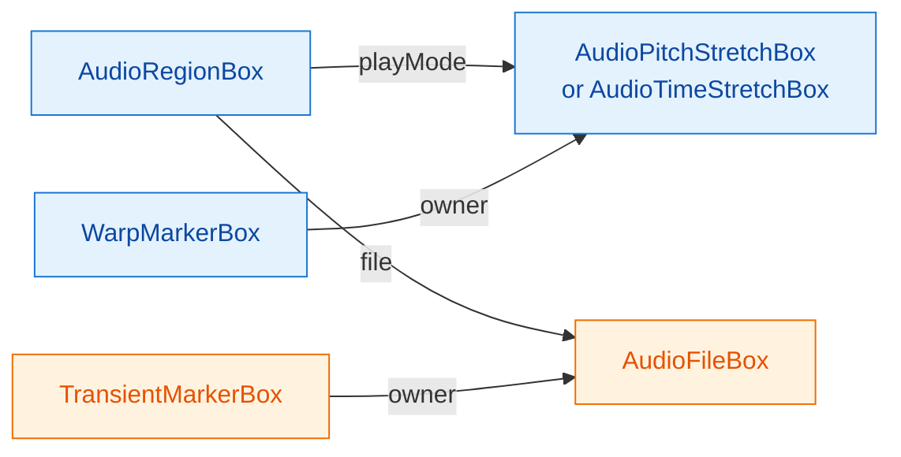

# Time & Pitch

> **Skip if:** you only need plain audio playback (no varispeed, no time-stretch, no pitch shift)
> **Prerequisites:** Ch. 02 (Timing & Tempo), Ch. 05 (Samples, Peaks & Looping), Ch. 09 (Editing & Fades) for `loopOffset` / `loopDuration` interactions

## Table of Contents

- [The Three Audio Play Modes](#the-three-audio-play-modes)
  - [Decision Matrix](#decision-matrix)
  - [Box-Graph Shape](#box-graph-shape)
- [How to Tell What Mode a Region Is In](#how-to-tell-what-mode-a-region-is-in)
- [NoStretch (Default)](#nostretch-default)
- [PitchStretch (Varispeed via Warp Markers)](#pitchstretch-varispeed-via-warp-markers)
- [TimeStretch (Transient-Aware, Independent Pitch)](#timestretch-transient-aware-independent-pitch)
  - [The Three Transient Play Modes](#the-three-transient-play-modes)
  - [Setting Pitch (Cents)](#setting-pitch-cents)
  - [Transient Markers Are Required](#transient-markers-are-required)
- [Warp Markers in Depth](#warp-markers-in-depth)
- [Switching Between Modes](#switching-between-modes)
- [Quality and Limits](#quality-and-limits)
- [MIDI Pitch vs Audio Pitch](#midi-pitch-vs-audio-pitch)
- [Reference Pitch (Concert Tuning)](#reference-pitch-concert-tuning)
- [Demo](#demo)

---

## The Four Audio Play Modes

Every `AudioRegionBox` (and `AudioClipBox`) has an optional `playMode` pointer field that selects how the engine interprets the audio file relative to the timeline:

| Play Mode | Box attached | TimeBase | Pitch ↔ Time | Use for |
|-----------|--------------|----------|--------------|---------|
| **NoStretch** | none (`playMode` is empty) | Seconds | Both fixed at source | Default — plays the file at original speed and pitch |
| **PitchStretch** | `AudioPitchStretchBox` | Musical (PPQN) | Coupled (varispeed) | Tape-style time warps where pitch follows tempo |
| **TimeStretch** | `AudioTimeStretchBox` | Musical (PPQN) | Decoupled | Musical time-stretching with independent pitch (±1 octave), transient-segment playback |
| **Signalsmith** | `AudioSignalsmithBox` | Musical (PPQN) | Decoupled | Spectral time-stretch (Signalsmith phase vocoder) with independent pitch (±24 st) — no transient markers needed |

The play-mode pointer is mandatory-not-mandatory: it's a `pointer` with `mandatory: false`. Leaving it empty *is* a mode — the default — not an error state.

### Decision Matrix

```
Need audio to sync to BPM changes?
│
├── No → NoStretch (default). File plays at original speed; if BPM changes,
│        the audio still plays in real time and "drifts" relative to the grid.
│
└── Yes → Need pitch to stay constant when tempo changes?
         │
         ├── No (varispeed is fine, or desired) → PitchStretch
         │   Cheaper, no transient detection. Good for loops, drones, FX,
         │   or when the tape-stop sound is the point.
         │
         └── Yes (musical time-stretch) → TimeStretch
             Independent pitch via cents (±1200). Transient-aware segment
             playback preserves attacks. Requires transient markers on the file.
```

### Box-Graph Shape

The modes are all built from the same set of boxes; what differs is which box is wired into `region.playMode` and how many markers exist on each side. `AudioSignalsmithBox` has the same shape as `AudioPitchStretchBox` (warp markers, no transient play-modes) plus a `transpose` float field (−24 to +24 semitones) that drives the phase vocoder's spectral pitch shift.



**Blue boxes are per-region** (each region gets its own). **Orange boxes are per-file** (shared by every region that references this file). Two scoping rules to remember:

- **Warp markers** are owned by the play-mode box, which is owned by the region → per-region. Two regions over the same audio file can warp time differently.
- **Transient markers** are owned by the `AudioFileBox` → per-file. Detect once, every region pointing at that file gets them. This is why `ensureTransientMarkers` (helper in `src/lib/transientDetection.ts`) keys on the file box — re-detection is wasted work.

---

## How to Tell What Mode a Region Is In

`AudioRegionBoxAdapter` exposes three predicates plus a unified warp-marker accessor:

```typescript
import type { AudioRegionBoxAdapter } from "@opendaw/studio-adapters";

const region: AudioRegionBoxAdapter = /* ... */;

if (region.isPlayModeNoStretch) {
  // Plain playback. No warp markers, TimeBase.Seconds.
}

region.asPlayModePitchStretch.ifSome(adapter => {
  // adapter: AudioPitchStretchBoxAdapter
  const markers = adapter.warpMarkers.asArray();
});

region.asPlayModeTimeStretch.ifSome(adapter => {
  // adapter: AudioTimeStretchBoxAdapter
  const cents = adapter.cents;                 // -1200..+1200
  const mode = adapter.transientPlayMode;      // Once | Repeat | Pingpong
  const markers = adapter.warpMarkers.asArray();
});

region.asPlayModeSignalsmith.ifSome(adapter => {
  // adapter: AudioSignalsmithBoxAdapter
  const st = adapter.transpose;                // -24..+24 semitones (box field)
  const cents = adapter.cents;                 // transpose expressed in cents
  const markers = adapter.warpMarkers.asArray();
});

// Mode-agnostic warp markers (Option<EventCollection<WarpMarkerBoxAdapter>>):
region.optWarpMarkers.ifSome(markers => {
  // Works for PitchStretch, TimeStretch, and Signalsmith.
});

// React to mode changes:
const sub = region.observableOptPlayMode.subscribe(mode => {
  // mode: Option<AudioPlayMode> — fires whenever playMode is added/removed/swapped.
});
```

The `Option<T>` rules from Ch. 04 apply: always `.isEmpty()` / `.ifSome()` / `.unwrap()` — never `?.` or `??` on Option values.

---

## NoStretch (Default)

When `regionBox.playMode` has no target, the engine plays the audio at the source sample rate. The region's `timeBase` should be `TimeBase.Seconds` so `duration`, `loopOffset`, and `loopDuration` are stored in seconds — they need to be insensitive to BPM changes, since the audio is too.

```typescript
import { TimeBase } from "@opendaw/lib-dsp";
import { AudioRegionBox, ValueEventCollectionBox } from "@opendaw/studio-boxes";
import { UUID } from "@opendaw/lib-std";

project.editing.modify(() => {
  const events = ValueEventCollectionBox.create(project.boxGraph, UUID.generate());
  AudioRegionBox.create(project.boxGraph, UUID.generate(), box => {
    box.position.setValue(0);
    box.duration.setValue(audioDurationSeconds);
    box.loopDuration.setValue(audioDurationSeconds);
    box.regions.refer(trackBox.regions);
    box.file.refer(audioFileBox);
    box.events.refer(events.owners);
    box.timeBase.setValue(TimeBase.Seconds);
    // box.playMode left empty → NoStretch
  });
});
```

This is what `loadTracksFromFiles` (Ch. 05) produces by default. If you only need playback, you can stop here.

---

## PitchStretch (Varispeed via Warp Markers)

`AudioPitchStretchBox` has exactly one field: a `warpMarkers` collection. Each `WarpMarkerBox` is a `(position: PPQN, seconds: file-seconds)` pair. The engine linearly interpolates between consecutive markers to map timeline PPQN to a position in the audio file, and reads samples at whatever rate that mapping implies.

**What that means audibly:** if you double the region's PPQN length without moving the markers, the timeline-to-seconds slope halves — the file plays at half speed, an octave down. Halve the region length and it plays double-speed, an octave up. Pitch tracks tempo. This is the "tape vari-speed" sound.

### Minimum setup: two markers

For a region that should play the whole file in tempo-locked sync, you need an anchor at each end:

```typescript
import { AudioPitchStretchBox, WarpMarkerBox } from "@opendaw/studio-boxes";
import { TimeBase, PPQN } from "@opendaw/lib-dsp";
import { UUID } from "@opendaw/lib-std";

project.editing.modify(() => {
  const stretch = AudioPitchStretchBox.create(project.boxGraph, UUID.generate());

  // Anchor 1: timeline PPQN 0 → file second 0
  WarpMarkerBox.create(project.boxGraph, UUID.generate(), m => {
    m.owner.refer(stretch.warpMarkers);
    m.position.setValue(0);
    m.seconds.setValue(0);
  });
  // Anchor 2: timeline PPQN = full duration → file second = full duration
  WarpMarkerBox.create(project.boxGraph, UUID.generate(), m => {
    m.owner.refer(stretch.warpMarkers);
    m.position.setValue(Math.round(durationPPQN));
    m.seconds.setValue(durationSeconds);
  });

  regionBox.timeBase.setValue(TimeBase.Musical);
  regionBox.playMode.refer(stretch);
});
```

`WarpMarkerBox.position` is `Int32` (PPQN), so always `Math.round()` floats before assigning — same rule as `AudioRegionBox.position` (see Ch. 09).

### Adding internal markers to lock specific moments

Drop a marker at any beat you want to "pin" to a specific moment in the file. Between consecutive markers the playback rate is constant — so three markers carve the region into two zones, each with its own implicit playback rate. This is how DAWs implement "warp this downbeat onto bar 5" workflows.

---

## TimeStretch (Transient-Aware, Independent Pitch)

`AudioTimeStretchBox` adds two fields on top of `warpMarkers`:

| Field | Type | Range | Default |
|-------|------|-------|---------|
| `warpMarkers` | pointer collection | — | — |
| `transientPlayMode` | enum `int32` | `Once` / `Repeat` / `Pingpong` | `Pingpong` |
| `playbackRate` | `float32` | positive (box constraint); ±1 octave / `[0.5, 2.0]` is an adapter convention — see below | `1.0` |

Warp markers still control timing the same way as PitchStretch — what changes is *how the file is read between transients*. Instead of reading samples at the rate implied by the warp curve, the engine plays each transient-bounded segment at the chosen `playbackRate` (pitch) and uses transient markers as resynchronization points. When the timeline asks for more time than a segment provides at this rate, the segment loops, pingpongs, or stops — that's the `transientPlayMode`.

The net effect: pitch and time are decoupled. You can pitch a drum loop down a fifth without slowing it down.

### The Three Transient Play Modes

```typescript
import { TransientPlayMode } from "@opendaw/studio-enums";

// TransientPlayMode.Once       → play segment to end, then silence until next transient
// TransientPlayMode.Repeat     → loop segment from start until next transient
// TransientPlayMode.Pingpong   → ping-pong inside the segment (default)
```

Choose by material:

| Material | Suggested mode | Why |
|----------|----------------|-----|
| Drum loops | `Pingpong` (default) | Smooth fills between hits without obvious looping |
| Sustained chords / pads | `Repeat` | The loop is the sound; ping-pong introduces motion that pads shouldn't have |
| Plucked / percussive one-shots | `Once` | A stretched piano note shouldn't restart mid-decay |

### Setting Pitch (Cents)

The adapter exposes a `cents` setter that converts to the underlying `playbackRate` and applies the ±1 octave clamp:

```typescript
project.editing.modify(() => {
  timeStretchAdapter.cents = 700;   // +7 semitones (a fifth up); playbackRate ≈ 1.498
  timeStretchAdapter.cents = -1200; // one octave down (clamped); playbackRate = 0.5
  timeStretchAdapter.cents = 1500;  // clamped to +1200 (playbackRate = 2.0)
});

const current = timeStretchAdapter.cents; // log2(playbackRate) * 1200
```

The clamp lives in `AudioTimeStretchBoxAdapter.cents`, not the box schema — the box constraint on `playbackRate` is just `"positive"`. If you write `box.playbackRate.setValue(5.0)` directly, the box accepts it and `adapter.playbackRate` returns `5.0`; `adapter.cents` will then read back as `~2787` instead of clamping. **Set via `cents` (or mirror the `[0.5, 2.0]` clamp yourself if you go through the field) to stay inside the adapter's expected range.**

If you need to read the raw rate (e.g. when persisting a project), use `timeStretchAdapter.playbackRate` — it returns the float that's actually stored on the box.

### Transient Markers Are Required

The engine needs `TransientMarkerBox` entries on the `AudioFileBox` (not on the region) to know where it can splice without clicks. With fewer than two markers the engine produces no output for TimeStretch regions; **for any musical material you want ≥2 markers** — typically dozens, one per onset.

Markers are stored on the *file* box, so they're shared by every region that references the same audio file. You have three ways to populate them.

#### What you'll get back from detection

Before you build UI around `Workers.Transients.detect()`, it helps to know the shape of its output:

| Property | Behaviour |
|----------|-----------|
| **Output unit** | Floating-point seconds, relative to the start of the file (not PPQN, not samples). Write them to `TransientMarkerBox.position` directly. |
| **Always includes endpoints** | The first entry is `0.0` (file start) and the last is the file's end. Even a silent file returns at least these two anchors, so `positions.length === 2` means "no internal onsets found." |
| **Density ceiling** | Hard-capped at `40 × duration_seconds` markers (plus the two endpoints). A 1-second clip can't exceed 42 markers; a 30-second loop can't exceed 1,202. The cap is enforced by keeping the highest-energy onsets and discarding weaker ones. |
| **Minimum spacing** | No two adjacent markers will be closer than ~120 ms. The detector keeps the louder one when candidates overlap inside that window. So a busy 32nd-note hi-hat at 240 BPM (intervals of ~62 ms) is *under-marked by design* — the detector treats it as one event per 120 ms window. |
| **Typical real counts** | A 30-second drum loop: ~60–150 markers depending on density. A 30-second sustained pad: 5–20 (mostly the endpoints plus a few crests). A 4-minute vocal: a few hundred. The 1,200 ceiling is rarely approached in practice — material that dense exhausts the minimum-spacing rule long before the density cap. |
| **Zero internal onsets** | Possible on pure tones, very quiet ambiences, or fully-faded material. The result is still `[0.0, duration]` — never an empty array. TimeStretch on such material plays back as a single long segment. |
| **Stability across runs** | Deterministic: same `AudioData` in → same `number[]` out. There's no random seeding, no analysis window jitter. |
| **Cost** | Roughly real-time (a 30-second file takes ~0.3 s on a modern laptop). The worker logs its realtime factor on each run. |

The internals chapter has the full algorithm: weighted multi-band onset detection, valley-snap refinement, and the strict-increasing dedup guard — see [Internals Ch. 08 — Time & Pitch](./internals/08-time-and-pitch.md#transient-detection-algorithm).

#### Per-file caching: re-detection is wasted

Because markers belong to the `AudioFileBox`, every region that references that file shares the same detection result. Detecting twice for the same file is pure work, so always guard with the idempotency check:

```typescript
// Engine minimum is two markers — treat 0 or 1 as "not yet detected".
if (audioFileBox.transientMarkers.pointerHub.incoming().length >= 2) {
  // Already detected — nothing to do.
  return;
}
```

The SDK's own `AudioContentModifier.toTimeStretch` guards the same way before calling `Workers.Transients.detect()`, though with a looser threshold — it skips when *any* markers exist. The demo's `ensureTransientMarkers` helper requires at least two (the engine's minimum) and re-detects a file carrying a single stale marker. The cost of *checking* is negligible; the cost of re-detecting a 4-minute track every time a user flips a region mode is not.


#### Option 1 — `Workers.Transients.detect()` (recommended)

The SDK ships an onset-detection worker that takes `AudioData` and returns `Promise<number[]>` (positions in file seconds). This is what `AudioContentModifier.toTimeStretch` calls internally when a user flips a region into TimeStretch mode in the studio app. Non-blocking, format-agnostic — feeds on `AudioData`, which you can derive from any browser-decoded `AudioBuffer` (MP3, WAV, OGG, FLAC, M4A — anything `decodeAudioData` accepts).

```typescript
import { Workers } from "@opendaw/studio-core";
import { AudioData } from "@opendaw/lib-dsp";
import { TransientMarkerBox } from "@opendaw/studio-boxes";
import { UUID } from "@opendaw/lib-std";

// 1. Convert AudioBuffer → AudioData (SharedArrayBuffer-backed)
function audioBufferToAudioData(buffer: AudioBuffer): AudioData {
  const { numberOfChannels, length: numberOfFrames, sampleRate } = buffer;
  const audioData = AudioData.create(sampleRate, numberOfFrames, numberOfChannels);
  for (let channel = 0; channel < numberOfChannels; channel++) {
    audioData.frames[channel].set(buffer.getChannelData(channel));
  }
  return audioData;
}

// 2. Detect (worker — does not block the main thread)
const positions: number[] = await Workers.Transients.detect(
  audioBufferToAudioData(audioBuffer)
);

// 3. Write the markers (single transaction)
project.editing.modify(() => {
  positions.forEach(seconds => {
    TransientMarkerBox.create(project.boxGraph, UUID.generate(), m => {
      m.owner.refer(audioFileBox.transientMarkers);
      m.position.setValue(seconds);
    });
  });
});
```

#### Option 2 — `TransientDetector.detect()` (synchronous, main thread)

For tests, server-side rendering, or short clips where worker round-trip cost matters more than UI responsiveness:

```typescript
import { TransientDetector } from "@opendaw/lib-dsp";

const positions: number[] = TransientDetector.detect(audioData);
```

Same return shape as the worker version. Blocks the main thread for the duration of analysis — fine for clips under ~1 second, painful for 5-minute songs.

#### Option 3 — Set them manually

If you already know where the transients are (imported markers, user-drawn beat grid, MIR pipeline output):

```typescript
project.editing.modify(() => {
  [0.0, 0.512, 0.998, 1.487].forEach(seconds => {
    TransientMarkerBox.create(project.boxGraph, UUID.generate(), m => {
      m.owner.refer(audioFileBox.transientMarkers);
      m.position.setValue(seconds);
    });
  });
});
```

#### Pattern: a format-agnostic "any file → ready for TimeStretch" API

A common need is to wrap this in an internal service: user uploads any audio file → service returns it with transient markers populated. The shape is small:

```typescript
import { Workers } from "@opendaw/studio-core";
import { AudioData } from "@opendaw/lib-dsp";
import { AudioFileBox, TransientMarkerBox } from "@opendaw/studio-boxes";
import { Project } from "@opendaw/studio-core";
import { UUID } from "@opendaw/lib-std";

export async function ensureTransientMarkers(
  project: Project,
  audioFileBox: AudioFileBox,
  buffer: AudioBuffer
): Promise<number[]> {
  // Idempotent: files that already meet the engine's two-marker minimum are
  // returned as-is. A single stale marker falls through to re-detection —
  // the engine renders silence below two markers anyway.
  const existing = audioFileBox.transientMarkers.pointerHub.incoming();
  if (existing.length >= 2) {
    return existing.map(p => (p.box as TransientMarkerBox).position.getValue());
  }

  const audioData = audioBufferToAudioData(buffer);
  const positions = await Workers.Transients.detect(audioData);
  if (positions.length < 2) {
    throw new Error(
      "Transient detection returned fewer than two positions — " +
      "TimeStretch renders silence below the engine's two-marker minimum."
    );
  }

  project.editing.modify(() => {
    // True replace: remove any stale marker first. Re-detection is
    // deterministic, so a surviving old marker would collide position-for-
    // position with a fresh one — and EventCollection panics on duplicates.
    existing.forEach(p => project.boxGraph.unstageBox(p.box));
    positions.forEach(seconds => {
      TransientMarkerBox.create(project.boxGraph, UUID.generate(), m => {
        m.owner.refer(audioFileBox.transientMarkers);
        m.position.setValue(seconds);
      });
    });
  });

  return positions;
}
```

Call it once per file — after the upload completes, or lazily on the first TimeStretch mode switch. The demo wraps this pattern in `src/lib/transientDetection.ts` and calls it on every mode-flip; the idempotency check means subsequent flips skip detection.

#### Reading existing markers via the adapter

When you have a region adapter rather than a raw box, the path is shorter — the `AudioFileBoxAdapter` already exposes the loaded data:

```typescript
import { AudioFileBoxAdapter } from "@opendaw/studio-adapters";

const fileAdapter = project.boxAdapters.adapterFor(audioFileBox, AudioFileBoxAdapter);

// Wait for the sample loader to finish:
const audioData = await fileAdapter.audioData;

// Read existing markers (no detection needed):
const existing = fileAdapter.transients.asArray().map(m => m.position);

// Or detect new ones:
const detected = await Workers.Transients.detect(audioData);
```

`fileAdapter.audioData` is `Promise<AudioData>` — it resolves once the sample loader has produced the SharedArrayBuffer-backed copy. `fileAdapter.data` is the synchronous `Option<AudioData>` if you want to check without awaiting.

---

## Warp Markers in Depth

A `WarpMarkerBox` is two fields:

| Field | Type | Unit |
|-------|------|------|
| `position` | `int32` | PPQN (region-local timeline position) |
| `seconds` | `float32` (≥ 0) | Position within the audio file |

Markers belong to a play-mode box via the `owner` pointer, so they reference *up* into the stretch box, not down from it. To enumerate them, go through the adapter:

```typescript
// Via the unified accessor
region.optWarpMarkers.ifSome(collection => {
  collection.asArray().forEach(marker => {
    console.log(JSON.stringify({
      ppqn: marker.position,
      seconds: marker.seconds,
    }));
  });
});
```

**Practical rules:**

- Always have a marker at PPQN 0 (or near it) and at the region's full duration. Without anchors at both ends, the linear interpolation has no slope at the edges and the engine bails.
- Between any two consecutive markers the playback rate is constant. Add more markers to "lock" beats; remove them to let the rate flow.
- Sort order is by PPQN — the SDK keeps the collection ordered for you via `MarkerComparator`.

---

## Switching Between Modes

Mode transitions aren't a single field write — the warp markers belong to the *old* play-mode box and need to be re-owned (or copied) onto the new one. The studio app's internal `AudioContentModifier` does this; the pattern boils down to:

```typescript
// PitchStretch → TimeStretch (preserving existing warp markers)
project.editing.modify(() => {
  const oldStretch = region.asPlayModePitchStretch.unwrap();
  const timeStretch = AudioTimeStretchBox.create(project.boxGraph, UUID.generate(), box => {
    box.transientPlayMode.setValue(TransientPlayMode.Pingpong);
    box.playbackRate.setValue(1.0);
  });

  // 1. Re-route the region pointer FIRST. `refer` replaces the old target
  //    atomically — no `defer()` needed and no race.
  region.box.playMode.refer(timeStretch);

  // 2. Re-own each marker to the new stretch box. Markers point UP to their
  //    play-mode owner via WarpMarkerBox.owner.
  oldStretch.warpMarkers.asArray().forEach(({ box: marker }) =>
    marker.owner.refer(timeStretch.warpMarkers)
  );

  // 3. Now the old box has no incoming references — safe to delete.
  oldStretch.box.delete();
});
```

If you don't want to share — for example you're cloning a region and want the new region's stretch to be independent — copy each marker instead:

```typescript
oldStretch.warpMarkers.asArray().forEach(({ box: source }) =>
  WarpMarkerBox.create(project.boxGraph, UUID.generate(), copy => {
    copy.position.setValue(source.position.getValue());
    copy.seconds.setValue(source.seconds.getValue());
    copy.owner.refer(timeStretch.warpMarkers);
  })
);
```

Going to `NoStretch` is simpler: clear the pointer, delete the orphan box, and flip the time base back:

```typescript
project.editing.modify(() => {
  const audibleSeconds = region.optWarpMarkers
    .mapOr(markers => markers.last()?.seconds ?? 0, 0);

  region.box.playMode.defer();
  // Any unreferenced AudioPitchStretchBox / AudioTimeStretchBox can be deleted here.
  region.box.timeBase.setValue(TimeBase.Seconds);
  region.box.duration.setValue(audibleSeconds);
  region.box.loopOffset.setValue(0);
  region.box.loopDuration.setValue(audibleSeconds);
});
```

**One transaction is fine — order matters.** Mode flips work in a single `editing.modify()` if you follow the SDK's own ordering (used by `AudioContentModifier.toPitchStretch` / `toTimeStretch` / `toSignalsmith` in `@opendaw/studio-core` — all three now share an `adoptWarpMarkers` helper that re-owns or clones the old mode's markers):

1. Create the new stretch box.
2. `region.playMode.refer(newBox)` — `refer` replaces the existing target cleanly; **no `defer()` first**.
3. Re-own or copy the old box's warp markers onto the new one.
4. Delete the old box.
5. Flip `timeBase` to `Musical`.

The `createInstrument` + `output.refer` race documented in Ch. 04 is a different shape: it re-routes a pointer that `createInstrument`'s internal transaction has *already set* during the same `editing.modify()`. Play-mode swaps update a pointer on an existing region with `refer()` directly, which the box graph resolves atomically. If you do explicitly `defer()` first and then `refer(newBox)` later in the same transaction, you can recreate the createInstrument-style race — so just don't: skip the `defer()` and let `refer()` do the swap.

---

## Quality and Limits

| Property | Limit |
|----------|-------|
| Pitch range (TimeStretch) | ±1200 cents (±1 octave) **via `AudioTimeStretchBoxAdapter.cents`**. The underlying `playbackRate` field has only a `"positive"` constraint — writing `box.playbackRate.setValue(5.0)` directly bypasses the clamp and is silently accepted. Use the adapter setter or mirror its `[0.5, 2.0]` clamp. |
| Pitch automation | Not supported — `playbackRate` is a scalar field, not an automatable target. To automate pitch over time, draw it on a MIDI note region driving a sampler (Ch. 16). |
| Formant preservation | Not implemented. Vocals will "chipmunk" up and "darken" down. |
| Real-time interpolation | Linear only. Aliasing audible at extreme rates. |
| Transient segment crossfade | Fixed at `VOICE_FADE_DURATION = 0.020` (20 ms). On very short segments (<40 ms) the crossfade can soften attacks audibly — choose `Once` mode or thin the transient markers. |
| TimeStretch without transients | Fewer than 2 markers → silence (`transients.length() < 2` bails before sequencing). ≥2 markers is what musical material wants. |
| PitchStretch without warp markers | Needs ≥2 anchors to define a slope; otherwise no output. |
| Mode flips | Single transaction works if you follow the SDK ordering above; `refer()` replaces the old pointer without a prior `defer()`. |

---

## MIDI Pitch vs Audio Pitch

Audio pitch (this chapter) lives on `AudioRegionBox.playMode`. **MIDI note pitch** lives on `NoteEvent.pitch` (semitone) and `NoteEvent.cent` (fine tuning) inside note regions, and is independent of everything described here. The MIDI Pitch effect listed in Ch. 11 is a MIDI-effect device — it transposes incoming note events before they reach an instrument; it does not touch any audio.

If you need to pitch-shift a sample for *playback*, use a sampler instrument (Vaporisateur, Soundfont, Playfield — see Ch. 17 for the modular ones) and drive it with MIDI notes. The samplers do their own pitch ratio computation from MIDI note + cent + root key, and they're the only path today that supports *time-varying* pitch.

---

## Reference Pitch (Concert Tuning)

Every project has a global reference pitch — the frequency that the MIDI note `A4` (note 69) maps to. The Western default is `440 Hz`. Orchestras and historical / non-Western tunings use other values: `432 Hz` (sometimes called "Verdi tuning"), `442 Hz` and `443 Hz` (common in European orchestras), `415 Hz` (Baroque). The SDK exposes this as a single Float32 field on the root box.

| Where | What |
|-------|------|
| Field | `project.rootBox.baseFrequency` (`Float32Field`) |
| Range constant | `BaseFrequencyRange` from `@opendaw/studio-adapters` — `{ min: 400, max: 480, default: 440.0 }` |
| Validator | `Validator.clampBaseFrequency(hz)` from `@opendaw/studio-adapters` — clamps to range, falls back to default for non-finite input |
| Read | `project.rootBox.baseFrequency.getValue()` (synchronous) |
| Write | inside `editing.modify()`, like any other box-graph field |

### What the SDK does with `baseFrequency`

Only one place inside the engine consumes it today: **the MIDI synth instruments**. The pitch utilities in `@opendaw/lib-dsp` all accept it as an optional parameter:

```typescript
import { midiToHz, hzToMidi, semitoneToHz, hzToSemitone } from "@opendaw/lib-dsp";

midiToHz(69, 440);   // 440  (A4 at standard tuning)
midiToHz(69, 443);   // 443  (A4 at A=443)
midiToHz(60, 440);   // 261.626 (middle C at standard tuning)
midiToHz(60, 443);   // 263.408 (middle C at A=443 — sharp by ~11.76 cents)
```

The Vaporisateur instrument calls `midiToHz(event.pitch + event.cent / 100.0, context.baseFrequency)` to compute oscillator frequency per note, so retuning the project shifts everything the synth plays. Other future MIDI instruments will conventionally do the same.

### What `baseFrequency` does NOT do

It does **not** retune audio files. `AudioRegionBox` playback reads samples from an `AudioFileBox` at whatever rate the play-mode dictates (`NoStretch` → file's source rate, `PitchStretch` → derived from warp markers + tempo, `TimeStretch` → `playbackRate` field). None of those paths multiply by `baseFrequency`.

If you want a project-wide concert pitch to be audible on audio files, you have to translate the tuning offset into the equivalent **cents shift** and apply it via TimeStretch. Compute the shift relative to whatever baseline you treat as "no retune" — that's typically the value `baseFrequency` had when the project loaded (so the file plays at source rate when the slider matches the project's authored tuning), not the Western convention of 440:

```typescript
// Capture once when the project loads:
const baselineHz = project.rootBox.baseFrequency.getValue();

// Per change:
const tuningCents = 1200 * Math.log2(referenceHz / baselineHz);  // 0 at the loaded value
const totalCents = userCents + tuningCents;                      // combine with user cents slider
const playbackRate = Math.pow(2, totalCents / 1200);             // TimeStretch field
// Clamp to AudioTimeStretchBoxAdapter.cents' ±1200 range:
const clamped = Math.min(2.0, Math.max(0.5, playbackRate));
box.playbackRate.setValue(clamped);
```

This is what the Time & Pitch demo does: it reads `rootBox.baseFrequency` at init and captures it as the cents-shift baseline, so a project saved at A=443 (or any other value in `BaseFrequencyRange`) plays at source rate when the slider sits at 443. Changing the **Reference Pitch (A4)** slider writes `rootBox.baseFrequency`, auto-engages a `TimeStretchBox` if the region is currently in `NoStretch` or `PitchStretch` mode, and recomputes `playbackRate` so the audio file's pitch follows the project tuning. The auto-engage is a demo-UX shortcut — in a real app you'd typically let the user choose when to engage TimeStretch and only update `playbackRate` if it's already attached; raw `baseFrequency` writes are always safe (they persist and retune MIDI synths regardless of mode).

### Pattern: a single transaction for both writes

Because both writes target the same box graph, do them inside one `editing.modify()`:

```typescript
project.editing.modify(() => {
  project.rootBox.baseFrequency.setValue(referenceHz);
  if (timeStretchBox) {
    timeStretchBox.playbackRate.setValue(clampedRate);
  }
});
```

One transaction = one undo entry, and the engine never sees an intermediate state where the project says "A = 443" but the stretch box still reads at `440`-based rate.

---

## Demo

[**Time & Pitch Demo →**](https://opendaw-test.pages.dev/time-pitch-demo.html) — switch a region between the three play modes, adjust cents on the TimeStretch path, and retune the project reference pitch (A4) from 400 to 480 Hz. Source: `src/demos/playback/time-pitch-demo.tsx`.

---

## Cross-References

- **Ch. 02** — Tempo automation. Tempo changes interact with all play modes: NoStretch ignores them (audio plays in real time); PitchStretch, TimeStretch, and Signalsmith follow the tempo because their durations are stored in PPQN.
- **Ch. 05** — `loopOffset` / `loopDuration` semantics; both are interpreted as PPQN when a play-mode is attached (Musical timebase), or as seconds in NoStretch.
- **Ch. 09** — Region editing and fades. `loopOffset` is region-local in both timebases, but the underlying file-position math differs: NoStretch uses `waveformOffset` directly; PitchStretch / TimeStretch use the warp-marker mapping.
- **Ch. 16** — MIDI note pitch and the MIDI Pitch effect.
- **Ch. 17** — Sampler instruments (Apparat, Vaporisateur) for time-varying audio pitch via MIDI.
