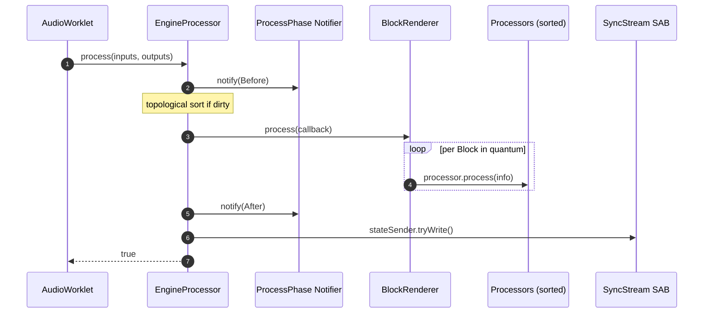

# Engine Processor

> **Audience:** contributors to openDAW. This chapter explains how the AudioWorkletProcessor that runs the engine is structured, so you can change it without breaking it.
>
> **Prereqs:** read [`00-system-architecture`](../00-system-architecture.md) for the thread model and [`03-animation-frame`](../03-animation-frame.md) for how the main thread observes state. This chapter assumes you know what an `AudioWorkletProcessor` is.

The engine processor is the real-time audio brain of openDAW. It lives in `packages/studio/core-processors/` and runs in the AudioWorklet thread, ticking once every 128 samples and producing a stereo output buffer. Everything else — clip sequencing, MIDI dispatch, effects, automation — is structured to feed that one render loop.

## Registration

Three processors are registered with the Web Audio API when the worklet module loads (`packages/studio/core-processors/src/register.ts`):

```typescript
registerProcessor("meter-processor", MeterProcessor)
registerProcessor("engine-processor", EngineProcessor)
registerProcessor("recording-processor", RecordingProcessor)
```

`engine-processor` is the one this chapter is about. The other two are siblings: `meter-processor` writes peak meters to a `SharedArrayBuffer` for the UI, and `recording-processor` captures input audio.

The main thread instantiates the worklet via `EngineWorklet` (an `AudioWorkletNode`) which passes `processorOptions` containing the serialized project, three `SharedArrayBuffer`s (sync stream, control flags, HR clock), and an optional stem-export configuration.

## The Process Loop

The audio thread invokes `process()` once per render quantum (128 frames). Each invocation walks a fixed sequence — wiring phase, topological-sort cache, block rendering, state publication:



The implementation is a thin wrapper around `render()`:

```typescript
// packages/studio/core-processors/src/EngineProcessor.ts:350
process(inputs: Float32Array[][], outputs: Float32Array[][]): boolean {
    if (!this.#valid) {return false}                               // dead processor
    if (Atomics.load(this.#controlFlags, 0) === 1) {return true}   // sleeping
    try {
        return this.render(inputs, outputs)
    } catch (reason: any) {
        this.#valid = false
        this.#engineToClient.error(reason)
        this.terminate()
        return false
    }
}
```

Three behaviours to notice:

1. **Invalidity is permanent.** Returning `false` from `process()` tells the Web Audio API to release the processor — the node never wakes up again. The engine sets `#valid = false` only on unrecoverable error.
2. **Sleep is cooperative.** When the main thread sets the control-flag word to `1`, the processor returns `true` without rendering. This is how `Engine.sleep()` is implemented without tearing down the AudioContext.
3. **Errors are caught.** Any exception out of `render()` invalidates the engine, reports back to the main thread, and terminates. There is no retry.

### `render()` — what happens each tick

`render()` (`EngineProcessor.ts:364`) is the actual work. Stripped of metrics and exports, the flow is:

```typescript
this.#notifier.notify(ProcessPhase.Before)              // wiring phase

if (this.#processQueue.isEmpty()) {
    this.#audioGraphSorting.update()
    this.#processQueue = Option.wrap(
        this.#audioGraphSorting.sorted().concat()
    )
}
const processors = this.#processQueue.unwrap()

this.#renderer.process(processInfo => {                 // BlockRenderer
    processors.forEach(p => p.process(processInfo))
    if (metronomeEnabled) this.#metronome.process(processInfo)
})

this.#notifier.notify(ProcessPhase.After)               // cleanup phase
this.#clipSequencing.changes().ifSome(c => this.#engineToClient.notifyClipSequenceChanges(c))
this.#stateSender.tryWrite()                            // publish to UI
this.#liveStreamBroadcaster.flush()
```

In words:

1. **Phase: Before.** Anything that needs to rewire (a device chain reacting to a new effect insertion) listens here. The phase is broadcast via `subscribeProcessPhase()` on `EngineContext`.
2. **Topological sort, cached.** The audio graph is a `Graph<Processor>` with vertices for every processor and edges for every connection. `registerProcessor()` and `registerEdge()` invalidate `#processQueue`, forcing a re-sort on the next tick. Steady-state, the same array is reused.
3. **BlockRenderer drives time.** `#renderer.process(callback)` subdivides the 128-frame quantum by timeline events and calls `callback` once per sub-block (see [BlockRenderer](#blockrenderer) below). Each processor's `process()` runs once per sub-block, in topo order.
4. **Phase: After.** Used by processors that need to publish state at the end of a tick.
5. **State publication.** `#stateSender.tryWrite()` writes the new playhead position, meter levels, and other observable state into the sync `SharedArrayBuffer`. `#liveStreamBroadcaster.flush()` sends spectrum/waveform broadcasts.

### Why a topological sort?

Audio flows through a directed graph: instrument → effect → effect → channel strip → master. Each processor reads its inputs and writes its output, so dependencies must be processed before their consumers. `registerEdge(source, target)` declares "source must run before target". The cached `#processQueue` is just that order linearized.

When you add a new processor in a contribution, you almost never sort manually — you register vertices and edges and let `audioGraphSorting.update()` do the rest. Topology changes invalidate the cache (`this.#processQueue = Option.None`) and the sort recomputes on the next tick.

## BlockRenderer

`packages/studio/core-processors/src/BlockRenderer.ts` advances the timeline. Its job: turn one render quantum (128 samples) into a sequence of `Block`s — contiguous spans of audio inside which tempo, marker, loop, and callback state is constant.

A `Block` carries the four numbers a processor needs to do its work:

| Field | Meaning |
|---|---|
| `p0`, `p1` | start and end position in PPQN (musical time) |
| `s0`, `s1` | start and end index in samples (within the 128-frame quantum) |
| `bpm` | tempo for this sub-block |
| `flags` | bitfield: transporting, playing, discontinuous, bpmChanged |

The block production logic (`BlockRenderer.process()`, line 77 onward) is a loop that consumes the 128 frames by finding the *next* timeline event and slicing the block at that point. Events, in evaluation order:

1. **Markers** — labelled timeline points; advancing past one may set a new active marker and trigger repeat counts.
2. **Loop boundary** — when playback crosses `loopArea.to`, jump back to `loopArea.from` (or pause, if `pauseOnLoopDisabled` is set).
3. **Callbacks** — anything registered via `setCallback(position, fn)` runs at exactly the given PPQN.
4. **Tempo automation** — sampled on a `TempoChangeGrid` quantization; emits a `tempo` action whenever the BPM at the next grid boundary differs from the current.

For each iteration:

- Compute the candidate `p1` assuming the full remaining quantum runs at the current BPM (`p1 = p0 + PPQN.samplesToPulses(remainingSamples, bpm, sampleRate)`).
- Check the four event categories above; the earliest event in `[p0, p1)` "wins".
- If no event: emit a Block spanning the full remainder and finish.
- If an event: emit a Block up to the event position, advance `s0`/`p0` past it, apply the event (loop = jump, marker = update state, tempo = change BPM), and loop.

The output is a `ProcessInfo` containing an array of these `Block`s, which is what every processor's `process()` receives.

### When `transporting` is false

If transport is stopped, no PPQN advance happens. `BlockRenderer.process()` does not iterate; it still calls the procedure once with a zero-duration block so that processors get a chance to run their non-musical work (input monitoring, manual parameter changes). The `#freeRunningPosition` field tracks where playback *would* be if transport were on — relevant for click-track behaviour and for some input-monitoring features.

## ClipSequencing

`packages/studio/core-processors/src/ClipSequencingAudioContext.ts` answers a single question per track: *which clip should be playing right now, and when does it stop?*

The state per track is two slots:

- **`playing`** — the clip currently active on this track (or `None` if silence).
- **`waiting`** — a clip scheduled to take over at the next quantization boundary (or `None` to schedule a stop).

External callers move clips into these slots via `schedulePlay(clipAdapter)` and `scheduleStop(trackAdapter)`. They don't take effect immediately — the transition happens at the next boundary aligned to the previous clip's duration. This is what gives you "launch quantization" in clip-launching DAWs.

The audio thread reads the result through `iterate(trackKey, p0, p1)`, a generator that yields `Section`s — `{from, to, clip | None}` spans covering `[p0, p1)`. Most code just iterates and does the right thing for each section.

Internally `iterate()`:

- If a clip is `waiting` and the playing clip has a duration, the transition position is `quantizeFloor(p1, duration)` — i.e. round down to the previous bar of the playing clip.
- If `playing` is set and looping is on, the section runs to the end of the request range with no stop.
- If `playing` is set and looping is off, the section ends at `clip.position + duration`, and the slot transitions to `None` automatically.

The `changes()` accessor returns and clears three lists (`started`, `stopped`, `obsolete`) so the main thread can sync clip-launch UI state. Called once per render quantum from `EngineProcessor.render()`.

## AudioUnit

`packages/studio/core-processors/src/AudioUnit.ts` is the per-channel processor — one `AudioUnit` per `AudioUnitBox`. It bundles three things:

- **`#midiDeviceChain`** — MIDI scheduling (`NoteSequencer`, MIDI effects, MIDI send/route).
- **`#audioDeviceChain`** — audio effects, sends, channel strip.
- **`#input`** — the source: an `InstrumentDeviceProcessor` (synth, sampler, etc.) for instrument units, or an `AudioBusProcessor` for bus inputs.

The chain wires up as:

```
input → [audio effects] → [aux sends] → channel strip → output
```

The exact wiring depends on three flags on `AudioUnitOptions`:

- `useInstrumentOutput` — bypass effects and channel strip entirely; instrument output is the AudioUnit output. Used for freeze and stem export.
- `skipChannelStrip` — skip the channel strip when frozen audio is present.
- `includeAudioEffects` / `includeSends` — set false for certain bus configurations.

`audioOutput()` returns the right buffer depending on which mode the unit is in:

```typescript
// AudioUnit.ts:53
audioOutput(): AudioBuffer {
    if (this.#useInstrumentOutput) {
        return this.#input.unwrap().audioOutput
    }
    if (this.#skipChannelStrip && this.#preChannelStripSource.nonEmpty()) {
        return this.#preChannelStripSource.unwrap()
    }
    return this.#audioDeviceChain.channelStrip.audioOutput
}
```

### DeviceChain rewiring

When you add or remove an effect, the underlying `AudioDeviceChain` (`packages/studio/core-processors/src/AudioDeviceChain.ts`) must rewire the graph. Rewiring is **not** allowed mid-tick — it's done in the `Before` phase.

`invalidateWiring()` marks the chain dirty; the next `ProcessPhase.Before` notification triggers `#wire()`, which terminates the old edges (the `Terminable` returned by `registerEdge()`) and registers new ones in the right order. Topological sort then picks up the new layout on the next tick.

This phase-based rewiring is why you never see "torn" audio when toggling effects: the AudioWorklet thread is either fully in the old graph or fully in the new one, never half-and-half.

## NoteSequencer

`packages/studio/core-processors/src/NoteSequencer.ts` produces MIDI note start/stop events for each block. It has three sources:

1. **Raw keyboard notes** — `pushRawNoteOn(pitch, velocity)` / `pushRawNoteOff(pitch)`. Held in a `Set<RawNote>` with a gate flag; emitted on the first frame they appear.
2. **Audition notes** — `auditionNote(pitch, duration, velocity)`. One-shots used by piano-roll preview and inspector clicks.
3. **Clip and region notes** — sequenced from `NoteRegionBox` events when transport is running, gated by `ClipSequencing`.

The main entry is a generator:

```typescript
* processNotes(from: ppqn, to: ppqn, flags: int): IterableIterator<NoteLifecycleEvent>
```

It iterates active sections from `context.clipSequencing.iterate()`, then per section walks the `NoteEventCollection` for active clips, applying:

- Clip-loop offset arithmetic (clip start vs. loop offset vs. loop duration).
- Note `chance` (probabilistic skip).
- `playCount` (a single stored note can repeat N times across its duration with a curve transform applied to velocity/pitch).
- Truncation at region end.

The output is a sequence of `NoteLifecycleEvent`s — either a *start* (with pitch, velocity, duration) or a *completion* (release). Downstream `InstrumentDeviceProcessor`s consume these and drive their voicing engines.

Two retainers track which notes are currently held:

- `#retainer: EventSpanRetainer<Id<NoteEvent>>` for clip/region notes.
- `#auditionRetainer: EventSpanRetainer<Id<NoteEvent>>` for one-shot auditions.

When transport stops or the playhead jumps (the `discontinuous` flag), all retained notes are released immediately. This is why scrubbing doesn't leave stuck notes.

## AutomatableParameter and AbstractProcessor

`AutomatableParameter<T>` (`packages/studio/core-processors/src/AutomatableParameter.ts`) wraps a single field whose value can be driven by an automation curve. The contract is one method:

```typescript
updateAutomation(position: ppqn): boolean
```

It samples the underlying `AutomatableParameterFieldAdapter` at `position`. If the resulting value differs from the cached one, it stores the new value and returns `true`. That `true` tells the owning processor "your parameter changed — re-derive any cached coefficients".

`AbstractProcessor` (`packages/studio/core-processors/src/AbstractProcessor.ts`) is the base class every processor extends. It owns the parameter machinery:

```typescript
// AbstractProcessor.ts:37
bindParameter<T extends PrimitiveValues>(
    adapter: AutomatableParameterFieldAdapter<T>
): AutomatableParameter<T>
```

The interesting thing this does is subscribe to the field's pointer hub (`Pointers.Automation`). When an automation lane is connected, the processor automatically:

1. Hooks into the engine-wide `UpdateClock` so it gets per-grid automation update events.
2. Pushes the parameter onto `#automatedParameters`.
3. Calls `parameter.onStartAutomation()` (which enables live streaming for the UI to draw the automation curve playhead).

When the last automation lane is removed, the inverse happens — the processor unsubscribes from the update clock.

`updateParameters(position, relativeBlockTimeInSeconds)` is then called by the processor's own `process()`. It iterates `#automatedParameters`, samples each, and notifies `parameterChanged()` for any that changed.

### AudioProcessor — event-aware block processing

Most concrete processors extend `AudioProcessor` (`packages/studio/core-processors/src/AudioProcessor.ts`), which implements `process(processInfo)` and exposes a simpler contract:

```typescript
abstract processAudio(block: Block): void
introduceBlock(_block: Block): void {}      // optional: called once per Block
handleEvent(_event: Event): void { panic(...) } // optional: receive events
finishProcess(): void {}                    // optional: per-quantum cleanup
```

`AudioProcessor.process()` subdivides each `Block` further by *events* in the processor's event buffer:

1. For each block, copy block parameters into a mutable chunk.
2. For each event in the block's event buffer (ordered by position):
   - Compute the sample index where the event happens (using `PPQN.pulsesToSamples`).
   - Call `processAudio(chunk)` for the audio leading up to it.
   - If it's an `UpdateEvent`, call `updateParameters(event.position, relativeBlockTime)`.
   - Otherwise, call `handleEvent(event)`.
   - Advance the chunk start to the event position.
3. Call `processAudio(chunk)` for any remaining audio after the last event.

This is the layer that makes sample-accurate parameter automation possible: you don't get one cutoff value per 128-frame block, you get the cutoff applied right at the sample where automation said it should change.

## EngineContext and TimeInfo

`EngineContext` (`packages/studio/core-processors/src/EngineContext.ts`) is the **dependency injection bag** for processors. Every processor that needs to call into the engine takes a `context: EngineContext` in its constructor. The interface:

```typescript
interface EngineContext extends BoxAdaptersContext, Terminable {
    get broadcaster(): LiveStreamBroadcaster
    get updateClock(): UpdateClock
    get timeInfo(): TimeInfo
    get mixer(): Mixer
    get engineToClient(): EngineToClient
    get audioOutputBufferRegistry(): AudioOutputBufferRegistry
    get preferences(): PreferencesClient<EngineSettings>
    get baseFrequency(): number

    getAudioUnit(uuid: UUID.Bytes): AudioUnit
    registerProcessor(processor: Processor): Terminable
    registerEdge(source: Processor, target: Processor): Terminable
    subscribeProcessPhase(observer: Observer<ProcessPhase>): Subscription
    awaitResource(promise: Promise<unknown>): void
    ignoresRegion(uuid: UUID.Bytes): boolean
    sendMIDIData(midiDeviceId, data, relativeTimeInMs): void
    getMonitoringChannel(channelIndex: int): Option<Float32Array>
}
```

`EngineProcessor` implements this interface itself, so processors get a back-channel to the engine without circular imports.

`TimeInfo` (`packages/studio/core-processors/src/TimeInfo.ts`) is deliberately tiny — 36 lines:

```typescript
class TimeInfo {
    #position: number = 0.0
    #transporting: boolean = false
    #leap: boolean = false
    isRecording: boolean = false
    isCountingIn: boolean = false
    metronomeEnabled: boolean = false

    set position(value: ppqn) { this.#position = value; this.#leap = true }
    advanceTo(position: ppqn) { this.#position = position }  // no leap flag
    getLeapStateAndReset(): boolean { ... }
    pause(): void { ... }
}
```

Notice the difference between `position = x` (sets `#leap = true`) and `advanceTo(x)` (doesn't). The first is for jumps — clicking the timeline, jumping to a marker — and tells consumers via `getLeapStateAndReset()` that they need to re-evaluate state (release stuck notes, re-pick active clips). `advanceTo()` is what `BlockRenderer` uses during normal forward playback: a smooth advance with no leap flag.

## State publication to the main thread

The engine pushes data back to the main thread two ways:

1. **`SharedArrayBuffer` sync state** — `#stateSender.tryWrite()` packs the new `EngineState` (position, transport flags, BPM, etc.) into a `SyncStream`. The main thread reads this via `SyncStream.reader<EngineState>` in `EngineWorklet`, and polls it from `AnimationFrame.add(...)` in `EngineFacade`. This is the hot path — every render quantum, sub-millisecond.

2. **`MessagePort` notifications** — `#engineToClient` (typed `EngineToClient`) is the RPC channel for events that aren't read-every-frame: clip-launch transitions, errors, log messages, MIDI device events. `notifyClipSequenceChanges(changes)` is the most frequent caller (once per quantum, but only when something changed).

Both channels are set up in `EngineWorklet` (main thread side) and the AudioWorkletNode `port` on the processor side. The sync `SharedArrayBuffer` requires the page to be cross-origin isolated (COOP + COEP headers); without them, `SharedArrayBuffer` constructor throws and the engine can't initialize. See [Ch. 12 — Browser Compatibility](../12-browser-compatibility.md).

## Offline rendering

The same `EngineProcessor` runs in two contexts:

- **Real-time** — instantiated in an `AudioWorkletGlobalScope` via `registerProcessor("engine-processor", EngineProcessor)`. Driven by the audio thread.
- **Offline** — instantiated in a Web Worker by `packages/studio/core-workers/src/offline-engine-main.ts`. Driven by an explicit `step(numSamples)` API.

The offline worker exposes:

```typescript
initialize(enginePort, config)       // build the processor with the project
step(numSamples)                     // render N samples synchronously
render(config)                       // run step() in a loop until silence
stop()
```

This is what mix and stem export use. Because it's the same processor, anything that works in real-time works in export — the difference is purely how time is driven (audio thread vs. worker `step()` calls).

The one wrinkle: offline rendering can't rely on `SharedArrayBuffer` polling because the consumer is a different thread without access to those buffers. The export pipeline reads completed frames from the worker's `step()` return value directly.

## Worker pool

The non-audio Web Workers live in `packages/studio/core-workers/src/workers-main.ts`. They expose three protocols:

- **`OpfsWorker`** — OPFS (Origin Private File System) reads and writes for the persistent cache.
- **`SamplePeakWorker`** — generates peak data (min/max per chunk) from audio frames for waveform rendering.
- **`TransientProtocol`** — onset detection for analysis.

These are plain Web Workers, not AudioWorklets. They're free to allocate, block, and use the standard async APIs — the only constraint is that they don't run on the audio thread.

The audio thread asks for samples via `fetchAudio(uuid)` over `MessagePort` RPC; the main thread routes that to the sample manager, which loads or decodes via these workers, and ships the decoded `AudioData` back to the worklet.

## How to add a new processor

A worked example: suppose you want to add a side-chain compressor as a new audio effect device.

1. **Add the box** — define `SidechainCompressorDeviceBox` under `packages/studio/boxes/`. This is the persistent data shape: fields for threshold, ratio, attack, release, side-chain source pointer.
2. **Add the adapter** — under `packages/studio/adapters/src/devices/effects/`, write a `SidechainCompressorDeviceBoxAdapter` that wraps the box and exposes typed parameter accessors via `AutomatableParameterFieldAdapter`.
3. **Add the processor** — under `packages/studio/core-processors/src/devices/effects/`, write a `SidechainCompressorProcessor` that:
    - Extends `AudioProcessor`.
    - Takes `(context: EngineContext, adapter: SidechainCompressorDeviceBoxAdapter)`.
    - Calls `bindParameter()` for each automatable field in the constructor.
    - Implements `processAudio(block: Block): void` doing the DSP.
    - Implements `parameterChanged(parameter, relativeBlockTime)` to recompute filter coefficients when parameters change mid-block.
    - Optionally `introduceBlock()` / `finishProcess()` for per-block setup/teardown.
    - Registers itself with the engine via `context.registerProcessor(this)` and declares edges with the upstream/downstream processors via `context.registerEdge(prev, this)` + `context.registerEdge(this, next)`.
4. **Register in `DeviceProcessorFactory`** — the engine maps adapter types to processor constructors here. Without this entry, your processor will never be instantiated.
5. **Optional: register a UI** — separate concern, lives in the studio app, not the engine.

The processor will then be picked up by `AudioDeviceChain.#wire()` like any other effect: dropped into the topological sort, processed in dependency order, ready to participate in automation and sub-block events.

## Performance constraints (read these before you write DSP)

The audio thread runs at 44.1 kHz with a 128-sample render quantum, giving you about **2.9 ms** of wall-clock time per `process()` call before you drop audio. Some practical rules from the codebase:

- **Don't allocate.** No `new`, no array literals, no closures created in `processAudio()`. The codebase uses object pools and pre-allocated typed arrays heavily. `MutableBlock` is a single reused object on `AudioProcessor.#chunk`.
- **Don't await.** AudioWorklets can't await Promises in their process loop. Async work happens via `awaitResource(promise)` on the context, which runs on the main thread.
- **No console logging.** Even guarded with `if (DEBUG)`, `console.log` runs and serializes on the audio thread. Use the existing `engineToClient.log()` channel which dispatches via MessagePort.
- **Pre-compute coefficients in `parameterChanged()`, not `processAudio()`.** If you have an IIR filter, derive the coefficients when a parameter changes; the audio loop should be a tight stream of multiplies and adds.
- **Profile with `HRClock`.** When `preferences.settings.debug.dspLoadMeasurement` is on, the engine times each `render()` call into a circular buffer that the UI displays as DSP load. Look there before optimizing.

These are the patterns the rest of the codebase already uses — match them when you add new processors and your code will fit in.

## Further reading

- **`packages/studio/core-processors/src/processing.ts`** — the `Block`, `BlockFlags`, `BlockFlag`, `ProcessInfo`, `ProcessPhase`, `Processor` definitions. Worth reading; it's the small file that defines the engine's data shapes.
- **`packages/studio/core-processors/src/UpdateClock.ts`** — how the automation event clock generates `UpdateEvent`s and dispatches them to processors with bound parameters.
- **`packages/studio/core-processors/src/EventBuffer.ts`** — the per-processor event input buffer used by `AudioProcessor.process()`.
- **`packages/studio/core/src/Engine.ts`** and **`EngineFacade.ts`** — the main-thread side that hosts the worklet and exposes Observables to the UI.
