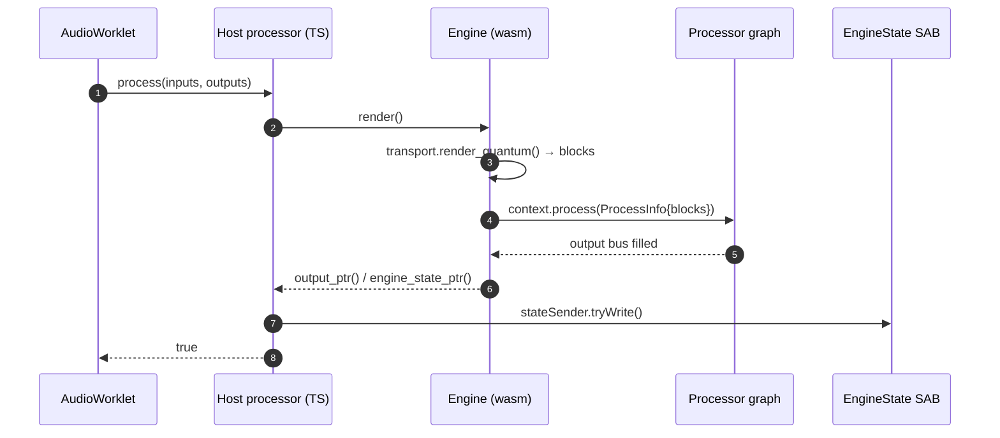

# Engine Processor

> **Audience:** contributors to openDAW. This chapter explains how the AudioWorkletProcessor that runs the engine is structured, so you can change it without breaking it.
>
> **Prereqs:** read [`00-system-architecture`](../00-system-architecture.md) for the thread model and [`03-animation-frame`](../03-animation-frame.md) for how the main thread observes state. This chapter assumes you know what an `AudioWorkletProcessor` is.

The engine is a Rust program compiled to WebAssembly. Everything that makes sound — transport, clip sequencing, note scheduling, audio-region playback, the metronome, the mixer — is Rust. The AudioWorkletProcessor around it is a thin host that owns the browser-side plumbing and contains no DSP.

So there are two halves you will move between constantly:

| Half | Where | What it owns |
|---|---|---|
| **Host** | `packages/studio/core-wasm/src/processor.ts` | the worklet, message channels, `SharedArrayBuffer`s, resource fetching, meters and analysers |
| **Engine** | `crates/engine/src/lib.rs` | one `Engine` struct behind a C ABI; `render()` fills a 128-frame stereo quantum |

Devices (instruments and effects) are a third piece: each is its own position-independent wasm *side module* under `crates/stock-devices/`, loaded at runtime and called through the engine's shared function table.


```mermaid
sequenceDiagram
    autonumber
    participant AW as AudioWorklet
    participant H as Host processor (TS)
    participant E as Engine (wasm)
    participant G as Processor graph
    participant SAB as EngineState SAB

    AW->>H: process(inputs, outputs)
    H->>E: render()
    E->>E: transport.render_quantum() → blocks
    E->>G: context.process(ProcessInfo{blocks})
    G-->>E: output bus filled
    E-->>H: output_ptr() / engine_state_ptr()
    H->>SAB: stateSender.tryWrite()
    H-->>AW: true
```

## Registration

Two worklet modules are added to every `AudioContext`, and they register three processors between them.

The engine-independent pair lives in `packages/studio/core-processors/src/register.ts`:

```typescript
registerProcessor("meter-processor", MeterProcessor)
registerProcessor("recording-processor", RecordingProcessor)
```

`meter-processor` writes per-channel peak and RMS values into a `SyncStream` over a `SharedArrayBuffer` for the UI; `recording-processor` captures input audio. Neither depends on the engine, which is why they live in their own module.

The engine registers itself from `packages/studio/core-wasm/src/processor.ts` under the name `WASM_ENGINE_PROCESSOR_NAME` — the string `"engine-wasm-processor"`, defined in `packages/studio/core-wasm/src/protocol.ts`.

The dependency runs one way between those two modules. The engine's worklet imports two engine-agnostic helpers out of the meter/recording package — `HRClock` for DSP-load timing and `PeakBroadcaster` for the master peak meter:

```typescript
// packages/studio/core-wasm/src/processor.ts:30
import {HRClock} from "../../core-processors/src/HRClock"
import {PeakBroadcaster} from "../../core-processors/src/PeakBroadcaster"
```

`HRClock` exists because an AudioWorklet has no `performance.now()` and cannot block: a Worker publishes timestamps through a `SharedArrayBuffer`, and the clock only accepts a measurement when the start and end responses carry consecutive counters, so a torn pair is dropped rather than reported as a spike.

The main thread never hardcodes that name. `EngineWorklet` (`packages/studio/core/src/EngineWorklet.ts`) asks `EngineVariant.current()` for it:

```typescript
// packages/studio/core/src/EngineWorklet.ts:110
const variant: EngineWorkletVariant = EngineVariant.current()

super(context, variant.processorName, {
    numberOfInputs: 1,
    numberOfOutputs: 2,
    outputChannelCount: [numberOfChannels, 8],
    processorOptions: {
        syncStreamBuffer: reader.buffer,
        controlFlagsBuffer: controlFlagsSAB,
        hrClockBuffer: HRClockWorker.get().sab,
        project: project.toArrayBuffer(),
        exportConfiguration,
        options,
        variant: variant.attachment
    } satisfies EngineProcessorAttachment
})
```

`EngineVariant` (`packages/studio/core/src/EngineVariant.ts`) exists because `studio-core` cannot import `studio-core-wasm` — that dependency runs the other way. `WasmEngine.install()` registers the provider; `EngineVariant.current()` resolves it at construction time. There is no built-in engine to fall back to, so a missing provider is a boot error, not a silent downgrade.

`variant.attachment` carries the compiled wasm:

```typescript
// packages/studio/core-wasm/src/engine-modules.ts:56
export type EngineModules = {
    engineModule: WebAssembly.Module
    deviceModules: ReadonlyArray<WebAssembly.Module> // PIC side modules, in load order
    deviceBoxTypes: ReadonlyArray<string>            // parallel: the device-box type each plugin realizes
    composites: ReadonlyArray<CompositeSpec>
    effectComposites: ReadonlyArray<EffectCompositeSpec>
}
```

`WasmEngine.ensureReady(context)` (`packages/studio/core-wasm/src/WasmEngine.ts`) does the two one-time steps: `context.audioWorklet.addModule(processorUrl)` and `loadEngineModules(wasmUrl)`, which fetches and compiles `${wasmUrl}/wasm/engine.wasm` plus each `/wasm/plugins/device_*.wasm`.

Two consequences worth internalizing:

- **The memory is non-shared and worklet-owned.** The processor constructs its own `WebAssembly.Memory` in its constructor (`createEngineMemory()` in `engine-modules.ts` — `{initial: 256}`, no maximum, no `shared` flag; a non-shared memory cannot be postMessaged, so it never travels through `processorOptions`). Without the shared flag there is no up-front virtual-address-space reservation — talc grows the memory on demand and the runtime may *relocate* the buffer on grow, which detaches every previously created typed-array view. The main thread never sees the wasm heap; bulk data (samples, freeze PCM) reaches the engine through RPC and is copied into the memory worklet-side.
- **The project does not arrive through `processorOptions`.** The `project` field is part of the attachment type, but the wasm host ignores it. The box graph arrives as a stream of serialized transactions over the `WASM_SYNC_CHANNEL`, described under [state publication](#state-publication-to-the-main-thread).

## The Process Loop

The audio thread invokes `process()` once per render quantum (128 frames). The host half is deliberately small:

```typescript
// packages/studio/core-wasm/src/processor.ts:288
process(inputs: Array<Array<Float32Array>>, outputs: Array<Array<Float32Array>>): boolean {
    if (!this.#valid) {return false} // will not revive
    if (Atomics.load(this.#controlFlags, 0) === 1) {
        this.#stateSender.tryWrite() // keep the UI in sync (stopped transport) while asleep, no DSP
        return true
    }
    const {status, error} = tryCatch(() => this.#render(inputs, outputs))
    if (status === "failure") {
        this.#fail(error)
        return false
    }
    return true
}
```

Three behaviours to notice:

1. **Invalidity is permanent.** Returning `false` tells the Web Audio API to release the processor — the node never wakes up again. `#valid` is only ever cleared on unrecoverable error or explicit `terminate`.
2. **Sleep is cooperative.** When the main thread sets the control-flag word to `1`, the processor skips all DSP but still publishes state, so a sleeping engine doesn't leave the UI showing a stale playhead.
3. **Errors are caught and translated.** `#fail` runs `describeEngineTrap(engine, memory, error)` (`packages/studio/core-wasm/src/boot.ts`), which pulls the Rust panic message out of the engine's panic buffer and attaches it to the raw `RuntimeError` before reporting through `engineToClient.error`. Devices trap rather than hang: each device's `#[panic_handler]` delegates to `abi::panic_to_host`, which deposits the formatted panic and then traps — never `loop {}`, which would be a silent audio-thread hang.

### The host tick

`#render()` (`processor.ts:331`) does, in order:

1. If DSP-load measurement is on, read the previous quantum's validated elapsed time from `HRClock`.
2. Stage live input channels into the engine's monitor-input buffer, if any unit is in effects-monitoring mode.
3. **`engine.render()`** — the entire audio computation, one call.
4. Copy the engine's monitor outputs onto the worklet's second output (the monitoring return).
5. Copy the engine's planar stereo output into the worklet's first output. The wasm buffer is re-read every quantum: the allocator may have grown linear memory, which detaches previously obtained views.
6. Feed the peak broadcaster and any active analysers (spectrum, waveform, stereo, goniometer, loudness) — each gated on whether the UI is actually subscribed.
7. `#syncBroadcasts()`, `broadcaster.flush()`, `stateSender.tryWrite()`, then drain the engine's queued clip-transition, marker-state and MIDI-output records.

### The engine tick

`Engine::render(&mut self, output: &mut [f32], state: &mut [u8])` (`crates/engine/src/lib.rs:1304`) is where the real work is. Stripped to its spine:

```rust
// clear the output, then apply the latest timeline values the box subscriptions recorded
self.transport.set_bpm(self.controls.bpm.get());
let loop_gate = (self.controls.loop_enabled.get() && !self.is_counting_in
    && (!self.is_recording || self.allow_takes)) || self.pause_on_loop_disabled;
self.transport.set_loop_enabled(loop_gate);
...
self.tempo_map.borrow_mut().update(self.controls.bpm.get(), tempo_curve);

// count-in flip: reaching the recording start turns counting-in into recording
if self.is_counting_in && self.transport.position() >= self.recording_start { ... }

blocks.clear();
if transport.is_playing() {
    transport.render_quantum(active_tempo, marker_slice, markers_enabled, |block| {
        metronome.process(block, signature_slice, left, right);
        blocks.push(Block { ... });
    });
} else {
    blocks.push(/* one free-running, non-playing block */);
}

context.process(&ProcessInfo {blocks: blocks.as_slice()});
// mix the output bus into `output`
write_engine_state(transport, state, is_recording, is_counting_in, recording_start, denominator);
```

Note what the box graph is *not* doing here: nothing reads boxes during render. Box-graph subscriptions record scalar edits into a shared `Controls` struct of `Cell`s (bpm, signature, loop area, tempo-automation enable), and `render` applies them at the top of the quantum. That is a hard constraint of the design — a subscription running during render would alias the `&mut self` the render already holds.

The metronome renders into its own staging buffer rather than straight into `output`, so the same signal can be mixed into the mixdown *and* copied out as its own stem.

## Blocks

A render quantum is not necessarily one span of musical time. Tempo automation, loop wraps and marker jumps all split it. The unit of that split is a `Block`, and it is part of the device ABI — host and devices read the identical struct out of the engine's linear memory:

```rust
// crates/abi/src/lib.rs:136
#[repr(C)]
#[derive(Clone, Copy, Debug)]
pub struct Block {
    pub index: u32,
    pub flags: BlockFlags,
    pub p0: f64,
    pub p1: f64,
    pub s0: u32,
    pub s1: u32,
    pub bpm: f32
}
```

`[p0, p1)` is the pulse (PPQN) range, `[s0, s1)` the sample range inside the quantum, `bpm` the tempo for this slice. `BlockFlags` (`crates/abi/src/lib.rs:82`) is a `u32` bitfield with four bits:

| Flag | Meaning |
|---|---|
| `TRANSPORTING` | the transport is advancing song position |
| `PLAYING` | playback is active |
| `DISCONTINUOUS` | first block after a position jump (loop wrap, marker jump, seek) |
| `BPM_CHANGED` | tempo changed at this block boundary |

The first two are *state* flags that persist across a block's sub-chunks. The last two are *event* flags, cleared after the first chunk via `clear_event_flags()` / `EVENT_MASK`. `DISCONTINUOUS` is the cue for any stateful device or sequencer to release what it holds — it is why scrubbing and looping don't leave stuck notes.

### How the quantum is split

`Transport::render_quantum` (`crates/transport/src/transport.rs:192`) is the loop. Per iteration it computes the candidate `p1` assuming the whole remaining quantum runs at the current bpm, then looks for the earliest of three actions inside `[p0, p1)`, in a strict precedence:

1. **Marker** — evaluated first. Crossing a section boundary either repeats the section (jump back to its start, `discontinuous = true`) or falls through to the next one once `plays` is exhausted. `plays == 0` means forever.
2. **Loop end** — takes over only when strictly earlier than the marker action. Wraps to `loop_from`, or, when `pauseOnLoopDisabled` is set, pauses the transport *at* the loop end and returns; the engine then renders the quantum's remainder as a non-playing tail so voices release and tails ring out instead of hard-cutting.
3. **Tempo automation** — evaluated last, strictly-earlier only. Tempo is re-evaluated on a fixed grid: `TEMPO_CHANGE_GRID = 80.0` pulses, which is `PPQN.fromSignature(1, 48)`, roughly a 10 ms window.

With no markers, no loop and a fixed tempo this emits exactly one block spanning the whole quantum — the common case, and the cheapest.

`Block` values are pushed into a `Vec` pre-sized to `MAX_BLOCKS_PER_QUANTUM` (16), so the render path never reallocates.

### When the transport is stopped

A paused quantum still renders. `Transport::render_paused` returns a block whose `p0`/`p1` come from a *free-running* pulse counter that keeps advancing while the song position stays frozen, with `TRANSPORTING` and `PLAYING` both clear. The graph therefore gets one more real block: held notes flush into note-offs, voices go to release, and effect tails ring out — while the sequencer, seeing no `PLAYING` flag, reads no new notes. The metronome stays silent because it only ticks on a moving block.

## The processor graph

Inside a quantum, audio flows through a directed graph of nodes. The node contract is two methods:

```rust
// crates/engine-env/src/processor.rs
pub trait Processor: EventReceiver {
    fn reset(&mut self);
    fn process(&mut self, info: &ProcessInfo);
}
```

`ProcessInfo` is just the quantum's blocks:

```rust
// crates/engine-env/src/process_info.rs
pub struct ProcessInfo<'a> {
    pub blocks: &'a [Block]
}
```

`EngineContext` (`crates/engine-env/src/engine_context.rs`) owns the graph and drives it. It is the merge of what used to be two separate concerns — the registration surface processors call, and the render loop over the sorted graph — because Rust ownership wants the graph and the processors in one place:

```rust
// crates/engine-env/src/engine_context.rs:196
pub fn process(&mut self, info: &ProcessInfo) {
    self.emit(ProcessPhase::Before);
    if self.needs_sort {
        self.sort.update(&self.graph);
        self.queue.clear();
        for &id in self.sort.sorted() {
            if let Some(processor) = self.processors.get(&id) {
                self.queue.push((id, processor.clone()));
            }
        }
        self.needs_sort = false;
    }
    for (_, processor) in &self.queue {
        processor.borrow_mut().process(info);
    }
    self.emit(ProcessPhase::After);
}
```

### Why a topological sort?

Audio flows instrument → effect → effect → channel strip → master. Each node reads its input buffer and writes its output, so dependencies must run before their consumers. `register_edge(source, target)` declares "source before target"; `register_processor` and `register_edge` set `needs_sort`, and the next `process` re-sorts and rebuilds the cached queue. Steady-state, the loop is a linear walk over `Vec<(NodeId, SharedProcessor)>` with no map lookups and no allocation.

Nodes are addressed by `NodeId` (a `u64`) rather than by object identity, and processors are shared single-threaded handles (`Rc<RefCell<dyn Processor>>`) so a parent chain can keep a typed handle for wiring while the context keeps a clone for driving.

`would_cycle(source, target)` rejects a feedback loop in output/send routing up front, rather than letting the topological sort silently drop a back-edge.

`ProcessPhase` still exists, with the same two values and the same rule:

```rust
// crates/engine-env/src/process_phase.rs
pub enum ProcessPhase {
    Before,
    After
}
```

Wiring is (re)built in `Before`, never mid-render; cleanup happens in `After`.

### Profiling

`EngineContext` carries an optional per-node profiler, off by default. `profile_enable(now)` installs a micros clock and zeroes the accumulators (pre-grown at registration, so timing adds two clock calls per node and no allocation); `profile_report()` returns `(label, micros)` per node plus the profiled quantum count. Labels are recorded at reconcile time regardless — a device node is labelled with its box type plus a short uuid — so enabling the profiler later still names things meaningfully.

## Clip sequencing

`ClipSequencer` (`crates/engine-env/src/clip_sequencer.rs`) answers one question per track: *which clip should be playing right now, and when does it stop?* The state per track is two slots — a `playing` clip and a `waiting` one (a scheduled clip, or a scheduled stop).

External callers move clips through `schedule_play(track, clip)` and `schedule_stop(track)`. Neither takes effect immediately: `iterate(track, p0, p1, info, ...)` splits the block's pulse range into `Section`s at the quantized handover point — the playing clip's own duration, or `BAR` (3840 pulses) when nothing is playing on that track yet — and swaps `waiting` into `playing` there. A non-looping clip stops itself at its own duration boundary. That quantized handover is what gives clip-launching its musical feel.

The sequencer stores only clip **UUIDs**. Duration and loop flag are resolved live through a `ClipInfo` trait implemented against the reactive box binding, so editing a clip while it is scheduled or playing stays correct.

Every start / stop / obsolete transition queues the clip uuid. `take_changes` drains that queue, and the host forwards it as `notifyClipSequenceChanges({started, stopped, obsolete})` — see `#drainClipChanges` in `processor.ts`, which reads 20-byte `[uuid 16][kind u32]` records out of engine memory.

Launching a clip also *starts* the transport if it was stopped (`Engine::schedule_clip_play`, `crates/engine/src/lib.rs:1565`), so hitting a clip from a stopped studio plays immediately.

## Note scheduling {#notesequencer}

`NoteSequencer` (`crates/engine-env/src/note_sequencer.rs`) is the per-audio-unit note source. Per block it reads the unit's note regions through a `NoteContentSource`, resolves region looping with `locate_loops`, and emits globally-positioned note events. It has three inputs:

1. **Raw notes** — live MIDI and on-screen keys.
2. **Audition notes** — fixed-duration one-shot previews.
3. **Clip and region notes** — sequenced from note regions, gated by the shared `ClipSequencer`.

Raw and audition notes are emitted **before** the transport gate, so they sound while the transport is stopped too — which works precisely because the paused quantum still advances a free-running pulse range.

Notes that outlast a block are held in a retainer (one per unit, so ids never collide across the unit's regions) and emit their completion when their span ends — or immediately on a transport stop or a `DISCONTINUOUS` block.

The event vocabulary is `Event::NoteStart`, `Event::NoteComplete` and `Event::Update` (a parameter-automation tick). Where several land on the same position, the engine imposes a total order (`compare_lifecycle`, `crates/engine/src/lib.rs:605`):

```rust
fn lifecycle_rank(event: &Event) -> u8 {
    match event {
        Event::NoteComplete {..} => 0, // note-off first
        Event::Update {..} => 1,       // then the param-update (clock tick)
        Event::NoteStart {..} => 2     // then note-on, so it sees the updated parameter
    }
}
```

A note ending at a position releases before the automated parameter updates, and a note starting there sees the new value. The tiebreak on note id makes the order total, which lets the engine use a non-allocating `sort_unstable_by` inside render.

Devices do not *receive* events; they **pull** them. A device calls the engine's `host_pull_events(from, to, flags, out_ptr, max)` export (`crates/engine/src/lib.rs:634`) for a pulse range and gets back sample-offset `EventRecord`s. The pull resolves the current link in a chain: a leaf sequencer converts directly; a MIDI-effect link descends into that effect's `process_events` with its own upstream swapped in, so a chain of MIDI effects (a groove device warping positions, an arpeggiator generating them) composes without the engine knowing anything about the specific devices.

Resolved note-ons and note-offs also set and clear bits in the unit's 128-bit note-activity slot, which is how the UI's held-note indicators light up.

## Audio region playback

`crates/engine/src/audio_region_player.rs` is the audio-track counterpart of the note sequencer, and it *is* the source for a tape-style unit. Per quantum it clears its output, then for each enabled audio track range-queries the track's sorted region collection, resolves each region's sample, and renders it:

- A read head that free-runs at native speed (`read += sourceRate / engineRate` per output sample) and persists across blocks, locked to the output clock. Deriving the read position per block from the tempo map instead would make the read rate jitter, which is audible as ring modulation.
- The head is reseated from the tempo map **only** at a discontinuity — region entry, loop wrap, transport jump — where the absolute file offset is exact even at a mid-file start.
- Linear interpolation when source and engine sample rates differ.
- Region gain plus a fade envelope, and a short boundary declick at un-faded region edges so adjacent regions don't click. The declick and an authored fade never multiply into a doubled fade.

Clip launching runs through the same passes: each track's pulse range is split into sections by the shared `ClipSequencer`, a clip section plays the clip's virtual region (position 0, looping at the clip duration), and the timeline's own regions play only in the clip-free sections.

Time-stretched playback (the granular play mode) lives in `crates/engine/src/time_stretch.rs`; see [Ch. 08 — Time and Pitch](./08-time-and-pitch.md).

## Metronome and count-in

`Metronome` (`crates/engine/src/metronome.rs`) schedules beats per block over the signature track's accumulated events, with beat indices resetting at each signature change. It honours three preferences pushed from the host — `beatSubDivision`, `gain` (dB) and `monophonic` (a new click fades every sounding one out over 5 ms) — and has two click sounds: synthesized defaults at 880 Hz for the downbeat and 440 Hz otherwise, replaceable by uploaded PCM via `load_click_sound`, resampled with linear interpolation from the sound's own rate.

Count-in is transport arithmetic, not a separate mode. `Engine::prepare_recording_state(count_in, count_in_bars)` (`crates/engine/src/lib.rs:1473`), when the transport is stopped and a count-in is wanted:

1. Resolves the time signature *in effect at the recording start* from the signature track.
2. Computes the offset as `PPQN.fromSignature(count_in_bars * nominator, denominator)`.
3. Records `recording_start`, sets `is_counting_in`, forces the metronome on, seeks to `recording_start - offset`, and plays.

The flip from counting-in to recording happens at the top of `render` when the playhead reaches `recording_start` — quantum-granular, so within about 2.7 ms — and restores the metronome preference at the same moment. `write_engine_state` reports `countInBeatsRemaining` as `(recording_start - position) / PPQN.fromSignature(1, denominator)`.

## AudioUnit

`crates/engine/src/audio_unit/` mirrors the box hierarchy `AudioUnitBox → TrackBox → RegionBox → NoteEventCollection` and holds everything beneath the root's audio units. It is split by concern: `mod.rs` (shared types and the unit lifecycle), `wiring.rs` (chain and cluster builders), `routing.rs` (sends, outputs, sidechains), `tracks/` (the track/region/clip cascade) and `params.rs` (device parameter automation).

The per-unit type is `AudioUnitBinding`. It holds three ordered device collections read from the box — the `input` instrument, the MIDI-effect chain and the audio-effect chain, each sorted by the device's `index` field — plus the shared region set the sequencer reads and the wired processor cluster.

`build_cluster` (`crates/engine/src/audio_unit/wiring.rs:1029`) assembles a unit in two directions at once:

- **Upstream, as a pull chain.** Starting from the note source, each enabled MIDI effect wraps the chain in a `PullLink::MidiFx`, so the instrument's `host_pull_events` walks back through the whole MIDI chain.
- **Downstream, as graph edges.** The instrument node registers first; each enabled audio effect takes the previous node's output buffer as its input, publishes its own, and gets `register_edge(previous, this)`.

The unit's signal path is therefore `instrument → fx0 → fx1 → … → channel strip → output bus`. The channel strip (`crates/engine-env/src/channel_strip.rs`) applies volume (dB), panning and mute, reading them from a shared `StripParams` the engine keeps in sync with the box fields — the strip itself has no box knowledge. Per-sample gains ride `LinearRamp`s so parameter moves don't click.

A **disabled** effect is not built and not wired: it is skipped entirely, rather than processed and bypassed.

Solo is a mixer-wide concern and cannot ride a single strip's per-block automation, because it silences *other* strips. It resolves once per quantum, at the quantum's start position and only while transporting, into per-strip forced-silent flags (`resolve_automated_solo`, called from `render`). A paused quantum therefore holds the last resolved solo state.

Every effect's output is also published into an `AudioOutputBufferRegistry` keyed by its box address, which is how a sidechain pointer resolves to both the buffer to read and the node to depend on.

### Rewiring

Rewiring never happens mid-render. A box edit that touches a unit records the unit's uuid into `dirty_units`; the reconcile pass that runs after a transaction rewires **only** those units, not all of them. The unit's cluster is rebuilt only when a chain reports dirty, and `remove_processor` clears the cached render queue immediately so a removed processor's `Rc` clone cannot keep it alive past the reconcile — a stale clone would leave the broadcast table serving a pointer into freed heap.

Because a Rust closure cannot hold `&mut` on the context it lives in, phase observers here are self-contained hooks over their own shared state, and context-mutating rewiring is an explicit engine step rather than something a `Before` observer performs.

## Devices

Every device is a separate wasm module. The engine is built with `--import-table`; each device is a position-independent side module installed into the one shared `__indirect_function_table`, and the engine calls the device's `process` by table slot via `call_indirect` — wasm to wasm, zero copy.

`packages/studio/core-wasm/src/device-linker.ts` owns the whole linking ritual: the `dylink.0` parse, allocating the device's data region and a 256 KiB stack from the engine's allocator, building the import environment, applying relocations, installing into the table, and registering the device.

That file also holds the **single authoritative host-import list** — the exports a device may import from `env`:

```typescript
const HOST_IMPORTS: ReadonlyArray<string> = [
    "host_pull_events", "host_pulse_to_offset",
    "host_bind_parameter", "host_bind_broadcast", "host_broadcast_ptr", "host_broadcast_active",
    "host_update_parameters", "host_first_update_position", "host_next_update_position",
    "host_resolve_sample", "host_observe_sample",
    "host_resolve_soundfont", "host_observe_soundfont",
    "host_observe_field", "host_observe_target_string",
    "host_bind_sidechain", "host_resolve_input", "host_self_uuid", "host_panic",
    "host_base_frequency"
]
```

Extend it there when the engine gains a host export, never in an individual loader — a loader that misses one fails loudly at link time with the import's name instead of a cryptic `LinkError`.

A device declares what it is through its `kind` export (`crates/abi/src/lib.rs:70`):

| Kind | Meaning |
|---|---|
| `DEVICE_KIND_INSTRUMENT` | voices notes into audio; exports `process` |
| `DEVICE_KIND_AUDIO_EFFECT` | transforms an input buffer; exports `process` |
| `DEVICE_KIND_MIDI_EFFECT` | transforms an upstream event stream; exports `process_events`, no audio |

and the rest of its surface is optional exports the linker looks for: `init`, `parameter_changed`, `field_changed`, `sample_changed`, `soundfont_changed`, `reset`, `terminate`, plus `state_size(sampleRate)` so the engine can allocate the device's zeroed state block.

### Parameter automation

There is no per-parameter wrapper object. A device calls `host_bind_parameter(path)` once to bind a box field, getting an id back, and then per block asks `host_update_parameters(position, out_ptr, max)` for the changes. The engine writes `ParamChange` records — `{id, kind, value}` — where `kind` says how to read the single `f32`: `PARAM_KIND_UNIT` is the uniform 0..1 automation value the device maps with its own mapping, while `INT` / `FLOAT` / `BOOL` carry a box field's already-real value. The device SDK decodes `(kind, value)` into a typed `ParamValue`, so device code never inspects a raw tag.

Sample-accurate automation comes from fragmenting the block on a fixed grid. `UPDATE_CLOCK_RATE` is 10 pulses (`crates/dsp/src/ppqn.rs:15`) — `PPQN.fromSignature(1, 384)` — and everything that fragments on it switches parameters together. A device seeds its fragment loop with `host_first_update_position(at)`, which returns the first grid point at or after `at`, then walks with `host_next_update_position`. Both return `f64::INFINITY` when the current device has **no** automated parameter or the quantum is not transporting, which collapses the fragment loop back to one span — you pay for automation only where automation exists.

The channel strip and aux sends fragment on the same grid for their own automated gains.

### How to add a device

1. **Add the box** under `packages/studio/forge-boxes/src/schema/` — the persistent data shape, which generates into `@opendaw/studio-boxes`.
2. **Add the adapter** under `packages/studio/adapters/src/devices/`, exposing typed parameter accessors.
3. **Write the device crate** under `crates/stock-devices/device-<name>/`, exporting `kind`, `state_size`, `process` (or `process_events`), and whichever of `init` / `parameter_changed` / `reset` it needs. Bind automatable fields with `bind_parameter` in `init`; do the DSP in `process`.
4. **Register the mapping** in the `DEVICES` table in `packages/studio/core-wasm/src/engine-modules.ts`:
   ```typescript
   {url: "/wasm/plugins/device_revamp.wasm", boxType: "RevampDeviceBox"}
   ```
   This is the entire device glue. When the box graph presents a `RevampDeviceBox`, the engine looks up the type here (`Engine::device_for_type`) to find the plugin that realizes it. Load order is irrelevant — chains are read from the box, ordered by each device's `index`.
5. **Optional: register a UI** — a separate concern, in the studio app.

A device box that hosts a *collection* of child instruments (Playfield) or parallel effect entries is registered as **data** rather than code: `CompositeSpec` / `EffectCompositeSpec` in the same file declare the field keys, and no engine code is composite-specific.

## State publication to the main thread

Four channels run between the worklet and the main thread, and it is worth knowing which is which.

**1. Box graph, main thread → engine.** `WasmEngine.connectSync` (`packages/studio/core-wasm/src/WasmEngine.ts:129`) puts a `SyncSource` over a synchronous loopback, serializes each transaction at emission time, and ships the bytes over `WASM_SYNC_CHANNEL` to `engine.apply_updates(len)`. Opening the source with a full dump is how the engine receives the project in the first place. Serializing at emission rather than after a `MessageChannel` hop matters: a later transaction could delete boxes before a deferred batch resolved its codecs.

A rejected transaction permanently desyncs the mirror, so it escalates as an engine error and the studio reboots the worklet from a fresh dump. As a second line of defence, the engine keeps a rolling 32-byte graph checksum, and roughly once a second the main thread sends the source graph's checksum for comparison. The checksum is computed only on that throttled path — it is a full-graph walk, and hashing per transaction dropped audio during marquee selection.

**2. Transport state, engine → main thread.** Every quantum the engine writes a fixed-layout, big-endian state record, and the host copies it into a `SyncStream` over a `SharedArrayBuffer`:

```typescript
// packages/studio/core-wasm/src/processor.ts:113
this.#stateSender = SyncStream.writer(EngineStateSchema(), syncStreamBuffer, state => {
    const view = new DataView(this.#memory.buffer, engine.engine_state_ptr(), engine.engine_state_len())
    state.position = view.getFloat32(0)
    state.bpm = view.getFloat32(4)
    state.playbackTimestamp = this.#playbackTimestamp
    state.countInBeatsRemaining = view.getFloat32(12)
    state.isPlaying = view.getUint8(16) === 1
    state.isCountingIn = view.getUint8(17) === 1
    state.isRecording = view.getUint8(18) === 1
    if (this.#measureLoad) {
        state.perfBuffer.set(this.#perfBuffer)
        state.perfIndex = this.#perfWriteIndex
    }
})
```

The main thread reads it from `AnimationFrame` and drives the observables the UI subscribes to. This is the hot path — every quantum, sub-millisecond.

**3. Live telemetry, engine → main thread.** Meters, automation values and per-unit note bits live in *slots* — boxed `f32` slices inside the engine (`crates/engine-env/src/telemetry.rs`) whose addresses never move. The engine registers each slot in a broadcast table under a box address (`crates/engine/src/broadcast.rs`). The host mirrors that table onto the studio's `LiveStreamBroadcaster` as `Float32Array` / `Int32Array` **views over wasm memory**, so the render path never copies telemetry.

The table carries a generation counter, bumped whenever entries register or are swept. `#syncBroadcasts()` re-reads the table only when the generation moved. Validity is self-healing: each entry holds a `Weak` reference to its slot, and a sweep at the end of every reconcile drops entries whose owner died — a dead entry's pointer would otherwise read freed heap as meter floats.

**4. RPC, both ways.** `EngineToClient` over `MessagePort` handles everything that isn't read every frame: `log`, `error`, `deviceMessage`, `fetchAudio`, `fetchSoundfont`, `fetchNamWasm`, `notifyClipSequenceChanges`, `switchMarkerState`, `ready`. In the other direction, `EngineCommands` carries `play`, `stop`, `setPosition`, `prepareRecordingState`, `stopRecording`, `queryLoadingComplete`, `panic`, `loadClickSound`, `setFrozenAudio`, `updateMonitoringMap`, `noteSignal`, `ignoreNoteRegion`, `scheduleClipPlay`, `scheduleClipStop`, `setupMIDI` and `terminate`.

The engine's own preferences (metronome enable/gain/subdivision/monophonic, `allowTakes`, `pauseOnLoopDisabled`, `truncateNotesAtRegionEnd`, `dspLoadMeasurement`) arrive on a fifth channel, `engine-preferences`, and are pushed straight into the corresponding wasm setters.

The sync `SharedArrayBuffer` requires cross-origin isolation (COOP + COEP); without those headers `SharedArrayBuffer` throws and the engine cannot initialize. See [Ch. 12 — Browser Compatibility](../12-browser-compatibility.md), and [Ch. 03 — Cross-thread protocols](./03-cross-thread-protocols.md) for the channel machinery itself.

Bulk PCM travels over these same channels: freeze audio arrives as a `setFrozenAudio(uuid, audioData)` engine command and is copied into the wasm heap on the worklet side — the memory is worklet-owned and non-shared, so no other thread *can* write into it.

## Offline rendering

The same wasm engine renders offline, but not through an AudioWorklet. `packages/studio/core-wasm/src/offline-worker.ts` is a plain Web Worker that instantiates the engine itself and speaks `OfflineEngineProtocol`:

```typescript
initialize(enginePort, config)   // decode the project snapshot, stream it in as one full-dump transaction
step(numSamples)                 // render N samples synchronously, return Float32Array[] channels
render(config)                   // run the step loop
stop()
```

`OfflineEngineRenderer` (studio-core) drives it, and `WasmEngine.install` registers the worker URL. The worker self-loads the wasm artifacts from the same `wasmUrl`, so nothing needs preloading on the main thread.

The step loop is deliberately fully synchronous: every resource is resolved during `initialize`, and yielding per second would cost more than the render itself (a clamped `setTimeout(0)` measured as 260 ms of a 297 ms empty render).

Two things settle at `initialize` rather than arriving as commands, because the render loop never yields and a racing command would only be dequeued after the render had finished:

- **Metronome configuration.** Off unless the export configuration asks for it, so a mixdown can never pick up a click by accident. `includeInMixdown` mixes it into the stereo mixdown; `stem` appends it as an additional stem after the unit stems.
- **Custom click PCM**, if any.

**Stem export** is per-unit wiring options handed to the engine before `bind`, in export order. Each `StemEntry` (`crates/engine/src/lib.rs:86`) carries `include_audio_effects`, `include_sends`, `use_instrument_output` and `skip_channel_strip`; the engine renders each entry's unit with its options and copies that unit's tap into planar stem staging (stem *i* → channels 2*i* / 2*i*+1). A stems render never reads the main output.

See [Ch. 10 — Export](../10-export.md) for the consumer-facing API.

## Worker pool

The non-audio Web Workers live in `packages/studio/core-workers/src/workers-main.ts` and are unrelated to the engine:

- **`OpfsWorker`** — OPFS reads and writes for the persistent cache.
- **`SamplePeakWorker`** — peak data (min/max per chunk) for waveform rendering.
- **`TransientProtocol`** — onset detection for analysis.

These are plain Web Workers. They may allocate, block and use async APIs freely; the only rule is that they don't run on the audio thread.

Sample data reaches the engine by the audio thread asking for it over RPC (`fetchAudio(uuid)`), the main thread routing that to the sample manager, and the decoded frames coming back over the port for the worklet to copy into the engine's memory.

## Performance constraints (read these before you write DSP)

The audio thread has roughly **2.9 ms** of wall-clock time per 128-frame quantum at 44.1 kHz before it drops audio. Practical rules the codebase already follows:

- **Don't allocate on the render path.** `Vec`s that render touches are pre-reserved at registration or reconcile time (`blocks` to `MAX_BLOCKS_PER_QUANTUM`, the sort's scratch, the profiler's accumulator, the event scratch). Where sorting is needed inside render, the code uses `sort_unstable_by` with a *total* order, because the stable sort heap-allocates past about 25 elements.
- **Don't touch the box graph.** Subscriptions record into `Cell`s that `render` reads; a subscription running during render would alias the `&mut self` render holds. Anything reactive is a reconcile-time step, not a render-time one.
- **Don't await, don't log.** Resource loading goes through the `EngineToClient` RPC and is awaited on the main thread. There is no console in the engine — use `engineToClient.log()` from the host half, or the panic path for genuine faults.
- **Precompute in `parameter_changed`, not in `process`.** Derive filter coefficients when a parameter actually changes; the audio loop should be a tight stream of multiplies and adds. The update-clock fragmentation is what makes this cheap: with no automated parameter the grid returns `INFINITY` and there is no fragmentation at all.
- **Re-read `memory.buffer` after any call that can grow it.** The allocator grows linear memory on demand, which detaches every previously created typed-array view. The host re-reads the buffer each quantum for exactly this reason.
- **Profile before optimizing.** Turn on `preferences.settings.debug.dspLoadMeasurement` for the `HRClock`-based DSP-load meter the UI shows, and use the engine's own `profile_enable` / `profile_report` for a per-node breakdown sorted by accumulated time.

## Further reading

- **`crates/abi/src/lib.rs`** — the device ABI: `Block`, `BlockFlags`, `EventRecord`, `ParamChange`, `ParamValue`, the device kinds and the host imports. The small file that defines the engine's data shapes; read it first.
- **`crates/engine-env/src/`** — the engine's shared standard library, one declaration per module: the `Processor` trait, `ProcessInfo`, `ProcessPhase`, the topological sort, event buffers, the channel strip, aux sends, the clip and note sequencers.
- **`crates/transport/src/transport.rs`** — the block loop, marker sections, loop wrapping and the tempo grid.
- **`packages/studio/core-wasm/src/boot.ts`** — engine instantiation, resource-request draining and trap description.
- **`packages/studio/core/src/Engine.ts`** and **`EngineFacade.ts`** — the main-thread side that hosts the worklet and exposes observables to the UI.
