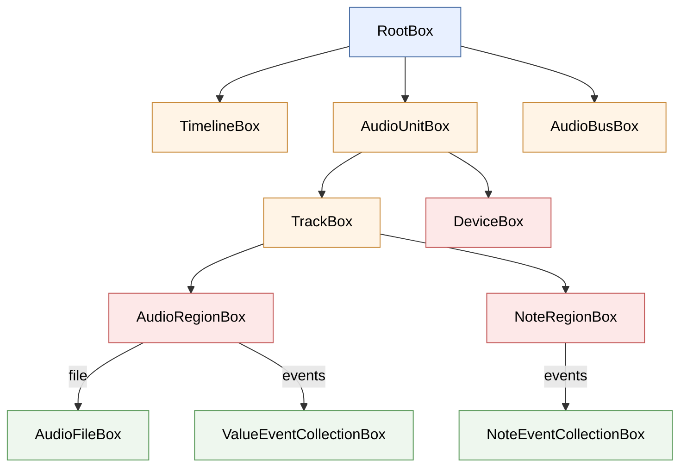

# Box System

> **Audience:** contributors to openDAW. This chapter explains the data layer — how state is stored, mutated, observed, and serialized — so you can add or change boxes without breaking the graph.
>
> **Prereqs:** read [`00-system-architecture`](../00-system-architecture.md) for where the box graph fits, and [`04-box-system-and-reactivity`](../04-box-system-and-reactivity.md) from the user handbook if you've never written against the box API at all.

Almost everything persistent in openDAW is a *box*. Tracks, regions, effects, automation curves, sample files, project settings — all of them are nodes in a typed graph stored in `lib-box`. Boxes are mutated through atomic transactions, observed through fine-grained subscriptions, and serialized to a single `ArrayBuffer` that becomes the saved project.

This chapter covers the primitives (`packages/lib/box/`), the catalog of concrete boxes (`packages/studio/boxes/`), the typed wrappers (`packages/studio/adapters/`), and the code generator that produces all of them (`packages/lib/box-forge/`).

## What is a Box?

A `Box` is a graph vertex addressed by a UUID and structured as a typed record of `Field`s. The base class is `Box<P, F>` in `packages/lib/box/src/box.ts:53`:

```typescript
export abstract class Box<
    P extends PointerTypes = PointerTypes,
    F extends Fields = any
> implements Vertex<P, F> {
    protected constructor({uuid, graph, name, pointerRules, resource, ephemeral}: BoxConstruct<P>) {
        this.#address = Address.compose(uuid)
        this.#graph = graph
        this.#name = name
        this.#pointerRules = pointerRules
        this.#resource = resource
        this.#ephemeral = ephemeral === true

        this.#fields = this.initializeFields()

        if (pointerRules.mandatory || pointerRules.exclusive) {
            this.graph.edges().watchVertex(this)
        }
    }

    protected abstract initializeFields(): F
    abstract accept<V extends VertexVisitor<any>>(visitor: V): ...
}
```

Type parameters:

- `P extends PointerTypes` — the union of pointer-type tags this box *accepts as incoming*. e.g. `AudioFileBox` accepts `Pointers.AudioFile | Pointers.FileUploadState | Pointers.MetaData`.
- `F extends Fields` — the typed record of this box's fields, indexed by integer keys.

The construct carries six things (`box.ts:44`):

```typescript
export type BoxConstruct<T extends PointerTypes> = {
    uuid: UUID.Bytes
    graph: BoxGraph
    name: string
    pointerRules: PointerRules<T>
    resource?: ResourceType
    ephemeral?: boolean
}
```

### Pointer rules

`PointerRules<P>` (defined in `packages/lib/box/src/vertex.ts:12`) controls what may point *at* this vertex:

```typescript
export interface PointerRules<P extends PointerTypes> {
    readonly accepts: ReadonlyArray<P>
    readonly mandatory: boolean   // must have ≥1 incoming pointer
    readonly exclusive?: boolean  // must have exactly 1
}
export const NoPointers: PointerRules<never> = {
    mandatory: false, exclusive: false, accepts: []
}
```

`mandatory: true` means the box gets garbage-collected if no incoming pointer references it. `exclusive: true` means at most one pointer may point at it. The graph enforces both at transaction commit; violation throws and the transaction aborts.

### Resource types

`ResourceType` (`box.ts:42`) controls UUID behaviour during copy/paste:

- **`"preserved"`** — UUID stays the same. Used for content-addressable resources like audio files where two projects referencing the same file should share the box.
- **`"internal"`** — UUID is regenerated. The default for boxes that represent a unique piece of one project (regions, tracks, effects).
- **`"shared"`** — UUID regenerated, *and* incoming edges are not followed when walking dependencies. Used for ambient state owners that shouldn't be cloned recursively.

The clone walker in `BoxGraph.dependenciesOf()` reads these flags to decide what to include.

## Fields

Boxes hold data exclusively in `Field`s. Five field shapes cover everything:

| Field class | What it stores | File |
|---|---|---|
| `PrimitiveField<V>` (subclasses below) | a single scalar | `packages/lib/box/src/primitive.ts:74` |
| `PointerField<P>` | a reference to another `Vertex` | `packages/lib/box/src/pointer.ts:34` |
| `ArrayField<F>` | fixed-length array of fields | `packages/lib/box/src/array.ts:20` |
| `ObjectField<F>` | nested record of fields | `packages/lib/box/src/object.ts:22` |
| `Field<P, _>` (generic placeholder) | a field that doesn't store a value, but can be *pointed at* | `packages/lib/box/src/field.ts:22` |

Primitive subclasses:

- `Float32Field`, `Int32Field` — bounded numerics with `constraints`.
- `BooleanField`, `StringField` — straightforward.
- `ByteArrayField` — `Int8Array` payload.

All fields implement `Vertex`, the address-resolving interface. That means you can `refer()` a pointer at a *field inside a box*, not just at the box itself. This is how, e.g., `AudioRegionBox.regions.refer(trackBox.regions)` works — both sides are fields, addressable independently.

### Mutating a primitive field

Every primitive setter goes through one path (`primitive.ts:117`):

```typescript
setValue(value: V): void {
    const oldValue = this.#value
    const newValue = this.clamp(value)
    if (this.equals(newValue)) {return}
    this.#value = newValue
    this.graph.onPrimitiveValueUpdate(this, oldValue, newValue)
}
```

Three guarantees:

1. **Clamping happens here.** `Float32Field` clamps to its constraints (e.g. `non-negative`), so the field never holds an out-of-range value.
2. **No-op writes are dropped.** Setting the same value doesn't emit an update — subscribers don't get spurious notifications.
3. **Updates flow through the graph.** The graph collects updates inside the current transaction and dispatches them on commit. You never directly notify a subscriber.

## The Graph

`BoxGraph` (`packages/lib/box/src/graph.ts`) owns every box. It's the *only* legal way to mutate state.

### Transactions

Every mutation must be inside a transaction. The graph asserts this (`graph.ts:552`): outside a transaction, mutations panic.

You almost never call `beginTransaction()` / `endTransaction()` directly — you use `BoxEditing.modify()` instead (covered below). But the transaction primitives are:

- `beginTransaction()` (`graph.ts:90`) — open the window.
- `endTransaction()` (`graph.ts:104`) — commit. Validates constraints, dispatches deferred pointer notifications, then notifies subscribers.
- `abortTransaction()` (`graph.ts:97`) — roll back. Used by `modify()` if the modifier threw.

Two important things happen during a transaction that don't happen immediately:

1. **Pointer notifications are deferred.** When you set a pointer mid-transaction, the target's `PointerHub` doesn't fire until commit. This prevents subscribers from seeing intermediate inconsistent states.
2. **Constraint validation runs at commit.** `mandatory`/`exclusive` rules are checked only at the end. So you can temporarily violate them while you re-wire the graph, as long as you fix it before `endTransaction()`.

### Staging a box

A new box enters the graph via `stageBox()` (`graph.ts:131`):

```typescript
stageBox<B extends Box>(box: B, constructor?: Procedure<B>): B
```

The generated `Box.create()` factories call this internally, so most contributors never see it. But it's the single entry point — there is no other way to put a box in the graph.

The optional `constructor` callback runs while `#constructingBox = true` is set, which defers pointer notifications even *within* the modifier. This is what lets you write:

```typescript
AudioRegionBox.create(graph, uuid, box => {
    box.regions.refer(trackBox.regions)         // pointer set during construction
    box.file.refer(audioFileBox)
    box.position.setValue(0)
})
```

without the trackBox briefly seeing a region that doesn't yet have a file.

### Lookups

```typescript
findBox<B extends Box>(uuid: UUID.Bytes): Option<B>     // graph.ts:191
findVertex(address: Address): Option<Vertex>           // graph.ts:195
```

`findVertex()` resolves a full `Address` (UUID + field keys) recursively, so you can address `regionBox.position` as a single value and look it up by address.

### Walking dependencies

`dependenciesOf()` (`graph.ts:355`) walks the graph from a starting set and collects every transitively reachable box and pointer field. It takes an options object — `{excludeBox?, alwaysFollowMandatory?, stopAtResources?}` — rather than a per-`ResourceType` dispatch. The resource-boundary behaviour is driven by `stopAtResources`: with `stopAtResources: true`, any box that has a `resource` value is treated as a boundary — the walk stops descending into that box's outgoing edges, but still back-traces mandatory incoming pointers (except for `"shared"` boxes, where ownership-field mandatory pointers are also excluded).

The per-`ResourceType` UUID policy — `"preserved"` keeps the original UUID; `"internal"`/`"shared"` regenerate — is applied afterward by the copy/paste layer (`TransferUtils.generateMap` in `packages/studio/adapters/src/transfer/`), not inside `dependenciesOf()` itself. Together they are the foundation of copy/paste and clip cloning: `dependenciesOf` decides what gets collected, and the transfer layer decides what gets cloned versus shared.

## Editing — Mutations with Undo/Redo

`BoxEditing` (`packages/lib/box/src/editing.ts:70`) wraps `BoxGraph` and adds an undo/redo history.

The main entry is `modify()` (`editing.ts:169`):

```typescript
modify<R>(modifier: SyncProvider<Maybe<R>>, mark: boolean = true): Option<R> {
    assert(!this.#inProcess, "Cannot call modify while a modification process is running")
    if (this.#modifying || this.#graph.inTransaction()) {
        this.#notifier.notify()
        return Option.wrap(modifier())
    }
    if (mark && this.#pending.length > 0) {this.mark()}
    this.#modifying = true
    const updates: Array<Update> = []
    const subscription = this.#graph.subscribeToAllUpdates({
        onUpdate: (update: Update) => updates.push(update)
    })
    const result = tryCatch(() => {
        this.#graph.beginTransaction()
        const result = modifier()
        this.#graph.endTransaction()
        return result
    })
    subscription.terminate()
    this.#modifying = false
    if (result.status === "failure") {
        if (this.#graph.inTransaction()) {this.#graph.abortTransaction()}
        throw result.error
    }
    const optimized = optimizeUpdates(updates)
    if (optimized.length > 0) {
        this.#pending.push(new Modification(optimized))
    }
    if (mark) {this.mark()}
    this.#notifier.notify()
    return Option.wrap(result.value)
}
```

What's happening:

1. **Nesting is flat.** If a `modify()` is called while another is in progress, the inner one runs the modifier inline without opening a new transaction.
2. **Updates are collected.** Every `Update` that flows through the graph during the transaction is captured into an array.
3. **Failure rolls back.** If the modifier throws, the graph aborts; the exception re-raises.
4. **Updates are optimized.** `optimizeUpdates()` collapses redundant updates — for example, a box created and deleted in the same transaction emits *no* updates at all. This keeps the history compact.
5. **A `Modification` enters the pending queue.** It can be undone (apply inverse of each update in reverse order) or redone.

### Update types

`packages/lib/box/src/updates.ts` defines four:

```typescript
export type Update = NewUpdate | PrimitiveUpdate | PointerUpdate | DeleteUpdate
```

Each has `forward(graph)` and `inverse(graph)` methods. Undo applies `inverse()` to each update in reverse order; redo applies `forward()`. Both run inside their own transaction so they observe the same constraint rules as user edits.

### History marking

`mark` controls whether the modify gets its own history entry:

- `mark: true` (the default) — separate undo step.
- `mark: false` — fold into the previous pending change. Use this for incremental edits like drag operations where the user thinks of the whole drag as one action.

`append()` is the explicit "fold into the previous" version.

## Pointers and PointerHub

`PointerField<P>` (`packages/lib/box/src/pointer.ts:34`) is a typed reference to a `Vertex` whose pointer type matches `P`.

```typescript
export class PointerField<P extends PointerTypes = PointerTypes>
    extends Field<UnreferenceableType, never> {

    static create<P>(
        construct: FieldConstruct<UnreferenceableType>,
        pointerType: P,
        mandatory: boolean
    ): PointerField<P>

    refer<TARGET extends PointerTypes>(
        vertex: Vertex<P & TARGET extends never ? never : TARGET>
    ): void
    defer(): void
    get targetVertex(): Option<Vertex>
    catchupAndSubscribe(observer: Observer<this>): Subscription
}
```

`refer()` validates via `PointerHub.validate()` (`pointer-hub.ts:12`) before assigning:

1. Pointer can't reference itself.
2. The target's `pointerRules.accepts` must include `pointer.pointerType`.

Both checks throw synchronously; misuse never silently corrupts the graph.

### PointerHub — the inbox

Where `PointerField` is the *outgoing* edge, `PointerHub` (`packages/lib/box/src/pointer-hub.ts`) is the *incoming* edge. Every box exposes a `pointerHub` getter (`box.ts:111`, lazy):

```typescript
@Lazy
get pointerHub(): PointerHub { return new PointerHub(this) }
```

You subscribe to it to react when something starts (or stops) pointing at this box:

```typescript
box.pointerHub.subscribe({
    onAdded: (pointer: PointerField) => { ... },
    onRemoved: (pointer: PointerField) => { ... }
}, Pointers.Selection)        // filter by pointer type
```

`catchupAndSubscribe()` fires the observer once with every current incoming pointer, then subscribes for future changes. This is the pattern adapters use to maintain derived state — see [Adapters](#adapters) below.

### Why this matters for contributors

The pointer graph is the source of truth for "what depends on what". When you write a new box and decide its `pointerRules.accepts`, you're telling the system what kinds of things can legally reference it. When you set `mandatory: true`, you're opting into garbage collection — the box dies when nothing points at it.

A common bug is forgetting to add a new pointer type to `accepts`; `refer()` then throws at runtime. The error includes the pointer type name, so it's usually easy to fix.

## The Box Catalog

`packages/studio/boxes/src/` holds every concrete box class. Each file is **generated** (more on forge below), but the patterns are stable enough that reading one file teaches you the whole catalog.

The catalog connects up like this — the major boxes and how a `Project` decomposes through them:



The solid arrows are "owns" (the child's pointer collection lives in the parent); the labelled arrows are "references" (the box points at, but doesn't own, another box's contents). `AudioFileBox` is the canonical shared resource — many `AudioRegionBox`es can refer to one `AudioFileBox`, which is why it's `resource: "preserved"` (see [Resource types](#resource-types)).

`AudioFileBox.ts` is a good anchor:

```typescript
// packages/studio/boxes/src/AudioFileBox.ts:30
export type AudioFileBoxFields = {
    1: /* startInSeconds */ Float32Field
    2: /* endInSeconds */ Float32Field
    3: /* fileName */ StringField
    10: /* transientMarkers */ Field<Pointers.TransientMarkers>
}

export class AudioFileBox extends Box<
    Pointers.AudioFile | Pointers.FileUploadState | Pointers.MetaData,
    AudioFileBoxFields
> {
    static create(
        graph: BoxGraph,
        uuid: UUID.Bytes,
        constructor?: Procedure<AudioFileBox>,
    ): AudioFileBox {
        return graph.stageBox(
            new AudioFileBox({
                uuid, graph, name: "AudioFileBox",
                pointerRules: {
                    accepts: [
                        Pointers.AudioFile,
                        Pointers.FileUploadState,
                        Pointers.MetaData,
                    ],
                    mandatory: true,
                    exclusive: false,
                },
                resource: "preserved",
                ephemeral: false,
            }),
            constructor,
        )
    }

    static readonly ClassName = "AudioFileBox"
    static readonly Resource: Optional<ResourceType> = "preserved"
    static readonly Ephemeral = false

    get startInSeconds(): Float32Field { return this.getField(1) }
    get endInSeconds(): Float32Field { return this.getField(2) }
    get fileName(): StringField { return this.getField(3) }
    get transientMarkers(): Field<Pointers.TransientMarkers> { return this.getField(10) }

    initializeFields(): AudioFileBoxFields { /* ... */ }
}
```

Notice:

- **Field keys are integers, not names.** The integer is the on-disk identifier; the name is documentation. Once a box is in the wild, *never renumber* its fields — you'd break every saved project that uses it.
- **Field 10 isn't a Float or String.** It's a generic `Field<P>` — a field with no value, just a vertex other boxes can point at. The `transientMarkers` "field" exists purely so transient-marker boxes can reference it.
- **`pointerRules` and `resource` are class-level facts.** They never vary per instance — they're stamped in by the generator from the schema.
- **`exclusive` defaults to `false`.** An `AudioFileBox` can be referenced by many regions; many regions can share one audio file.

The full catalog covers: timeline (`TrackBox`, `AudioRegionBox`, `NoteRegionBox`, `ValueRegionBox`, `ClipBox`), routing (`AudioUnitBox`, `AudioBusBox`, `TrackCollectionBox`), data (`AudioFileBox`, `NoteEventBox`, `ValueEventBox`, `ValueEventCollectionBox`), instruments + effects (every `*DeviceBox`), and project-level (`RootBox`, `TimelineBox`, `MarkerTrackBox`). A few hundred files, all generated.

## Adapters

A `Box` is the data; a `BoxAdapter` is the *typed wrapper* that processors and the UI work against. The interface is intentionally minimal (`packages/studio/adapters/src/BoxAdapter.ts:4`):

```typescript
export interface BoxAdapter extends Addressable, Terminable {
    get box(): Box
    get uuid(): UUID.Bytes
}
```

In practice an adapter does three things on top of holding a box reference:

1. **Cache derived state.** e.g. `AudioRegionBoxAdapter` resolves its `file` pointer and caches an `AudioFileBoxAdapter` reference, so consumers don't have to walk the graph.
2. **Subscribe to relevant mutations.** When the file pointer changes, the cached adapter is replaced.
3. **Expose typed convenience methods.** `valueAt(position)` on a `ValueEventCollectionBoxAdapter` is much friendlier than walking the underlying box's event list.

A concrete adapter (`AudioRegionBoxAdapter`, abridged):

```typescript
constructor(context: BoxAdaptersContext, box: AudioRegionBox) {
    this.#context = context
    this.#box = box
    this.#terminator.ownAll(
        this.#box.file.catchupAndSubscribe((pointerField) => {
            this.#fileAdapter = pointerField.targetVertex.map(vertex =>
                this.#context.boxAdapters.adapterFor(vertex.box, AudioFileBoxAdapter))
        }),
        this.#box.subscribe(Propagation.Children, (update) => {
            this.#dispatchChange()
        })
    )
}
```

### Lifecycle

Adapters are tied to their box. They're created lazily (when first requested via `boxAdapters.adapterFor()`) and terminated when the box is deleted. The `Terminator` they `own()` is what unsubscribes all the catchup-subscribes when the adapter goes away — that's how the cleanup of derived state stays in sync with the graph automatically.

### The adapter context

`BoxAdaptersContext` (`packages/studio/adapters/src/BoxAdaptersContext.ts`) is the shared service bag adapters use:

```typescript
export interface BoxAdaptersContext extends Terminable {
    get boxGraph(): BoxGraph
    get boxAdapters(): BoxAdapters
    get sampleManager(): SampleLoaderManager
    get soundfontManager(): SoundfontLoaderManager
    get rootBoxAdapter(): RootBoxAdapter
    get timelineBoxAdapter(): TimelineBoxAdapter
    get tempoMap(): TempoMap
    get isMainThread(): boolean
    ...
}
```

Concrete adapters take this in their constructor and stash it for later. This is what gives the audio thread's adapter for a region access to the sample manager so it can request decoded audio data, while the same adapter class running on the main thread might fetch from IndexedDB.

`isMainThread` is the one branch you'll see in adapters — anything that needs to behave differently between the main thread and the audio worklet checks this flag.

## Forge — Code Generation

You don't write boxes by hand. You write a schema, and `BoxForge` (`packages/lib/box-forge/src/forge.ts`) generates the box class.

### The schema

Field types and pointer rules are declarative (`packages/lib/box-forge/src/schema.ts`):

```typescript
export type BoxSchema<E extends PointerTypes> = Referencable<E> & {
    type: "box"
    class: ClassSchema<E>
    ephemeral?: boolean
    resource?: ResourceType
    tags?: Record<string, string | number | boolean>
}
```

The schema for `AudioFileBox` is twenty lines (`packages/studio/forge-boxes/src/schema/std/AudioFileBox.ts`):

```typescript
export const AudioFileBox: BoxSchema<Pointers> = {
    type: "box",
    class: {
        name: "AudioFileBox",
        fields: {
            1: {type: "float32", name: "start-in-seconds", constraints: "non-negative", unit: "s"},
            2: {type: "float32", name: "end-in-seconds", constraints: "non-negative", unit: "s"},
            3: {type: "string", name: "file-name"},
            10: {
                type: "field", name: "transient-markers",
                pointerRules: {accepts: [Pointers.TransientMarkers], mandatory: false}
            }
        }
    },
    pointerRules: {
        accepts: [Pointers.AudioFile, Pointers.FileUploadState, Pointers.MetaData],
        mandatory: true
    },
    resource: "preserved"
}
```

Compare to the generated `AudioFileBox.ts` — every property maps directly. The generator is mechanical.

### Running forge

`BoxForge.gen(schema)` (`forge.ts:24`) writes four output files:

- The visitor interface (`BoxVisitor<R>` with one `visitFooBox(box)` method per box class).
- One file per box class (the `AudioFileBox.ts` you'd read).
- The catalog index file.
- The `io.ts` dispatch table used for deserialization.

The studio invocation lives at `packages/studio/forge-boxes/src/forge.ts:7`:

```typescript
BoxForge.gen<Pointers>({
    path: "../boxes/src/",
    pointers: {
        from: "@opendaw/studio-enums",
        enum: "Pointers",
        print: pointer => `Pointers.${Pointers[pointer]}`
    },
    boxes: [...Definitions, ...DeviceDefinitions, ...]
})
```

The contributor workflow: edit a schema file, run forge (`npm run build` in `forge-boxes`), commit both the schema and the regenerated files. Never hand-edit the generated files — they have the "auto-generated | do not edit" banner for a reason and any change you make will be lost the next time anyone runs forge.

## Serialization

A whole project — every box, every field, every pointer — serializes to one `ArrayBuffer`. The format is binary and version-tagged. The two entry points (`graph.ts:467`):

```typescript
toArrayBuffer(): ArrayBufferLike {
    const output = ByteArrayOutput.create()
    const boxes = this.#boxes.values()
    output.writeInt(boxes.length)
    boxes.forEach(box => {
        const buffer = box.serialize()
        output.writeInt(buffer.byteLength)
        output.writeBytes(new Int8Array(buffer))
    })
    return output.toArrayBuffer()
}

fromArrayBuffer(buffer): void {
    // 1. read box count
    // 2. for each: read length, name, uuid; createBox(name, uuid, box => box.read(stream))
    // 3. sort by creationIndex
    // 4. dispatch deferred pointer updates
}
```

Each box serializes itself (`box.ts:125`):

```typescript
serialize(): ArrayBufferLike {
    const output = ByteArrayOutput.create()
    output.writeInt(this.#creationIndex)
    output.writeString(this.name)
    output.writeBytes(new Int8Array(this.address.uuid.buffer))
    this.write(output)              // delegate to fields
    return output.toArrayBuffer()
}
```

The format is:

```
[box count: int32]
for each box:
  [box size: int32]
  [creation index: int32]
  [name length + bytes]
  [uuid: 16 bytes]
  [field 1 ... field N]   // per-field encoding
```

Field encoding is per-type. Primitives write their value directly. Pointers write a boolean (null or not) followed by the target's `Address`. Arrays write a length then their elements.

Two things to know if you're touching this:

1. **`creationIndex` is restored.** Boxes get re-staged in their original creation order during deserialization, which keeps `Box.Index` monotonic across save/load.
2. **Pointers go in last.** On load, pointers can target boxes that haven't been read yet, so the graph defers all pointer notifications until every box is loaded. This is the same deferral mechanism that the transaction system uses.

## Reactivity

The subscription model has three flavours, controlled by `Propagation` (`packages/lib/box/src/dispatchers.ts:4`):

```typescript
export enum Propagation {
    This,      // only updates to this exact address
    Parent,    // updates to this address or any ancestor (less common)
    Children   // updates to this address or any descendant (most common)
}
```

`box.subscribe(Propagation.Children, callback)` is what you reach for to know "anything inside this box changed". `field.subscribe(observer)` is implemented as `Children` propagation over the field's address.

A subscription handler is called *once per transaction*, not once per update. `subscribeEndTransaction()` defers the notification so that subscribers always see a consistent state — multiple updates inside one `modify()` collapse to one callback.

### `catchupAndSubscribe` everywhere

The catchup pattern is everywhere because it's a clean way to write derived state:

```typescript
box.someField.catchupAndSubscribe(field => {
    derivedState = computeFrom(field.getValue())
})
```

The observer runs immediately with the current value, then again whenever the value changes. The derived state is always in sync — you don't have to initialize it separately.

### Live broadcast vs. structural changes

Two channels exist:

- **`subscribe()` / `Update`** — structural changes (a field changed value, a pointer was set, a box was created or deleted). Goes through the transaction system. UI uses this to re-render lists, etc.
- **`LiveStreamBroadcaster`** — sub-millisecond audio-thread broadcasts (peak meters, automation playhead). Bypasses transactions; uses a separate `SharedArrayBuffer` channel. Covered in [Ch. 01 (Engine Processor)](./01-engine-processor.md).

If you're tempted to use the LiveStreamBroadcaster from the main thread, you're doing something wrong; it's strictly worklet-to-main.

## AudioFileBox: end to end

Tracing one box through every layer (each step links to the previous sections):

1. **Schema** (`packages/studio/forge-boxes/src/schema/std/AudioFileBox.ts`) — twenty lines declaring fields, pointer rules, resource type.
2. **Forge** generates `packages/studio/boxes/src/AudioFileBox.ts` mechanically from the schema. Adds the `BoxIO.create("AudioFileBox", ...)` dispatch and the `BoxVisitor.visitAudioFileBox` entry.
3. **Catalog index** in `packages/studio/boxes/src/io.ts` registers the dispatch:

    ```typescript
    case "AudioFileBox":
        return AudioFileBox.create(graph, uuid, constructor) as V
    ```

4. **Adapter** (`packages/studio/adapters/src/sample/AudioFileBoxAdapter.ts`) wraps the box, exposes typed accessors, and may cache derived state (e.g. the resolved sample peaks).
5. **Consumer** — in the engine, `SampleManagerWorklet` watches for `AudioFileBox` lifecycle events; in the UI, `WaveformView` subscribes to the box's `fileName` and `startInSeconds`.
6. **Mutation**:

    ```typescript
    editing.modify(() => {
        const uuid = UUID.generate()
        return AudioFileBox.create(graph, uuid, box => {
            box.fileName.setValue("loop.wav")
            box.endInSeconds.setValue(4.0)
        })
    })
    ```

    Inside the transaction, two `PrimitiveUpdate`s and one `NewUpdate` are collected. On commit they're optimized (any redundant ones dropped), pushed to the undo stack, and dispatched to subscribers.
7. **Serialization** — when the project saves, the box's `serialize()` writes its `creationIndex`, name, UUID, and fields into the bytes for the project file.

That's the full path: from declarative source to persisted state, observed by everyone who needs to know.

## How to add a new box

Adding a box (say, a `LFODeviceBox` for a low-frequency oscillator modulator):

1. **Add pointer types if needed.** If your box exposes new pointer targets (e.g. an `LFOOutput` slot), add them to `Pointers` enum in `packages/studio/enums/`. Pointer types are global tags — don't reuse an existing one for a different semantic meaning.
2. **Write the schema** in `packages/studio/forge-boxes/src/schema/devices/LFODeviceBox.ts`. Declare each field with its type, name, constraints, units. Declare `pointerRules` and `resource: "internal"` (the typical case).
3. **Run forge.** From `packages/studio/forge-boxes/`, `npm run build`. Inspect the generated `LFODeviceBox.ts` in `packages/studio/boxes/src/` and verify the field types match.
4. **Write the adapter** in `packages/studio/adapters/src/devices/modular/LFODeviceBoxAdapter.ts`. Subscribe to the fields you care about, expose typed accessors, terminate cleanly.
5. **Register the adapter** with `BoxAdapters` so consumers can request it via `boxAdapters.adapterFor(box, LFODeviceBoxAdapter)`.
6. **Add a processor** if it's a runtime device (see [Ch. 01 — Engine Processor](./01-engine-processor.md), the "How to add a new processor" section).
7. **Write tests.** `packages/lib/box/src/box.test.ts` and `editing.test.ts` are good models — they construct a `BoxGraph` in-memory and assert on mutations.

The schema/forge/adapter triplet is the *only* way to add persistent state. If you find yourself trying to store project data outside a box, stop — there's almost always a better way using the box system.

## Critical invariants

If you take only one section from this chapter, take this one. Violating any of these breaks the graph silently or breaks every saved project on disk.

1. **Mutate only inside a transaction.** `BoxGraph` asserts on every mutation. Use `editing.modify()` unless you know exactly why you need a raw transaction.
2. **Field keys are forever.** Once a box is shipped, never renumber its fields, never remove a field key, never change a field's type. Add new keys at the end.
3. **Pointer types are global.** Two boxes with `Pointers.AudioFile` in their `accepts` list mean the same thing. Don't reuse a tag for a different concept.
4. **`exclusive: true` means exactly one.** The graph rejects a second pointer at commit. If you don't want that constraint, leave `exclusive` off.
5. **Don't hand-edit generated files.** Always edit the schema and rerun forge.
6. **Pointers must be valid at commit, not mid-transaction.** You can temporarily violate `mandatory`/`exclusive` while rewiring; just make sure it's right by the end.
7. **`PointerHub` notifications are deferred to commit.** Don't rely on `pointerHub.subscribe()` callbacks firing inside a `modify()` block — they fire after.
8. **Adapters own subscriptions; let them clean themselves up.** Terminating the adapter terminates all of its subscriptions. Don't bypass this.
9. **`Propagation.Children` is the default subscribe.** Use `This` only when you specifically want notifications for an exact field.
10. **`resource: "preserved"` UUIDs are world-stable.** Two installations that import the same audio file get the same UUID. Anything you mark `"preserved"` must be safe to share across projects.

## Further reading

- **`packages/lib/box/src/box.test.ts`** and **`editing.test.ts`** — the unit tests are the most readable spec for transaction semantics, edge validation, and undo behaviour.
- **`packages/lib/box/src/sync-source.ts`** and **`sync-target.ts`** — the protocol for shipping a `BoxGraph` across threads (used to send a project snapshot from the main thread to the AudioWorklet).
- **`packages/studio/adapters/src/protocols.ts`** — the message shapes adapters use to talk between threads.
- **`packages/studio/core/src/project/Project.ts`** — the top-level `Project` class that owns the graph, the editing, the sample manager, and the engine facade. Read this after this chapter to see how everything composes.
