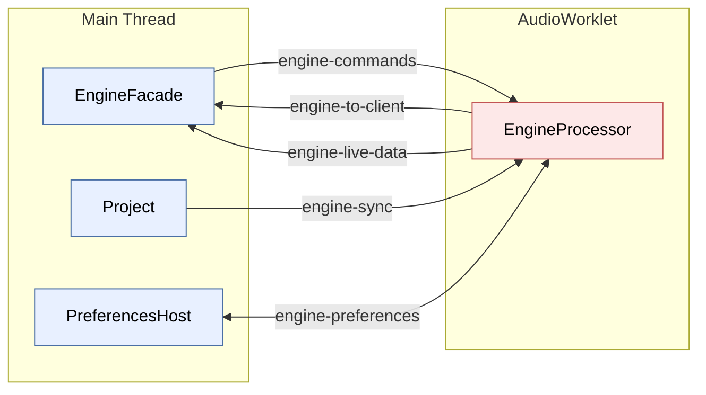

# Cross-Thread Protocols

> **Audience:** contributors to openDAW. This chapter explains the wire protocols that connect the audio thread, the main thread, and the worker pool — how a button click in the UI becomes a command on the audio thread, and how the playhead position gets back to the UI sixty times a second.
>
> **Prereqs:** [`01-engine-processor`](./01-engine-processor.md) and [`02-box-system`](./02-box-system.md). The engine chapter says "RPC via `MessagePort`" and "state via `SharedArrayBuffer`" and defers the details to this chapter. This is that chapter.

The openDAW engine spans **at least four execution contexts**: the main browser thread, the AudioWorklet thread, the HRClock worker, and the Web Worker pool (peaks, OPFS, FFmpeg). They have to coordinate with microsecond precision — the audio thread can't block, the main thread can't drop frames, and neither can wait on the other.

Three primitives carry all the traffic between them:

1. **`MessagePort` + `Messenger` + `Communicator`** — typed RPC for commands, async resource loading, and structural notifications.
2. **`SharedArrayBuffer` + `SyncStream`** — lock-free state polling, used by the audio thread to publish playhead / meters / DSP load that the UI reads every animation frame.
3. **`SharedArrayBuffer` + `Atomics.wait/notify`** — blocking notification, used by the HRClock worker and the `RingBuffer`.

Almost every cross-thread interaction in openDAW is one of these three patterns dressed up in a typed wrapper.

## Messenger — typed port wrapping

`Messenger` (`packages/lib/runtime/src/messenger.ts:20`) is a thin observer wrapper around a `MessagePort`:

```typescript
export type Messenger = Observable<any> & Terminable & {
    send(message: any, transfer?: Array<Transferable>): void
    channel(name: string): Messenger
}
```

You construct one with `Messenger.for(port)`. It attaches `onmessage` / `onmessageerror` handlers and exposes the message stream as an `Observable<any>`. If the port is already wrapped (`onmessage` is set), the constructor throws — there's exactly one `Messenger` per port.

### Channel multiplexing

You almost never use the raw messenger directly. Instead you call `channel(name)` to get a logical sub-channel:

```typescript
// packages/lib/runtime/src/messenger.ts:56
class Channel implements Messenger {
    constructor(messages: Messenger, name: string) {
        this.#messages = messages
        this.#name = name
        this.#subscription = messages.subscribe(data => {
            if ("__id__" in data && data.__id__ === "42"
                && "message" in data && "channel" in data
                && data.channel === name) {
                this.#notifier.notify(data.message)
            }
        })
    }

    send(message, transferrables?): void {
        this.#messages.send({__id__: "42", channel: this.#name, message}, transferrables)
    }
}
```

Each channel filters messages by name. The `"42"` magic string is a marker so the channel ignores foreign messages on the same port. This lets one `MessagePort` carry many independent RPC protocols — the engine multiplexes at least five (see below).

## Communicator — typed RPC

`Communicator` (`packages/lib/runtime/src/communicator.ts`) layers request/response semantics over `Messenger`. The two factories are:

```typescript
// packages/lib/runtime/src/communicator.ts:19
export const sender = <PROTOCOL>(
    messenger: Messenger,
    bind: (dispatcher: Dispatcher) => PROTOCOL
): PROTOCOL =>
    bind(new Sender(messenger))

export const executor = <PROTOCOL>(
    messenger: Messenger,
    protocol: PROTOCOL
): Executor<PROTOCOL> =>
    new Executor(messenger, protocol)
```

Pattern:

- One side calls `sender(messenger, dispatcher => proxyImplementingPROTOCOL)` and gets a typed object. Calling a method on the object sends a message.
- The other side calls `executor(messenger, protocolImpl)` and provides the actual implementation. The executor dispatches incoming messages to the matching method.

You write the *same* `PROTOCOL` interface twice (once as sender proxy, once as executor handler), and the wire is type-safe at both ends.

### Dispatcher

The `Dispatcher` passed to the sender's bind function gives you two call shapes:

```typescript
// packages/lib/runtime/src/communicator.ts:25
export interface Dispatcher {
    dispatchAndForget: <F extends (..._: Parameters<F>) => void>(
        func: F, ...args: Parameters<F>
    ) => void

    dispatchAndReturn: <F extends (..._: Parameters<F>) => Promise<R>, R>(
        func: F, ...args: Parameters<F>
    ) => Promise<R>
}
```

`dispatchAndForget` is fire-and-forget. `dispatchAndReturn` allocates a `returnId`, stores the resolve/reject in a map (`#expected`), sends the message, and waits for a matching `"resolve"` or `"reject"` to come back.

### Wire format

The actual message objects (`communicator.ts:163`):

```typescript
type Send<T> = {
    type: "send"
    func: keyof T              // method name
    args: Arg[]
    returnId: int | false       // false for fire-and-forget
}

type Arg = { value: any } | { callback: int }

type Resolve = { type: "resolve", returnId: int, resolve: any }
type Reject  = { type: "reject", returnId: int, reject: any }
type Callback = { type: "callback", returnId: int, funcAt: int, args: Arg[] }
```

The executor receives a `Send`, looks up `protocol[message.func]`, calls it with the unwrapped args, and if the return is a Promise, pipes the resolution back as a `Resolve` / `Reject`. Callbacks in the args (functions) get serialized as `{callback: index}` and replaced on the executor side with proxy functions that send `Callback` messages back.

### Transferables

The dispatcher scans args and auto-detects transferables (`MessagePort`, `ImageBitmap`, `OffscreenCanvas`, anything wrapped in `Communicator.Transfer`) and passes them as the second arg to `postMessage()`. This is how `setupMIDI(port: MessagePort, buffer: SharedArrayBuffer)` actually transfers the port — no manual `transfer` list required.

## The engine's RPC channels

`EngineWorklet` (`packages/studio/core/src/EngineWorklet.ts:119–237`) creates one `Messenger` over the worklet's `port` and multiplexes five named channels:

| Channel | Direction | Protocol |
|---|---|---|
| `engine-commands` | Main → Worklet | `EngineCommands` (typed in `protocols.ts:9`) |
| `engine-to-client` | Worklet → Main | `EngineToClient` (typed in `protocols.ts:33`) |
| `engine-sync` | Main → Worklet | `Synchronization<BoxIO.TypeMap>` (box graph diffs) |
| `engine-live-data` | Worklet → Main | live broadcaster data (meters, spectrum, waveform) |
| `engine-preferences` | Main ↔ Worklet | preferences sync |

Visually:



One `MessagePort` underneath, five logical channels multiplexed over it by the `"__id__"` filter trick in `Channel`.

### `EngineCommands` (main → worklet)

```typescript
// packages/studio/adapters/src/protocols.ts:9
export interface EngineCommands extends Terminable {
    play(): void
    stop(reset: boolean): void
    setPosition(position: ppqn): void
    prepareRecordingState(countIn: boolean): void
    stopRecording(): void
    queryLoadingComplete(): Promise<boolean>
    panic(): void
    noteSignal(signal: NoteSignal): void
    ignoreNoteRegion(uuid: UUID.Bytes): void
    scheduleClipPlay(clipIds: ReadonlyArray<UUID.Bytes>): void
    scheduleClipStop(trackIds: ReadonlyArray<UUID.Bytes>): void
    setupMIDI(port: MessagePort, buffer: SharedArrayBuffer): void
    loadClickSound(index: 0 | 1, data: AudioData): void
    setFrozenAudio(uuid: UUID.Bytes, audioData: Nullable<AudioData>): void
    updateMonitoringMap(map: ReadonlyArray<MonitoringMapEntry>): void
}
```

Most methods are `void` — fire-and-forget commands. `queryLoadingComplete()` is the only one that returns a `Promise`, used to await sample loading before play begins.

`setupMIDI(port, buffer)` is interesting: it transfers a `MessagePort` *and* a `SharedArrayBuffer` to the worklet so MIDI input events from a separate worker can land directly in the audio thread without going through the main thread.

### `EngineToClient` (worklet → main)

```typescript
// packages/studio/adapters/src/protocols.ts:33
export interface EngineToClient {
    log(message: string): void
    error(reason: unknown): void
    deviceMessage(uuid: string, message: string): void
    fetchAudio(uuid: UUID.Bytes): Promise<AudioData>
    fetchSoundfont(uuid: UUID.Bytes): Promise<SoundFont2>
    fetchNamWasm(): Promise<ArrayBuffer>
    notifyClipSequenceChanges(changes: ClipSequencingUpdates): void
    switchMarkerState(state: Nullable<[UUID.Bytes, int]>): void
    ready(): void
}
```

Worklet-originated. The three `fetch*` methods are RPC calls — the worklet *awaits* the result before continuing. The rest are notifications.

The worklet calling `fetchAudio(uuid).then(...)` is how it gets decoded sample data — see [the fetchAudio flow](#fetchaudio-the-async-resource-pattern) below.

## SyncStream — lock-free state polling

For state that updates every quantum (~370 times a second at 48 kHz, more if `bufferSize < 128`), RPC is too slow and too noisy. Instead, the worklet writes into a `SharedArrayBuffer` and the main thread polls.

### Schema

`packages/studio/adapters/src/EngineStateSchema.ts`:

```typescript
export const PERF_BUFFER_SIZE = 512

export const EngineStateSchema = Schema.createBuilder({
    position: Schema.float,
    bpm: Schema.float,
    playbackTimestamp: Schema.float,
    countInBeatsRemaining: Schema.float,
    isPlaying: Schema.bool,
    isCountingIn: Schema.bool,
    isRecording: Schema.bool,
    perfIndex: Schema.int32,
    perfBuffer: Schema.floats(PERF_BUFFER_SIZE)
})

export type EngineState = ReturnType<typeof EngineStateSchema>["object"]
```

`Schema.createBuilder` builds a typed view over a `SharedArrayBuffer` with fixed offsets per field. The reader and writer agree on the layout because they share the same `Schema` factory.

Total buffer size: 7 floats × 4 bytes + 1 int32 + 512 floats × 4 bytes = **2080 bytes**.

The `perfBuffer` field is a circular ring of DSP load measurements written by `HRClock`; `perfIndex` is the write pointer the main thread uses to find the most recent samples.

### Writer (worklet)

The writer is created once during `EngineProcessor` construction and called from `render()` every quantum:

```typescript
// EngineProcessor.ts:143 (in constructor)
this.#stateSender = SyncStream.writer(EngineStateSchema(), syncStreamBuffer, x => {
    const {transporting, isCountingIn, isRecording, position} = this.#timeInfo
    const denominator = this.#timelineBoxAdapter.box.signature.denominator.getValue()
    x.position = position
    x.bpm = this.#renderer.bpm
    x.playbackTimestamp = this.#playbackTimestamp
    x.countInBeatsRemaining = isCountingIn
        ? (this.#recordingStartTime - position) / PPQN.fromSignature(1, denominator)
        : 0
    x.isPlaying = transporting
    x.isRecording = isRecording
    x.isCountingIn = isCountingIn
    if (this.#preferences.settings.debug.dspLoadMeasurement) {
        x.perfBuffer.set(this.#perfBuffer)
        x.perfIndex = this.#perfWriteIndex
    }
})

// EngineProcessor.ts:414 (in render())
this.#stateSender.tryWrite()
```

`tryWrite()` is the publish step. The exact ordering (whether each field uses `Atomics.store` or a relaxed write, and whether there's a generation counter for torn-read detection) lives in `@opendaw/lib-std`'s `SyncStream` — read that if you need bit-level certainty.

### Reader (main thread)

```typescript
// EngineWorklet.ts:88
const reader = SyncStream.reader<EngineState>(EngineStateSchema(), state => {
    this.#isPlaying.setValue(state.isPlaying)
    this.#isRecording.setValue(state.isRecording)
    this.#isCountingIn.setValue(state.isCountingIn)
    this.#countInBeatsRemaining.setValue(state.countInBeatsRemaining)
    this.#playbackTimestamp.setValue(state.playbackTimestamp)
    this.#bpm.setValue(state.bpm)
    this.#perfBuffer = state.perfBuffer
    this.#perfIndex = state.perfIndex
    this.#updateCpuLoad(budgetMs, project)
    this.#position.setValue(state.position) // This must be the last to handle the state values before
})
```

The trailing comment matters: `position` is set last so that any subscriber listening to `position` and reading other state via cross-observables sees a coherent snapshot. The reader is then polled every animation frame:

```typescript
// EngineWorklet.ts:233
AnimationFrame.add(() => reader.tryRead())
```

`tryRead()` reads the buffer atomically, decodes into the typed `state` object, and calls the callback. If the buffer hasn't changed since the last read, the callback isn't fired.

## SyncSource / SyncTarget — graph synchronization

The box graph lives on the main thread; the audio thread needs a copy. The initial state is shipped as a serialized `ArrayBuffer` in `processorOptions` (see [EngineProcessorAttachment](#engineprocessorattachment)). After that, every commit on the main-thread graph is shipped to the worklet as a stream of `UpdateTask`s.

### `UpdateTask`

```typescript
// packages/lib/box/src/sync.ts
export type UpdateTask<M> =
    | { type: "new", name: keyof M, uuid: UUID.Bytes, buffer: ArrayBufferLike }
    | { type: "update-primitive", address: AddressLayout, value: unknown }
    | { type: "update-pointer", address: AddressLayout, target: Maybe<AddressLayout> }
    | { type: "delete", uuid: UUID.Bytes }

export interface Synchronization<M> {
    sendUpdates(updates: ReadonlyArray<UpdateTask<M>>): void
    checksum(value: Int8Array): Promise<void>
}
```

Each task is the minimum information needed to replay a graph mutation. The `address` field is a flattened `AddressLayout` (UUID + integer field keys), not a `Vertex` reference, so it survives serialization.

### Source (main thread)

`SyncSource` (`packages/lib/box/src/sync-source.ts`) subscribes to the graph's transactions. On `onEndTransaction`, it serializes the accumulated updates and sends them as one batched RPC call:

```typescript
this.#caller = Communicator.sender(messenger, ({dispatchAndForget, dispatchAndReturn}) =>
    new class implements Synchronization<M> {
        sendUpdates(updates: ReadonlyArray<UpdateTask<M>>): void {
            dispatchAndForget(this.sendUpdates, updates)
        }
        checksum(value: Int8Array): Promise<void> {
            return dispatchAndReturn(this.checksum, value)
        }
    })
```

The `checksum()` method is a debug round-trip: send the local graph's checksum to the worklet and confirm it matches. Used when investigating sync drift.

### Target (worklet)

`SyncTarget` (`packages/lib/box/src/sync-target.ts`) is the executor side. It applies every batch inside a single transaction:

```typescript
sendUpdates(updates: ReadonlyArray<UpdateTask<M>>): void {
    graph.beginTransaction()
    updates.forEach(update => {
        if (update.type === "new") {
            graph.createBox(update.name, update.uuid, box =>
                box.read(new ByteArrayInput(update.buffer)))
        } else if (update.type === "update-primitive") {
            (graph.findVertex(Address.reconstruct(update.address)) as PrimitiveField)
                .setValue(update.value)
        } else if (update.type === "update-pointer") {
            (graph.findVertex(Address.reconstruct(update.address)) as PointerField)
                .targetAddress = isDefined(update.target)
                    ? Option.wrap(Address.reconstruct(update.target))
                    : Option.None
        } else if (update.type === "delete") {
            graph.unstageBox(graph.findBox(update.uuid).unwrap())
        }
    })
    graph.endTransaction()
}
```

One main-thread `modify()` becomes one worklet-thread transaction. The deferred pointer notifications, constraint validation, and ordering guarantees from [Ch. 02](./02-box-system.md#editing--mutations-with-undoredo) apply on the worklet side too — both graphs are real `BoxGraph` instances, just kept in lock-step.

`EngineWorklet` sets this up in its constructor:

```typescript
// EngineWorklet.ts:236
new SyncSource<BoxIO.TypeMap>(project.boxGraph, messenger.channel("engine-sync"), false)
```

The `false` means "don't initialize" — the worklet already received the initial snapshot via `processorOptions.project`. Subsequent transactions stream through this channel.

## Control flags SharedArrayBuffer

A 4-byte `SharedArrayBuffer` holds a single `Int32Array` that the main thread uses to nudge the audio thread between renders, *without* an RPC round-trip.

### Allocation (main thread)

```typescript
// EngineWorklet.ts:101
const controlFlagsSAB = new SharedArrayBuffer(4)  // 4 bytes minimum
// ...
this.#controlFlags = new Int32Array(controlFlagsSAB)
```

It's passed to the processor in `processorOptions.controlFlagsBuffer`.

### Reader (audio thread)

```typescript
// EngineProcessor.ts:350
process(inputs, outputs): boolean {
    if (!this.#valid) {return false}
    if (Atomics.load(this.#controlFlags, 0) === 1) {return true}   // sleep
    try { return this.render(inputs, outputs) }
    catch (reason) { ... }
}
```

Slot `[0]` is the sleep flag. Set to `1`, the processor returns `true` (silent) on every `process()` until the main thread clears it. Set to `0`, normal operation.

### Writer (main thread)

```typescript
// EngineWorklet.ts:249
sleep(): void {
    Atomics.store(this.#controlFlags, 0, 1)
    this.#isPlaying.setValue(false)
    this.#commands.stop(true)
}

wake(): void {Atomics.store(this.#controlFlags, 0, 0)}
```

This is the entire mechanism behind `Engine.suspend()`. No RPC, no audio glitch — the next `process()` reads the flag and returns immediately. The `AudioContext` keeps running so no node graph teardown is needed.

Today only slot `[0]` is used. The buffer is sized for future flags; any new ones would be added at higher slot indices to preserve compatibility.

## HRClock — high-resolution timing via Atomics.wait/notify

The audio thread cannot call `performance.now()` reliably (worklet scope) and certainly cannot sleep. To measure how long a `render()` takes — for the DSP load meter — openDAW uses a dedicated worker that blocks on `Atomics.wait()` and reports back via `performance.now()`.

### The worker

`packages/studio/core/src/HRClockWorker.ts` is a 44-line file that constructs an inline Worker:

```typescript
this.sab = new SharedArrayBuffer(32)
const code = `
    onmessage = (e) => {
        const int32 = new Int32Array(e.data)
        const float64 = new Float64Array(e.data)
        let lastCounter = 0
        while (true) {
            Atomics.wait(int32, 0, lastCounter)
            lastCounter = Atomics.load(int32, 0)
            const isStart = (lastCounter & 1) === 1
            if (isStart) {
                float64[2] = performance.now()
                Atomics.store(int32, 1, lastCounter)
            } else {
                float64[3] = performance.now()
                Atomics.store(int32, 2, lastCounter)
            }
        }
    }
`
const blob = new Blob([code], {type: "application/javascript"})
this.#worker = new Worker(URL.createObjectURL(blob))
this.#worker.postMessage(this.sab)
```

The 32-byte SAB layout:

| Bytes | View | Purpose |
|---|---|---|
| 0–3 | `int32[0]` | request counter (incremented by audio thread) |
| 4–7 | `int32[1]` | start response counter (set by worker on start) |
| 8–11 | `int32[2]` | end response counter (set by worker on end) |
| 16–23 | `float64[2]` | start timestamp |
| 24–31 | `float64[3]` | end timestamp |

Counter parity (odd / even) tells the worker whether to write a start or end timestamp. This means each `process()` call increments the counter twice — once at the start, once at the end.

### Audio-thread API

`packages/studio/core-processors/src/HRClock.ts` is the consumer side. `start()` increments the counter and reads back the *previous* round's timestamps to compute elapsed time. `end()` increments again. The key correctness check:

```typescript
if (this.#prevStartCounter > 0 && this.#prevEndCounter === this.#prevStartCounter + 1) {
    elapsed = this.#prevEndTs - this.#prevStartTs
}
```

If the counter pair doesn't match (worker fell behind, OS jitter), `elapsed = 0` — better to report no measurement than a bogus one.

The audio thread never blocks. It writes one `Atomics.add` + `Atomics.notify` per call and proceeds.

## RingBuffer — bulk audio transfer

For recording — where you need to ship hundreds of samples per quantum continuously from the worklet to the main thread — RPC would generate so many messages it would saturate the event loop. `RingBuffer` (`packages/studio/adapters/src/RingBuffer.ts:5`) is the bulk transport:

```typescript
export namespace RingBuffer {
    export interface Config {
        sab: SharedArrayBuffer
        numChunks: int
        numberOfChannels: int
        bufferSize: int
    }
    export interface Writer { write(channels: ReadonlyArray<Float32Array>): void }
    export interface Reader { stop(): void }
}
```

Layout in the SAB:

```
bytes [0, 4):    write pointer (Int32, slot 0)
bytes [4, 8):    read pointer  (Int32, slot 1)
bytes [8, ∞):    audio data    (Float32, planar: ch0 chunk0 | ch1 chunk0 | ch0 chunk1 | …)
```

Each chunk holds `numberOfChannels * bufferSize` floats. Pointers wrap modulo `numChunks`.

### Writer (audio thread, single-producer)

```typescript
// RingBuffer.ts:61
write: (channels) => {
    const writePtr = Atomics.load(pointers, 0)
    const offset = writePtr * numberOfChannels * bufferSize
    channels.forEach((channel, index) =>
        audio.set(channel, offset + index * bufferSize))
    Atomics.store(pointers, 0, (writePtr + 1) % numChunks)
    Atomics.notify(pointers, 0)
}
```

Copy, advance the write pointer, notify. Single-producer single-consumer means no CAS — just relaxed loads on the writer's own pointer, atomic store on increment, and `Atomics.notify` to wake the reader.

### Reader (main thread or worker, single-consumer)

```typescript
// RingBuffer.ts:17
const step = () => {
    if (!running) return
    let readPtr = Atomics.load(pointers, 1)
    let writePtr = Atomics.load(pointers, 0)
    if (readPtr === writePtr) {
        if (canBlock) {
            Atomics.wait(pointers, 0, writePtr)   // block until writer notifies
        } else {
            setTimeout(step, 1)                   // poll fallback for main thread
            return
        }
        writePtr = Atomics.load(pointers, 0)
    }
    while (readPtr !== writePtr) {
        // copy chunk into planarChunk, split per channel, callback
        readPtr = (readPtr + 1) % numChunks
        Atomics.store(pointers, 1, readPtr)
        if (!running) return
        append(channels)
    }
    step()
}
```

`canBlock` is `typeof document === "undefined"` — `Atomics.wait` is forbidden on the main browser thread, allowed in workers. So the reader self-detects: when run inside a worker, it blocks; when run on the main thread, it polls via `setTimeout(step, 1)`.

The recording processor writes; the main thread reads chunks for WAV export.

## fetchAudio — the async resource pattern

How does the audio thread get a decoded `AudioData`? It needs the main thread's `sampleManager`, but it can't block on a Promise — yet, somehow, it does.

The trick is two-fold: the request is launched asynchronously and the result is *cached* synchronously when it arrives.

### Worklet side

`packages/studio/core-processors/src/SampleManagerWorklet.ts`:

```typescript
class SampleLoaderWorklet implements SampleLoader, Terminable {
    readonly uuid: UUID.Bytes
    #data: Option<AudioData> = Option.None

    constructor(uuid: UUID.Bytes, engineToClient: EngineToClient) {
        engineToClient.fetchAudio(uuid).then(
            data => this.#data = Option.wrap(data),
            console.warn
        )
    }

    get data(): Option<AudioData> { return this.#data }
}
```

The first time a processor asks for a sample, a `SampleLoaderWorklet` is created. It immediately fires `engineToClient.fetchAudio(uuid)` — a `dispatchAndReturn` Promise. While the Promise is pending, `data` is `Option.None` and the processor either waits or plays silence. When the Promise resolves, `#data` becomes the loaded `AudioData` and subsequent ticks see it synchronously.

### Main-thread side

```typescript
// EngineWorklet.ts:183
fetchAudio: (uuid: UUID.Bytes): Promise<AudioData> => {
    return new Promise((resolve, reject) => {
        const handler = project.sampleManager.getOrCreate(uuid)
        const subscription = handler.subscribe(state => {
            if (state.type === "error") {
                reject(new Error(state.reason))
                subscription.terminate()
            } else if (state.type === "loaded") {
                resolve(handler.data.unwrap())
                subscription.terminate()
            }
        })
    })
}
```

`sampleManager.getOrCreate(uuid)` triggers the load (decode-from-OPFS, generate peaks, etc.) and returns a handler with an observable state. The Promise resolves when state hits `"loaded"`.

### Tracking pending resources

```typescript
// EngineProcessor.ts:446
awaitResource(promise: Promise<unknown>): void {
    this.#pendingResources.add(promise)
    promise.finally(() => this.#pendingResources.delete(promise))
}
```

Processors that load resources (e.g. soundfonts) register their promises here. `queryLoadingComplete()` (an `EngineCommands` RPC method) waits for the set to clear — so the UI can show a "loading…" state and only enable play once all resources are ready.

## EngineProcessorAttachment

The full configuration passed in `processorOptions` when `EngineWorklet` is constructed:

```typescript
// packages/studio/adapters/src/EngineProcessorAttachment.ts:7
export type EngineProcessorAttachment = {
    syncStreamBuffer: SharedArrayBuffer  // SyncStream state ring
    controlFlagsBuffer: SharedArrayBuffer // sleep / future flags
    hrClockBuffer: SharedArrayBuffer      // HR timing ring
    project: ArrayBufferLike              // serialized BoxGraph snapshot
    exportConfiguration?: ExportConfiguration
    options?: ProcessorOptions
}
```

`project` is a one-shot snapshot — the worklet reconstructs the box graph from it, then keeps in sync via the `engine-sync` channel for all subsequent changes.

## EngineAddresses — live broadcast slots

Three reserved addresses for the live stream broadcaster (`packages/studio/adapters/src/EngineAddresses.ts`):

```typescript
export namespace EngineAddresses {
    export const PEAKS    = Address.compose(UUID.Lowest).append(0)
    export const SPECTRUM = Address.compose(UUID.Lowest).append(1)
    export const WAVEFORM = Address.compose(UUID.Lowest).append(2)
}
```

`UUID.Lowest` (all-zero UUID) doesn't correspond to a real box. These are virtual addresses the broadcaster uses to publish data over the `engine-live-data` channel without involving a box. The UI subscribes to these addresses and gets the broadcast payload as if it were a box update.

The live broadcaster is its own subsystem — separate from `SyncStream` — and lives in `@opendaw/lib-fusion`. The cross-thread mechanism is the same MessagePort channel multiplexing pattern.

## Offline renderer — same processor, different driver

`packages/studio/adapters/src/offline-renderer.ts` runs the same `EngineProcessor` in a Web Worker (not an AudioWorklet) and drives it with explicit `step()` calls:

```typescript
export interface OfflineEngineProtocol {
    initialize(enginePort: MessagePort, config: OfflineEngineInitializeConfig): Promise<void>
    addModule(code: string): Promise<void>
    render(config: OfflineEngineRenderConfig): Promise<Float32Array[]>
    step(samples: number): Promise<Float32Array[]>
    stop(): void
}
```

The `SyncStream` and control-flag SABs are still passed in `initialize`, but the rendered audio comes back as return values from `step()` — not through a Web Audio destination. Resource loading uses the same `fetchAudio` RPC because the worker still needs the main thread's `sampleManager`.

This is how export works: render the project to a `Float32Array[]` array, save as WAV/FLAC/MP3 via the FFmpeg worker.

## SyncLog — persistent transaction history

`packages/studio/core/src/sync-log/` is a save-format concern, not a runtime cross-thread protocol, but worth a brief mention because it's part of the persistence story:

- **`Commit.ts`** — a single hash-chained commit: previous hash, this hash, payload, timestamp.
- **`SyncLogWriter.ts`** — captures graph transactions and appends them to the log.
- **`SyncLogReader.ts`** — replays the log to reconstruct the project state.

The first commit is `Init` with a full project snapshot; subsequent commits are `Updates` carrying the same `UpdateTask` array the worklet receives. The hash chain prevents corruption from silently passing — on load, hash mismatches throw and recovery code can step back to the previous good commit.

When you read a project file off disk, you're replaying a `SyncLog`. When you save, you're appending to it.

## COOP / COEP — required browser headers

Every cross-thread channel in this chapter — `SyncStream`, control flags, HRClock, `RingBuffer`, the `processorOptions` attachment — uses `SharedArrayBuffer`. The browser only lets you construct a `SharedArrayBuffer` if the page is cross-origin isolated:

```
Cross-Origin-Opener-Policy: same-origin
Cross-Origin-Embedder-Policy: require-corp
```

In the upstream openDAW Studio app, these are set in `packages/app/studio/vite.config.ts`. In this docs/demos repo, they're set in `vercel.json` (top-level). Cloudflare Pages picks the same headers up via that file.

Without these headers, `new SharedArrayBuffer()` throws and the engine fails to initialize — most of this chapter becomes academic. The error from the engine in that case is "engine could not initialize," which is misleading; the real failure is upstream in the browser's isolation check. See [Ch. 12 — Browser Compatibility](../12-browser-compatibility.md) for the full headers-and-iframes story.

## Critical invariants

Like the engine and box chapters, here are the rules that, if you violate them, will either silently corrupt state or break audio.

1. **One `Messenger` per `MessagePort`.** Constructing a second one throws because `onmessage` is already set. If you need to share a port, use `channel(name)`.
2. **Channel names are global.** Two channels with the same name on the same port get the same messages. Choose unique names per protocol.
3. **`dispatchAndReturn` allocates a return slot.** Failing to send a matching `resolve`/`reject` leaks the Promise. The executor side always sends one or the other — don't skip it.
4. **Args go through structured clone.** Don't send class instances with private fields or methods; they lose their prototype. Plain data objects only. Use `Communicator.makeTransferable()` to mark transferables explicitly when auto-detection isn't enough.
5. **Never write to the SyncStream from the main thread.** It's worklet-only; main-thread writes would race.
6. **`Atomics.wait` is forbidden on the main thread.** The `RingBuffer` reader self-detects (`canBlock` check); if you write similar code, do the same.
7. **One `BoxGraph` change becomes one `SyncTarget` transaction.** Don't try to apply individual `UpdateTask`s outside a transaction — pointer constraints will trip.
8. **The control-flag SAB is one Int32Array, single-slot today.** Adding new flags? Use higher indices. Don't repurpose `[0]`.
9. **`SharedArrayBuffer` requires COOP+COEP.** Every deployment needs the headers. The first thing to check when "engine won't start" is the response headers of `index.html`.
10. **`fetchAudio` resolves once.** The Promise is correlated by `returnId`. Don't try to "re-fetch" by calling the same Promise — make a new RPC call.

## Further reading

- **`packages/lib/runtime/src/communicator.test.ts`** — the unit tests for `Communicator` are the most concrete spec for the wire format and serialization rules. Read these before changing anything about the RPC layer.
- **`@opendaw/lib-std`'s `SyncStream`** (in `packages/lib/std/src/` — search for `SyncStream` and `Schema`) — the bit-level layout, atomic ordering, and torn-read prevention for SAB-backed state.
- **`packages/studio/core/src/MIDIReceiver.ts`** and **`MonitoringRouter.ts`** — both transfer a `MessagePort` and a `SharedArrayBuffer` into the worklet for sub-RPC-latency event streams. Good worked examples of mixing the two primitives.
- **[Ch. 12 — Browser Compatibility](../12-browser-compatibility.md)** — the COOP/COEP story, including iframe embedding and resource fetching gotchas.
- **[Ch. 01 — Engine Processor](./01-engine-processor.md)** — where these channels are *used*. Read with this chapter for a complete picture.
