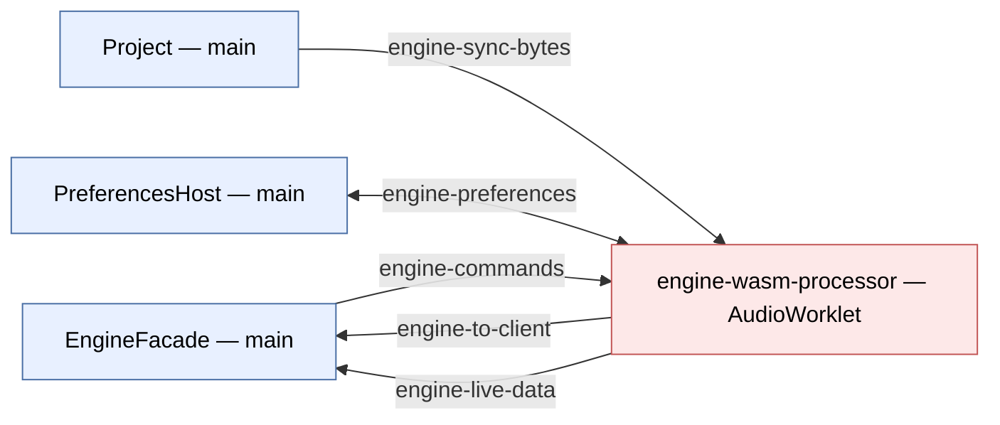

# Cross-Thread Protocols

> **Audience:** contributors to openDAW. This chapter explains the wire protocols that connect the audio thread, the main thread, and the worker pool — how a button click in the UI becomes a command on the audio thread, and how the playhead position gets back to the UI sixty times a second.
>
> **Prereqs:** [`01-engine-processor`](./01-engine-processor.md) and [`02-box-system`](./02-box-system.md). The engine chapter says "RPC via `MessagePort`" and "state via `SharedArrayBuffer`" and defers the details to this chapter. This is that chapter.

The openDAW engine spans **at least four execution contexts**: the main browser thread, the AudioWorklet thread, the HRClock worker, and the Web Worker pool (peaks, OPFS, FFmpeg). They have to coordinate with microsecond precision — the audio thread can't block, the main thread can't drop frames, and neither can wait on the other.

Three primitives carry all the traffic between them:

1. **`MessagePort` + `Messenger` + `Communicator`** — typed RPC for commands, async resource loading, and structural notifications.
2. **`SharedArrayBuffer` + `SyncStream`** — lock-free state polling, used by the audio thread to publish playhead / meters / DSP load that the UI reads every animation frame.
3. **`SharedArrayBuffer` + `Atomics.wait/notify`** — blocking notification, used by the HRClock worker and the `RingBuffer`.

Almost every cross-thread interaction in openDAW is one of these three patterns dressed up in a typed wrapper.

## Messenger — typed port wrapping

`Messenger` (`packages/lib/runtime/src/messenger.ts:20`) is a thin observer wrapper around a `MessagePort`:

```typescript
export type Messenger = Observable<any> & Terminable & {
    send(message: any, transfer?: Array<Transferable>): void
    channel(name: string): Messenger
}
```

You construct one with `Messenger.for(port)`. It attaches `onmessage` / `onmessageerror` handlers and exposes the message stream as an `Observable<any>`. If the port is already wrapped (`onmessage` is set), the constructor throws — there's exactly one `Messenger` per port.

### Channel multiplexing

You almost never use the raw messenger directly. Instead you call `channel(name)` to get a logical sub-channel:

```typescript
// packages/lib/runtime/src/messenger.ts:56
class Channel implements Messenger {
    constructor(messages: Messenger, name: string) {
        this.#messages = messages
        this.#name = name
        this.#subscription = messages.subscribe(data => {
            if ("__id__" in data && data.__id__ === "42"
                && "message" in data && "channel" in data
                && data.channel === name) {
                this.#notifier.notify(data.message)
            }
        })
    }

    send(message, transferrables?): void {
        this.#messages.send({__id__: "42", channel: this.#name, message}, transferrables)
    }
}
```

Each channel filters messages by name. The `"42"` magic string is a marker so the channel ignores foreign messages on the same port. This lets one `MessagePort` carry many independent RPC protocols — the engine multiplexes at least five (see below).

## Communicator — typed RPC

`Communicator` (`packages/lib/runtime/src/communicator.ts`) layers request/response semantics over `Messenger`. The two factories are:

```typescript
// packages/lib/runtime/src/communicator.ts:19
export const sender = <PROTOCOL>(
    messenger: Messenger,
    bind: (dispatcher: Dispatcher) => PROTOCOL
): PROTOCOL =>
    bind(new Sender(messenger))

export const executor = <PROTOCOL>(
    messenger: Messenger,
    protocol: PROTOCOL
): Executor<PROTOCOL> =>
    new Executor(messenger, protocol)
```

Pattern:

- One side calls `sender(messenger, dispatcher => proxyImplementingPROTOCOL)` and gets a typed object. Calling a method on the object sends a message.
- The other side calls `executor(messenger, protocolImpl)` and provides the actual implementation. The executor dispatches incoming messages to the matching method.

You write the *same* `PROTOCOL` interface twice (once as sender proxy, once as executor handler), and the wire is type-safe at both ends.

### Dispatcher

The `Dispatcher` passed to the sender's bind function gives you two call shapes:

```typescript
// packages/lib/runtime/src/communicator.ts:25
export interface Dispatcher {
    dispatchAndForget: <F extends (..._: Parameters<F>) => void>(
        func: F, ...args: Parameters<F>
    ) => void

    dispatchAndReturn: <F extends (..._: Parameters<F>) => Promise<R>, R>(
        func: F, ...args: Parameters<F>
    ) => Promise<R>
}
```

`dispatchAndForget` is fire-and-forget. `dispatchAndReturn` allocates a `returnId`, stores the resolve/reject in a map (`#expected`), sends the message, and waits for a matching `"resolve"` or `"reject"` to come back.

### Wire format

The actual message objects (`communicator.ts:163`):

```typescript
type Send<T> = {
    type: "send"
    func: keyof T              // method name
    args: Arg[]
    returnId: int | false       // false for fire-and-forget
}

type Arg = { value: any } | { callback: int }

type Resolve = { type: "resolve", returnId: int, resolve: any }
type Reject  = { type: "reject", returnId: int, reject: any }
type Callback = { type: "callback", returnId: int, funcAt: int, args: Arg[] }
```

The executor receives a `Send`, looks up `protocol[message.func]`, calls it with the unwrapped args, and if the return is a Promise, pipes the resolution back as a `Resolve` / `Reject`. Callbacks in the args (functions) get serialized as `{callback: index}` and replaced on the executor side with proxy functions that send `Callback` messages back.

### Transferables

The dispatcher scans args and auto-detects transferables (`MessagePort`, `ImageBitmap`, `OffscreenCanvas`, anything wrapped in `Communicator.Transfer`) and passes them as the second arg to `postMessage()`. This is how `setupMIDI(port: MessagePort, buffer: SharedArrayBuffer)` actually transfers the port — no manual `transfer` list required.

## The engine's RPC channels

The audio-thread end of these channels is the WASM engine's worklet processor — `engine-wasm-processor`, registered by `@opendaw/studio-core-wasm` (source: `packages/studio/core-wasm/src/processor.ts`; the constant is `WASM_ENGINE_PROCESSOR_NAME` in `packages/studio/core-wasm/src/protocol.ts`). `EngineWorklet` does not name it directly: it constructs itself against `EngineVariant.current().processorName`, and `WasmEngine.install` is what registers that variant.

Worth knowing when you go looking for it: the engine is **not** in the worklet module the studio adds to every `AudioContext`. `packages/studio/core-processors/src/register.ts` registers exactly two processors — `meter-processor` and `recording-processor` — both engine-independent. The engine's module is added separately, by `WasmEngine.ensureReady`.

`EngineWorklet` (`packages/studio/core/src/EngineWorklet.ts`) creates one `Messenger` over the worklet's `port`. Four channels are opened by the worklet pair itself; the installed engine variant opens one more on the same messenger:

| Channel | Direction | Protocol |
|---|---|---|
| `engine-commands` | Main → Worklet | `EngineCommands` (`packages/studio/adapters/src/protocols.ts`) |
| `engine-to-client` | Worklet → Main | `EngineToClient` (same file) |
| `engine-live-data` | Worklet → Main | `LiveStreamBroadcaster` payloads (peaks, spectrum, waveform, meters) |
| `engine-preferences` | Main ↔ Worklet | `PreferencesHost` ↔ `PreferencesClient` settings sync |
| `engine-sync-bytes` | Main → Worklet | `WasmSyncProtocol` — serialized box-graph transactions |

The last one is named by `packages/studio/core-wasm/src/protocol.ts` (`WASM_SYNC_CHANNEL`) and wired by `WasmEngine.install`'s `connectSync` hook on `EngineWorkletVariant`. Frozen-track PCM needs no channel of its own: it rides the `setFrozenAudio` engine command and is copied into the wasm heap worklet-side (the engine memory is non-shared, so no other thread can write into it).

Visually:


```mermaid
flowchart LR
    Facade["EngineFacade — main"]
    Project["Project — main"]
    Prefs["PreferencesHost — main"]
    EP["engine-wasm-processor — AudioWorklet"]

    Facade -- "engine-commands" --> EP
    EP -- "engine-to-client" --> Facade
    Project -- "engine-sync-bytes" --> EP
    EP -- "engine-live-data" --> Facade
    Prefs <-- "engine-preferences" --> EP

    classDef main fill:#e8f0ff,stroke:#4a6fa5,color:#000
    classDef rt fill:#fde8e8,stroke:#c25555,color:#000
    class Facade,Project,Prefs main
    class EP rt
```

One `MessagePort` underneath, five logical channels multiplexed over it by the `"__id__"` filter trick in `Channel`.

### `EngineCommands` (main → worklet)

```typescript
// packages/studio/adapters/src/protocols.ts
export interface EngineCommands extends Terminable {
    play(): void
    stop(reset: boolean): void
    setPosition(position: ppqn): void
    prepareRecordingState(countIn: boolean): void
    stopRecording(): void
    queryLoadingComplete(): Promise<boolean>
    panic(): void
    noteSignal(signal: NoteSignal): void
    ignoreNoteRegion(uuid: UUID.Bytes): void
    scheduleClipPlay(clipIds: ReadonlyArray<UUID.Bytes>): void
    scheduleClipStop(trackIds: ReadonlyArray<UUID.Bytes>): void
    setupMIDI(port: MessagePort, buffer: SharedArrayBuffer): void
    loadClickSound(index: 0 | 1, data: AudioData): void
    setFrozenAudio(uuid: UUID.Bytes, audioData: Nullable<AudioData>): void
    updateMonitoringMap(map: ReadonlyArray<MonitoringMapEntry>): void
}
```

Most methods are `void` — fire-and-forget commands. `queryLoadingComplete()` is the only one that returns a `Promise`, used to await sample loading before play begins.

`setupMIDI(port, buffer)` is interesting: it transfers a `MessagePort` *and* a `SharedArrayBuffer` to the worklet so MIDI input events from a separate worker can land directly in the audio thread without going through the main thread.

On the worklet side every one of these is a thin marshalling step into the WASM engine's `extern "C"` surface. The processor writes any argument bytes into the engine's input buffer (`engine.input_reserve(n)` returns a pointer into the engine's `WebAssembly.Memory`) and then calls the export — `setPosition` becomes `engine.set_position(position)`, `scheduleClipPlay` writes each 16-byte UUID and calls `engine.schedule_clip_play()`, `updateMonitoringMap` packs `[uuid 16][left i32][right i32]` per entry and calls `engine.set_monitoring_map(count)`. The exports are defined in `crates/engine/src/lib.rs`.

### `EngineToClient` (worklet → main)

```typescript
// packages/studio/adapters/src/protocols.ts
export interface EngineToClient {
    log(message: string): void
    error(reason: unknown): void
    deviceMessage(uuid: string, message: string): void
    fetchAudio(uuid: UUID.Bytes): Promise<AudioData>
    fetchSoundfont(uuid: UUID.Bytes): Promise<SoundFont2>
    fetchNamWasm(): Promise<ArrayBuffer>
    notifyClipSequenceChanges(changes: ClipSequencingUpdates): void
    switchMarkerState(state: Nullable<[UUID.Bytes, int]>): void
    ready(): void
}
```

Worklet-originated. The three `fetch*` methods are RPC calls — the worklet *awaits* the result before continuing. The rest are notifications.

The worklet calling `fetchAudio(uuid).then(...)` is how it gets decoded sample data — see [the fetchAudio flow](#fetchaudio-the-async-resource-pattern) below.

## SyncStream — lock-free state polling

For state that updates every quantum (~370 times a second at 48 kHz, more if `bufferSize < 128`), RPC is too slow and too noisy. Instead, the worklet writes into a `SharedArrayBuffer` and the main thread polls.

### Schema

`packages/studio/adapters/src/EngineStateSchema.ts`:

```typescript
export const PERF_BUFFER_SIZE = 512

export const EngineStateSchema = Schema.createBuilder({
    position: Schema.float,
    bpm: Schema.float,
    playbackTimestamp: Schema.float,
    countInBeatsRemaining: Schema.float,
    isPlaying: Schema.bool,
    isCountingIn: Schema.bool,
    isRecording: Schema.bool,
    perfIndex: Schema.int32,
    perfBuffer: Schema.floats(PERF_BUFFER_SIZE)
})

export type EngineState = ReturnType<typeof EngineStateSchema>["object"]
```

`Schema.createBuilder` builds a typed view over a `SharedArrayBuffer` with fixed offsets per field. The reader and writer agree on the layout because they share the same `Schema` factory.

Total buffer size: 4 floats × 4 bytes + 3 bools × 1 byte + 1 int32 × 4 bytes + 512 floats × 4 bytes = **2071 bytes** of schema data, plus a 1-byte state header allocated by `SyncStream.reader` = **2072 bytes**.

The `perfBuffer` field is a circular ring of DSP load measurements written by `HRClock`; `perfIndex` is the write pointer the main thread uses to find the most recent samples.

### Writer (worklet)

The writer is created once in the worklet processor's constructor and published from `render()` every quantum. The engine itself keeps the authoritative transport state inside its own linear memory and exposes it as a flat record; the writer's job is to decode that record into the schema's typed fields:

```typescript
// packages/studio/core-wasm/src/processor.ts (in constructor)
this.#stateSender = SyncStream.writer(EngineStateSchema(), syncStreamBuffer, state => {
    const view = new DataView(this.#memory.buffer, engine.engine_state_ptr(), engine.engine_state_len())
    state.position = view.getFloat32(0)
    state.bpm = view.getFloat32(4)
    state.playbackTimestamp = this.#playbackTimestamp
    state.countInBeatsRemaining = view.getFloat32(12)
    state.isPlaying = view.getUint8(16) === 1
    state.isCountingIn = view.getUint8(17) === 1
    state.isRecording = view.getUint8(18) === 1
    if (this.#measureLoad) {
        state.perfBuffer.set(this.#perfBuffer)
        state.perfIndex = this.#perfWriteIndex
    }
})
```

`engine_state_ptr()` / `engine_state_len()` are exports of `crates/engine/src/lib.rs` — the byte offsets above are that record's layout, so the two sides must be changed together. `playbackTimestamp` is the exception: it's a host-side value the processor tracks across `setPosition` / `stop`, not something the engine owns.

`tryWrite()` is the publish step. The exact ordering (whether each field uses `Atomics.store` or a relaxed write, and whether there's a generation counter for torn-read detection) lives in `@opendaw/lib-std`'s `SyncStream` — read that if you need bit-level certainty.

### Reader (main thread)

```typescript
// packages/studio/core/src/EngineWorklet.ts (in the constructor's pre-super() setup)
const reader = SyncStream.reader<EngineState>(EngineStateSchema(), state => {
    this.#isPlaying.setValue(state.isPlaying)
    this.#isRecording.setValue(state.isRecording)
    this.#isCountingIn.setValue(state.isCountingIn)
    this.#countInBeatsRemaining.setValue(state.countInBeatsRemaining)
    this.#playbackTimestamp.setValue(state.playbackTimestamp)
    this.#bpm.setValue(state.bpm)
    this.#perfBuffer = state.perfBuffer
    this.#perfIndex = state.perfIndex
    this.#updateCpuLoad(budgetMs, project)
    this.#position.setValue(state.position) // This must be the last to handle the state values before
})
```

The trailing comment matters: `position` is set last so that any subscriber listening to `position` and reading other state via cross-observables sees a coherent snapshot. The reader is then polled every animation frame:

```typescript
// packages/studio/core/src/EngineWorklet.ts
AnimationFrame.add(() => reader.tryRead())
```

`tryRead()` reads the buffer atomically, decodes into the typed `state` object, and calls the callback. If the buffer hasn't changed since the last read, the callback isn't fired.

## SyncSource — graph synchronization

The box graph lives on the main thread; the audio thread needs a copy. Every commit on the main-thread graph is shipped to the worklet as a stream of `UpdateTask`s, and the engine's mirror is populated by the same mechanism: the sync source opens with a full dump of the graph, so the first batch *is* the initial state.

### `UpdateTask`

```typescript
// packages/lib/box/src/sync.ts
export type UpdateTask<M> =
    | { type: "new", name: keyof M, uuid: UUID.Bytes, buffer: ArrayBufferLike }
    | { type: "update-primitive", address: AddressLayout, primitiveType: PrimitiveType, value: unknown }
    | { type: "update-pointer", address: AddressLayout, target: Maybe<AddressLayout> }
    | { type: "delete", uuid: UUID.Bytes }

export interface Synchronization<M> {
    sendUpdates(updates: ReadonlyArray<UpdateTask<M>>): void
    checksum(value: Int8Array): Promise<void>
}
```

Each task is the minimum information needed to replay a graph mutation. The `address` field is a flattened `AddressLayout` (UUID + integer field keys), not a `Vertex` reference, so it survives serialization.

These four tag strings are a **wire contract with the Rust engine**, decoded by `decode_forward` in `crates/boxgraph/src/updates.rs`. `sync.ts` says so in a comment for a reason: renaming one is a silent cross-language break that TypeScript cannot catch.

`primitiveType` exists for the same reason: it carries the field's codec captured at emission time, so a batch stays self-contained even when a later task in it deletes the box an earlier task wrote to.

### Source (main thread)

`SyncSource` (`packages/lib/box/src/sync-source.ts`) subscribes to the graph's transactions and, on `onEndTransaction`, emits the accumulated updates as one batch.

The engine's mirror is not a JavaScript `BoxGraph`, so the batch cannot simply be structured-cloned across the port — it has to become bytes the Rust decoder understands. `WasmEngine.install`'s `connectSync` (`packages/studio/core-wasm/src/WasmEngine.ts`) arranges exactly that, and the ordering is the point:

```typescript
const target: Synchronization<BoxIO.TypeMap> = {
    sendUpdates: (tasks: ReadonlyArray<UpdateTask<BoxIO.TypeMap>>): void => {
        sender.applyUpdates(serializeUpdateTasks(tasks))
        verifyChecksum()
    },
    checksum: (value: Int8Array): Promise<void> => sender.checksum(value)
}
const loopback = createSyncLoopback()
const executor = Communicator.executor<Synchronization<BoxIO.TypeMap>>(loopback.target, target)
const syncSource = new SyncSource<BoxIO.TypeMap>(project.boxGraph, loopback.source, true)
```

`createSyncLoopback()` (`packages/studio/core-wasm/src/sync/loopback.ts`) is a *synchronous* in-process messenger pair. That matters: serialization has to happen at emission time, while the source graph still holds the boxes the batch refers to. A real `MessageChannel` hop would let a later transaction delete a box before the batch resolved its field codecs.

The `true` on `SyncSource` means "initialize" — it opens with a full dump of the graph, which is how the engine receives the project in the first place.

`serializeUpdateTasks` (`packages/studio/core-wasm/src/sync/serialize-update-tasks.ts`) writes a self-contained stream: a task count, then per task a type string and its payload. Each `update-primitive` carries the field's codec (`primitiveType`) captured at emission time rather than a reference to be re-resolved later, for the same reason.

The `checksum()` round-trip is no longer only a debug aid. `connectSync` throttles one to roughly a second and sends the source graph's checksum after the batches on the same ordered channel; the worklet compares it against the engine's rolling checksum and escalates a divergence.

### Target (worklet and engine)

The executor side lives in the worklet processor and is deliberately thin — it copies the bytes into the engine's input buffer and hands off:

```typescript
// packages/studio/core-wasm/src/processor.ts
#applyUpdates(bytes: ArrayBuffer): void {
    const array = new Uint8Array(bytes)
    const pointer = this.#engine.input_reserve(array.length)
    new Uint8Array(this.#memory.buffer, pointer, array.length).set(array)
    const rejected = this.#engine.apply_updates(array.length)
    if (rejected !== 0) {
        this.#engineToClient.error(new Error(`apply_updates rejected a transaction (code ${rejected})`))
        return
    }
    if (!this.#bound && this.#engine.bind() === 0) {this.#bound = true}
    drainResourceRequests(...)
}
```

The decode and apply are Rust. `apply_updates` (`crates/engine/src/lib.rs`) runs `decode_forward` from `crates/boxgraph/src/updates.rs` and applies the resulting `Update` values to the mirror `BoxGraph` in `crates/boxgraph/src/graph.rs`. The wire format is documented at the top of `updates.rs`:

```
new/delete : uuid(16) + name(string) + settingsLen(int) + settings(FLDS bytes)
pointer    : address + optional oldAddress + optional newAddress
primitive  : address + valueType(string) + oldValue + newValue
```

Carrying the *old* value alongside the new is what lets `updates.rs` implement `revert`, so a partially-applied transaction can be undone rather than leaving the mirror wedged.

Two consequences worth internalizing:

- **A rejected transaction is fatal, not recoverable in place.** Once `apply_updates` returns non-zero the mirror has permanently diverged from the source, so the processor escalates through `EngineToClient.error` and the studio's restart flow reboots the worklet from a fresh full dump. There is no partial-repair path.
- **A transaction can create work.** New `AudioFileBox` / `SoundfontFileBox` targets make the engine queue resource requests, which is why `#applyUpdates` ends by draining them (see [the fetchAudio flow](#fetchaudio--the-async-resource-pattern)).

The deferred pointer notifications, constraint validation, and ordering guarantees from [Ch. 02](./02-box-system.md#editing--mutations-with-undoredo) still hold — the Rust mirror is a real box graph with its own subscription hub (`crates/boxgraph/src/subscription.rs`), kept in lock-step with the source rather than re-deriving anything.

## Control flags SharedArrayBuffer

A 4-byte `SharedArrayBuffer` holds a single `Int32Array` that the main thread uses to nudge the audio thread between renders, *without* an RPC round-trip.

### Allocation (main thread)

```typescript
// packages/studio/core/src/EngineWorklet.ts
const controlFlagsSAB = new SharedArrayBuffer(4)  // 4 bytes minimum
// ...
this.#controlFlags = new Int32Array(controlFlagsSAB)
```

It's passed to the processor in `processorOptions.controlFlagsBuffer`.

### Reader (audio thread)

```typescript
// packages/studio/core-wasm/src/processor.ts
process(inputs, outputs): boolean {
    if (!this.#valid) {return false} // will not revive
    if (Atomics.load(this.#controlFlags, 0) === 1) {
        this.#stateSender.tryWrite() // keep the UI in sync (stopped transport) while asleep, no DSP
        return true
    }
    const {status, error} = tryCatch(() => this.#render(inputs, outputs))
    if (status === "failure") {
        this.#fail(error)
        return false
    }
    return true
}
```

Slot `[0]` is the sleep flag. Set to `1`, the processor skips the render entirely — no call into the WASM engine — but still publishes the state stream so the UI doesn't freeze on a stale playhead. Set to `0`, normal operation.

Note the asymmetry between the two early returns: `#valid` is latched off permanently by a fatal engine error (a WASM trap surfaces through `#fail`), and returning `false` from `process()` tells the browser to tear the node down. Sleep is the reversible one.

### Writer (main thread)

```typescript
// packages/studio/core/src/EngineWorklet.ts
sleep(): void {
    Atomics.store(this.#controlFlags, 0, 1)
    this.#isPlaying.setValue(false)
    this.#commands.stop(true)
}

wake(): void {Atomics.store(this.#controlFlags, 0, 0)}
```

This is the entire mechanism behind `Engine.sleep()`. No RPC, no audio glitch — the next `process()` reads the flag and returns immediately. The `AudioContext` keeps running so no node graph teardown is needed.

Today only slot `[0]` is used. The buffer is sized for future flags; any new ones would be added at higher slot indices to preserve compatibility.

## HRClock — high-resolution timing via Atomics.wait/notify

The audio thread cannot call `performance.now()` reliably (worklet scope) and certainly cannot sleep. To measure how long a `render()` takes — for the DSP load meter — openDAW uses a dedicated worker that blocks on `Atomics.wait()` and reports back via `performance.now()`.

### The worker

`packages/studio/core/src/HRClockWorker.ts` is a 44-line file that constructs an inline Worker:

```typescript
this.sab = new SharedArrayBuffer(32)
const code = `
    onmessage = (e) => {
        const int32 = new Int32Array(e.data)
        const float64 = new Float64Array(e.data)
        let lastCounter = 0
        while (true) {
            Atomics.wait(int32, 0, lastCounter)
            lastCounter = Atomics.load(int32, 0)
            const isStart = (lastCounter & 1) === 1
            if (isStart) {
                float64[2] = performance.now()
                Atomics.store(int32, 1, lastCounter)
            } else {
                float64[3] = performance.now()
                Atomics.store(int32, 2, lastCounter)
            }
        }
    }
`
const blob = new Blob([code], {type: "application/javascript"})
this.#worker = new Worker(URL.createObjectURL(blob))
this.#worker.postMessage(this.sab)
```

The 32-byte SAB layout:

| Bytes | View | Purpose |
|---|---|---|
| 0–3 | `int32[0]` | request counter (incremented by audio thread) |
| 4–7 | `int32[1]` | start response counter (set by worker on start) |
| 8–11 | `int32[2]` | end response counter (set by worker on end) |
| 16–23 | `float64[2]` | start timestamp |
| 24–31 | `float64[3]` | end timestamp |

Counter parity (odd / even) tells the worker whether to write a start or end timestamp. This means each `process()` call increments the counter twice — once at the start, once at the end.

### Audio-thread API

`packages/studio/core-processors/src/HRClock.ts` is the consumer side. It is engine-independent — it knows only about the 32-byte SAB layout above — which is why it outlived the engine rewrite: the WASM worklet processor constructs one from `processorOptions.hrClockBuffer` and brackets its render with it.

`start()` increments the counter and reads back the *previous* round's timestamps to compute elapsed time. `end()` increments again. The key correctness check:

```typescript
if (this.#prevStartCounter > 0 && this.#prevEndCounter === this.#prevStartCounter + 1) {
    elapsed = this.#prevEndTs - this.#prevStartTs
}
```

If the counter pair doesn't match (worker fell behind, OS jitter), `elapsed = 0` — better to report no measurement than a bogus one.

The audio thread never blocks. It writes one `Atomics.add` + `Atomics.notify` per call and proceeds.

## RingBuffer — bulk audio transfer

For recording — where you need to ship hundreds of samples per quantum continuously from the worklet to the main thread — RPC would generate so many messages it would saturate the event loop. `RingBuffer` (`packages/studio/adapters/src/RingBuffer.ts:5`) is the bulk transport:

```typescript
export namespace RingBuffer {
    export interface Config {
        sab: SharedArrayBuffer
        numChunks: int
        numberOfChannels: int
        bufferSize: int
    }
    export interface Writer { write(channels: ReadonlyArray<Float32Array>): void }
    export interface Reader { stop(): void }
}
```

Layout in the SAB:

```
bytes [0, 4):    write pointer (Int32, slot 0)
bytes [4, 8):    read pointer  (Int32, slot 1)
bytes [8, ∞):    audio data    (Float32, planar: ch0 chunk0 | ch1 chunk0 | ch0 chunk1 | …)
```

Each chunk holds `numberOfChannels * bufferSize` floats. Pointers wrap modulo `numChunks`.

### Writer (audio thread, single-producer)

```typescript
// RingBuffer.ts:61
write: (channels) => {
    const writePtr = Atomics.load(pointers, 0)
    const offset = writePtr * numberOfChannels * bufferSize
    channels.forEach((channel, index) =>
        audio.set(channel, offset + index * bufferSize))
    Atomics.store(pointers, 0, (writePtr + 1) % numChunks)
    Atomics.notify(pointers, 0)
}
```

Copy, advance the write pointer, notify. Single-producer single-consumer means no CAS — just relaxed loads on the writer's own pointer, atomic store on increment, and `Atomics.notify` to wake the reader.

### Reader (dedicated worker, single-consumer)

`RingBuffer.reader(config, append)` spawns a **dedicated worker from a blob URL** that
blocks on `Atomics.wait` (woken by the writer's `Atomics.notify`), drains every available
chunk into a batch, and `postMessage`s the batch back (buffers transferred). The caller's
`append` callback still runs on the main thread, once per drained chunk:

```typescript
// RingBuffer.ts — worker source, inlined as a blob
while (true) {
    let readPtr = Atomics.load(pointers, 1)
    let writePtr = Atomics.load(pointers, 0)
    if (readPtr === writePtr) {
        Atomics.wait(pointers, 0, writePtr)     // block until writer notifies
        writePtr = Atomics.load(pointers, 0)
    }
    const batch = []                            // drain everything available
    while (readPtr !== writePtr) {
        // slice each channel out of the SAB, collect transferables
        readPtr = (readPtr + 1) % numChunks
        Atomics.store(pointers, 1, readPtr)
        batch.push(channels)
    }
    postMessage(batch, transfer)
}
```

`Reader.stop()` terminates the worker and revokes the blob URL.

The reader lives on a dedicated worker (rather than the main thread) because Chrome
throttles main-thread timers in hidden tabs to ~1s — any polling reader would overrun
the ring and silently drop recorded audio. A blocking `Atomics.wait` worker drains in
real time regardless of tab visibility. `CaptureAudio.prepareRecording` allocates the
recording ring with 1024 chunks (~2.7 s at 48 kHz) of headroom, covering the worker's
async boot and transient stalls.

The recording processor writes; the worker drains; the main thread receives chunks for WAV export.

## fetchAudio — the async resource pattern

How does the audio thread get a decoded `AudioData`? It needs the main thread's `sampleManager`, but it can't block on a Promise — yet, somehow, it does.

The trick is two-fold: the request is launched asynchronously and the result is written into the engine's memory synchronously when it arrives.

### Worklet side

The audio thread cannot hold a Promise, so the WASM engine doesn't. It **queues requests** and the host drains them. `drainResourceRequests` (`packages/studio/core-wasm/src/boot.ts`) pops the queue after every applied transaction and after every render:

```typescript
for (; ;) {
    const outPtr = engine.input_reserve(16)
    const handle = engine.sample_take_request(outPtr)
    if (handle < 0) {break}                       // queue empty
    const uuid = new Uint8Array(memory.buffer, outPtr, 16).slice() as UUID.Bytes
    track(engineToClient.fetchAudio(uuid).then(data => {
        const {numberOfFrames, numberOfChannels, sampleRate: dataRate, frames} = data
        const bytesPerChannel = numberOfFrames * Float32Array.BYTES_PER_ELEMENT
        const pointer = engine.sample_allocate(handle, numberOfChannels * bytesPerChannel)
        if (pointer === 0) {return}               // dead handle — see below
        for (let channel = 0; channel < numberOfChannels; channel++) {
            new Float32Array(memory.buffer, pointer + channel * bytesPerChannel, numberOfFrames)
                .set(frames[channel])
        }
        engine.sample_set_ready(handle, numberOfFrames, numberOfChannels, dataRate)
    }, reason => {
        engine.sample_allocate(handle, 4)
        engine.sample_set_ready(handle, 1, 1, fallbackSampleRate)   // 1 frame of silence
        engineToClient.log(`sample load failed: ${reason}`)
    }))
}
```

So the handshake is: **take a request → fetch over RPC → allocate inside the engine → copy frames → mark ready.** Until `sample_set_ready` lands, the engine renders that sample as not-yet-loaded. Soundfonts follow the identical shape (`soundfont_take_request` / `soundfont_allocate` / `soundfont_set_ready`), with the SoundFont2 first reduced by `simplifySoundfont`.

Two details that look like paranoia and aren't:

- **A zero pointer means the handle died.** Handle slots are freed and generation-bumped, so a request can be answered after its slot was recycled — the `AudioFileBox` delete/recreate churn when a recorded take is finalized does exactly this. Writing frames at address `0` would corrupt the engine's own memory, so the continuation bails; the engine re-requests against the fresh handle when the new box syncs.
- **A failed load resolves as one frame of silence, not as nothing.** Leaving the handle unresolved would hang `queryLoadingComplete()` forever.

### Main-thread side

```typescript
// packages/studio/core/src/EngineWorklet.ts
fetchAudio: (uuid: UUID.Bytes): Promise<AudioData> => {
    return new Promise((resolve, reject) => {
        const handler = project.sampleManager.getOrCreate(uuid)
        const subscription = handler.subscribe(state => {
            if (state.type === "error") {
                reject(new Error(state.reason))
                subscription.terminate()
            } else if (state.type === "loaded") {
                resolve(handler.data.unwrap())
                subscription.terminate()
            }
        })
    })
}
```

`sampleManager.getOrCreate(uuid)` triggers the load (decode-from-OPFS, generate peaks, etc.) and returns a handler with an observable state. The Promise resolves when state hits `"loaded"`.

### Tracking pending resources

Every chain started by `drainResourceRequests` is registered in a set the processor owns, via the `track` helper in `boot.ts`:

```typescript
const track = (promise: Promise<unknown>): void => {
    const guarded = promise.catch(onError)
    pending.add(guarded)
    guarded.finally(() => pending.delete(guarded))
}
```

`queryLoadingComplete()` (an `EngineCommands` RPC method) is then just `Promise.all(this.#pendingResources).then(() => true)` — so the UI can show a "loading…" state and only enable play once every queued sample and soundfont has been written into the engine.

Note that `track` wraps the promise in a `.catch(onError)` *before* storing it. A throw inside one of these continuations is an engine trap while writing into WASM memory; without the guard it would vanish as an unhandled rejection in the worklet's global scope, where nothing is listening.

## EngineProcessorAttachment

The full configuration passed in `processorOptions` when `EngineWorklet` is constructed:

```typescript
// packages/studio/adapters/src/EngineProcessorAttachment.ts
export type EngineProcessorAttachment = {
    syncStreamBuffer: SharedArrayBuffer   // SyncStream state ring
    controlFlagsBuffer: SharedArrayBuffer // sleep / future flags
    hrClockBuffer: SharedArrayBuffer      // HR timing ring
    project: ArrayBufferLike
    exportConfiguration?: ExportConfiguration
    options?: ProcessorOptions
    variant?: Record<string, unknown>     // structured-clonable extras for the engine processor
}
```

The first three are the `SharedArrayBuffer`s this chapter has been describing. `variant` is the interesting one: it's an opaque bag the `EngineVariant` provider fills in, and it is how the engine's own artifacts reach the audio thread. For the WASM engine it is a `WasmEngineAttachment` (`packages/studio/core-wasm/src/protocol.ts`):

```typescript
export type WasmEngineAttachment = {
    engineModule: WebAssembly.Module
    deviceModules: ReadonlyArray<WebAssembly.Module>
    deviceBoxTypes: ReadonlyArray<string>
    composites: ReadonlyArray<CompositeSpec>
    effectComposites: ReadonlyArray<EffectCompositeSpec>
}
```

`WebAssembly.Module` is structured-cloneable, so the compiled engine and the per-device plugin modules travel through `processorOptions` without a second fetch on the audio thread. The engine's linear memory is **not** in the attachment: a non-shared memory cannot be cloned, so the processor constructs its own fresh `WebAssembly.Memory` per boot — re-instantiating the engine re-applies its data segments, and a recycled heap would leak every allocation of the previous instance anyway.

`project` is a serialized snapshot of the box graph. The WASM engine does not consume it: its mirror is built from the sync stream's opening full dump instead (see [SyncSource](#syncsource--graph-synchronization)).

## EngineAddresses — live broadcast slots

Reserved addresses for the live stream broadcaster (`packages/studio/adapters/src/EngineAddresses.ts`):

```typescript
export namespace EngineAddresses {
    export const PEAKS    = Address.compose(UUID.Lowest).append(0)
    export const SPECTRUM = Address.compose(UUID.Lowest).append(1)
    export const WAVEFORM = Address.compose(UUID.Lowest).append(2)
    export const STEREO   = Address.compose(UUID.Lowest).append(3)
    export const GONIO    = Address.compose(UUID.Lowest).append(4)
    export const LOUDNESS = Address.compose(UUID.Lowest).append(5)
    export const HEAP     = Address.compose(UUID.Lowest).append(6)
}
```

Each analyser behind these runs lazily — the worklet only computes spectrum, waveform, stereo, goniometer or loudness data while a UI subscription to that address is active. `HEAP` publishes three floats — the engine's `heap_used()`, `heap_claimed()`, and the committed memory (`memory.buffer.byteLength`) — a live meter over the wasm heap.

`UUID.Lowest` (all-zero UUID) doesn't correspond to a real box. These are virtual addresses the broadcaster uses to publish data over the `engine-live-data` channel without involving a box. The UI subscribes to these addresses and gets the broadcast payload as if it were a box update.

The live broadcaster is its own subsystem — separate from `SyncStream` — and lives in `@opendaw/lib-fusion`. The cross-thread mechanism is the same MessagePort channel multiplexing pattern.

## Offline renderer — same engine, different driver

An export doesn't run in an AudioWorklet. `OfflineEngineRenderer` (`packages/studio/core/src/OfflineEngineRenderer.ts`) drives the *same* WASM engine inside a plain Web Worker (`packages/studio/core-wasm/src/offline-worker.ts`) with explicit `step()` calls, over the protocol declared in `packages/studio/adapters/src/offline-renderer.ts`:

```typescript
export interface OfflineEngineProtocol {
    initialize(enginePort: MessagePort, config: OfflineEngineInitializeConfig): Promise<void>
    addModule(code: string): Promise<void>
    render(config: OfflineEngineRenderConfig): Promise<Float32Array[]>
    step(samples: number): Promise<Float32Array[]>
    stop(): void
}
```

The reuse is real, not approximate: `instantiateWasmEngine` and `drainResourceRequests` in `boot.ts` are written to serve both hosts, which is why an offline render and a live render produce the same audio from the same project.

Three things change relative to the realtime path:

- **Audio comes back as return values.** `step(samples)` resolves with a `Float32Array[]`, rather than the engine writing into a Web Audio destination.
- **The engine artifacts are fetched by the worker.** `OfflineEngineRenderer.install` is handed the worker URL plus a `variant` attachment carrying the wasm base URL, and the worker self-loads from there — no `WebAssembly.Module` is transferred.
- **`enginePort` is a real `MessagePort`.** The worker still needs the main thread's `sampleManager`, so `fetchAudio` / `fetchSoundfont` run over the unchanged `EngineToClient` RPC.

The `SyncStream` and control-flag SABs are still passed in `initialize`, so transport state is observable during a render exactly as it is live.

This is how export works: render the project to a `Float32Array[]`, save as WAV/FLAC/MP3 via the FFmpeg worker. See [Ch. 10 — Export](../10-export.md) for the API-level view.

## SyncLog — persistent transaction history

`packages/studio/core/src/sync-log/` is a save-format concern, not a runtime cross-thread protocol, but worth a brief mention because it's part of the persistence story:

- **`Commit.ts`** — a single hash-chained commit: previous hash, this hash, payload, timestamp.
- **`SyncLogWriter.ts`** — captures graph transactions and appends them to the log.
- **`SyncLogReader.ts`** — replays the log to reconstruct the project state.

The first commit is `Init` with a full project snapshot; subsequent commits are `Updates` carrying the same `UpdateTask` array the worklet receives. The hash chain prevents corruption from silently passing — on load, hash mismatches throw and recovery code can step back to the previous good commit.

When you read a project file off disk, you're replaying a `SyncLog`. When you save, you're appending to it.

## COOP / COEP — required browser headers

Every cross-thread channel in this chapter — `SyncStream`, control flags, HRClock, `RingBuffer` — uses `SharedArrayBuffer` (the engine's own wasm heap does not; it is non-shared and worklet-owned). The browser only lets you construct a `SharedArrayBuffer` if the page is cross-origin isolated:

```
Cross-Origin-Opener-Policy: same-origin
Cross-Origin-Embedder-Policy: require-corp
```

In the upstream openDAW Studio app, these are set in `packages/app/studio/vite.config.ts`. In this docs/demos repo, they're set in `vercel.json` (top-level). Cloudflare Pages picks the same headers up via that file.

Without these headers, `new SharedArrayBuffer()` throws and the engine fails to initialize — most of this chapter becomes academic. The error from the engine in that case is "engine could not initialize," which is misleading; the real failure is upstream in the browser's isolation check. See [Ch. 12 — Browser Compatibility](../12-browser-compatibility.md) for the full headers-and-iframes story.

## Critical invariants

Like the engine and box chapters, here are the rules that, if you violate them, will either silently corrupt state or break audio.

1. **One `Messenger` per `MessagePort`.** Constructing a second one throws because `onmessage` is already set. If you need to share a port, use `channel(name)`.
2. **Channel names are global.** Two channels with the same name on the same port get the same messages. Choose unique names per protocol.
3. **`dispatchAndReturn` allocates a return slot.** Failing to send a matching `resolve`/`reject` leaks the Promise. The executor side always sends one or the other — don't skip it.
4. **Args go through structured clone.** Don't send class instances with private fields or methods; they lose their prototype. Plain data objects only. Use `Communicator.makeTransferable()` to mark transferables explicitly when auto-detection isn't enough.
5. **Never write to the SyncStream from the main thread.** It's worklet-only; main-thread writes would race.
6. **`Atomics.wait` is forbidden on the main thread.** The `RingBuffer` reader runs it on a dedicated worker; if you write similar code, block only in a worker.
7. **One main-thread transaction becomes one `apply_updates` batch.** Don't split a batch or reorder tasks within it — pointer constraints and the `revert` path both assume the batch is atomic.
8. **Serialize sync updates at emission time, never after a port hop.** A later transaction can delete the boxes an earlier batch refers to. This is why `connectSync` uses a synchronous loopback rather than a `MessageChannel`.
9. **A rejected `apply_updates` is unrecoverable.** The engine's mirror has diverged; escalate through `EngineToClient.error` so the worklet reboots from a fresh dump. Never try to patch it up in place.
10. **The control-flag SAB is one Int32Array, single-slot today.** Adding new flags? Use higher indices. Don't repurpose `[0]`.
11. **`SharedArrayBuffer` requires COOP+COEP.** Every deployment needs the headers. The first thing to check when "engine won't start" is the response headers of `index.html`.
12. **`fetchAudio` resolves once.** The Promise is correlated by `returnId`. Don't try to "re-fetch" by calling the same Promise — make a new RPC call.
13. **Check for a zero pointer before writing into engine memory.** `sample_allocate` / `frozen_allocate` return `0` for a handle that died while the fetch was in flight. Writing there corrupts the engine's heap.

## Further reading

- **`packages/lib/runtime/src/communicator.test.ts`** — the unit tests for `Communicator` are the most concrete spec for the wire format and serialization rules. Read these before changing anything about the RPC layer.
- **`@opendaw/lib-std`'s `SyncStream`** (in `packages/lib/std/src/` — search for `SyncStream` and `Schema`) — the bit-level layout, atomic ordering, and torn-read prevention for SAB-backed state.
- **`packages/studio/core/src/midi/MIDIReceiver.ts`** and **`packages/studio/core/src/MonitoringRouter.ts`** — both transfer a `MessagePort` and a `SharedArrayBuffer` into the worklet for sub-RPC-latency event streams. Good worked examples of mixing the two primitives.
- **`packages/studio/core-wasm/src/processor.ts`** — the audio-thread end of every channel in this chapter, in one file. The most useful single read if you want to see the protocols land.
- **`packages/studio/core-wasm/src/boot.ts`** — engine instantiation and the sample/soundfont handshakes, shared by the realtime worklet and the offline worker.
- **`crates/boxgraph/src/updates.rs`** and **`crates/boxgraph/src/graph.rs`** — the engine-side decode and the mirror graph. Read `updates.rs`'s header comment for the authoritative wire format.
- **[Ch. 12 — Browser Compatibility](../12-browser-compatibility.md)** — the COOP/COEP story, including iframe embedding and resource fetching gotchas.
- **[Ch. 01 — Engine Processor](./01-engine-processor.md)** — where these channels are *used*. Read with this chapter for a complete picture.
