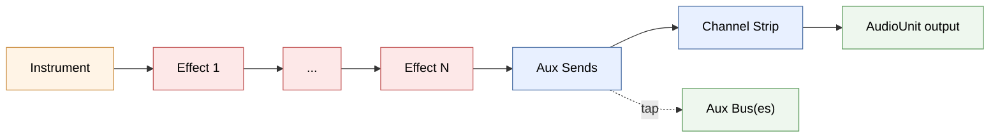

# Devices and Effects

> **Audience:** contributors to openDAW. This chapter is the device layer — instruments, audio effects, MIDI effects — and how they wire into the audio graph established in [Ch. 01](./01-engine-processor.md).
>
> **Prereqs:** [`01-engine-processor`](./01-engine-processor.md) for the `AudioUnit` / device chain frame, [`02-box-system`](./02-box-system.md) for box generation and adapters, [`03-cross-thread-protocols`](./03-cross-thread-protocols.md) for `fetchNamWasm` and friends. Chapter 04 is helpful but not required.

A "device" in openDAW is anything that processes audio or MIDI inside an `AudioUnit`: instruments (Tape, Vaporisateur, Soundfont, …), audio effects (Compressor, Reverb, Delay, …), and MIDI effects (Arpeggio, Pitch, Velocity, …). Each one is a three-layer triple:

1. **Box** — generated by forge from a schema; persistent state, lives in the graph.
2. **Adapter** — typed wrapper around the box; exposes parameters with `ValueMapping`/`StringMapping`.
3. **Processor** — runs in the audio worklet; reads parameters, produces audio or note events.

Adding a new device means adding all three plus two registration entries (factory + dispatcher). The rest of the system — wiring, automation, save/load, undo — just works because every device follows the same shape.

## How a track's audio chain wires up

Before diving into the processor interfaces, it helps to see what the chain itself looks like in motion. Every `AudioUnit`'s audio side wires its devices together like this:



The instrument (or `AudioBusProcessor` for a bus unit) is the source. Effects run in their declared order. Aux sends tap the signal *after* the effects, route copies to one or more aux buses, and pass the original through to the channel strip — which applies volume, pan, mute, solo, and produces the unit's output. The MIDI device chain is symmetric but simpler: notes flow through MIDI effects directly into the instrument's `noteEventTarget`, with no sends or channel strip.

## Processor interfaces

The processor hierarchy is `Processor → DeviceProcessor → {AudioDeviceProcessor, MidiEffectProcessor}` with two further specializations under audio. From the source (`packages/studio/core-processors/src/`):

```typescript
// DeviceProcessor.ts
export interface DeviceProcessor extends Terminable {
    get uuid(): UUID.Bytes
    get incoming(): Processor
    get outgoing(): Processor
}
```

`incoming` and `outgoing` are the *graph vertices* the chain wires up. For a simple effect they're the same processor; for a compound one (e.g. an effect with internal sidechain) they're different.

```typescript
// AudioDeviceProcessor.ts
export interface AudioDeviceProcessor extends DeviceProcessor, AudioGenerator {}

// AudioEffectDeviceProcessor.ts
export interface AudioEffectDeviceProcessor extends AudioDeviceProcessor, AudioInput {
    index(): int
    adapter(): AudioEffectDeviceAdapter
}

// InstrumentDeviceProcessor.ts
export interface InstrumentDeviceProcessor extends AudioDeviceProcessor {
    get noteEventTarget(): Option<NoteEventTarget & DeviceProcessor>
}

// MidiEffectProcessor.ts
export interface MidiEffectProcessor extends Processor, NoteEventSource, NoteEventTarget, Terminable {
    get uuid(): UUID.Bytes
    index(): int
    adapter(): MidiEffectDeviceAdapter
}
```

A few invariants drop out:

- **Instruments produce audio and consume notes.** They're `AudioGenerator` (have an `audioOutput`) and optionally a `NoteEventTarget` (consume note events).
- **Audio effects produce *and* consume audio.** They're both `AudioGenerator` (output) and `AudioInput` (set source via `setAudioSource(source)`).
- **MIDI effects pass notes through.** They have no audio surface — they're `NoteEventSource` *and* `NoteEventTarget`, plus the basic `Processor` contract.

Concrete processors extend `AudioProcessor` (which extends `AbstractProcessor` — see [chapter 01](./01-engine-processor.md#abstractprocessor--event-aware-block-processing)) and implement one of these four interfaces.

## The DeviceProcessorFactory dispatch

When the box graph says "there's a new effect in this chain," the chain has a box but needs a matching processor. That dispatch lives in `packages/studio/core-processors/src/DeviceProcessorFactory.ts`. There are three namespaces, one per device kind:

```typescript
// DeviceProcessorFactory.ts:147
export namespace AudioEffectDeviceProcessorFactory {
    export const create = (context: EngineContext, box: Box): AudioEffectDeviceProcessor =>
        asDefined(box.accept<BoxVisitor<AudioEffectDeviceProcessor>>({
            visitCompressorDeviceBox: (box) =>
                new CompressorDeviceProcessor(
                    context, context.boxAdapters.adapterFor(box, CompressorDeviceBoxAdapter)),
            visitDelayDeviceBox: (box) =>
                new DelayDeviceProcessor(
                    context, context.boxAdapters.adapterFor(box, DelayDeviceBoxAdapter)),
            visitReverbDeviceBox: (box) =>
                new ReverbDeviceProcessor(
                    context, context.boxAdapters.adapterFor(box, ReverbDeviceBoxAdapter)),
            // ... 15+ more
        }), `Could not create audio-effect for '${box.name}'`)
}
```

It's a `BoxVisitor` (see [chapter 02 — visitor pattern](./02-box-system.md#the-box-catalog)). For each box type, there's exactly one entry that:

1. Builds (or fetches the cached) adapter via `context.boxAdapters.adapterFor()`.
2. Constructs the matching processor class, passing `EngineContext` and the adapter.

The `asDefined()` wrapper means "if no visitor case matched, panic with this message" — i.e. an unhandled effect box is a contributor bug, not a runtime fallback.

The other two namespaces follow the same shape:

- **`InstrumentDeviceProcessorFactory.create`** dispatches `ApparatDeviceBox`, `VaporisateurDeviceBox`, `TapeDeviceBox`, `PlayfieldDeviceBox`, `SoundfontDeviceBox`, etc., plus `AudioBusBox` (which uses an `AudioBusProcessor`).
- **`MidiEffectDeviceProcessorFactory.create`** dispatches `ArpeggioDeviceBox`, `PitchDeviceBox`, `VelocityDeviceBox`, `ZeitgeistDeviceBox`, `SpielwerkDeviceBox`.

These dispatchers are called from `AudioDeviceChain.#wire()` / `MidiDeviceChain.#wire()` whenever the chain rewires — see [chapter 01 — DeviceChain rewiring](./01-engine-processor.md#devicechain-rewiring) for the phase-based rewiring story.

## Two factory layers (don't conflate)

There are *two* things called "factory" in the device code. They do different jobs:

| Layer | Lives in | Role |
|---|---|---|
| **`DeviceProcessorFactory`** | `core-processors` | Box → processor instantiation (audio thread side) |
| **`EffectFactory` / `InstrumentFactory`** | `core` (effect side), `adapters` (instrument side) | Adds the device to the project (main thread side) |

The audio thread version (`DeviceProcessorFactory.create`) wakes up when a new box appears in the graph; its job is to instantiate the processor. It runs in the worklet.

The main-thread version (`EffectFactory.create` etc.) is what the UI calls when the user clicks "+ Add Effect"; its job is to construct a new box, set its initial state, and wire its `host` pointer to the device chain.

### `EffectFactory`

```typescript
// packages/studio/core/src/EffectFactory.ts
export interface EffectFactory extends DeviceFactory {
    readonly separatorBefore: boolean
    readonly external: boolean
    readonly type: "audio" | "midi"
    create(project: Project, host: Field<EffectPointerType>, index: int): EffectBox
}
```

Concrete factories are in `packages/studio/core/src/EffectFactories.ts`. The Compressor entry:

```typescript
export const Compressor: EffectFactory = {
    defaultName: "Compressor",
    defaultIcon: IconSymbol.Compressor,
    briefDescription: "Compressor",
    description: "Reduces the dynamic range by attenuating signals above a threshold",
    manualPage: DeviceManualUrls.Compressor,
    separatorBefore: false,
    external: false,
    type: "audio",
    create: ({boxGraph}, hostField, index): CompressorDeviceBox =>
        CompressorDeviceBox.create(boxGraph, UUID.generate(), (box) => {
            box.label.setValue("Compressor")
            box.index.setValue(index)
            box.host.refer(hostField)
        })
}
```

`hostField` is the chain's "slot" the box should point to ([chapter 02 — pointers and PointerHub](./02-box-system.md#pointers-and-pointerhub)) — that's how the chain knows the new box belongs to it. `EffectFactories.ts` exposes 20+ such factories grouped into `MidiNamed` / `AudioNamed` / etc. for the menu.

### `InstrumentFactory`

```typescript
// packages/studio/adapters/src/factories/InstrumentFactory.ts
export interface InstrumentFactory<A = any, INST extends InstrumentBox = InstrumentBox>
    extends DeviceFactory {

    trackType: TrackType
    create: (boxGraph: BoxGraph<BoxIO.TypeMap>,
             host: Field<Pointers.InstrumentHost | Pointers.AudioOutput>,
             name: string,
             icon: IconSymbol,
             attachment?: A) => INST
}
```

Slightly different because instruments are *track roots* — you create a track around them, not an effect into an existing track. The `trackType` tells the project what kind of track to create (audio, MIDI, etc.), and `attachment` carries any extra payload like a SoundFont file pointer.

## Worked example: Compressor end to end

Five files, three packages. The pattern is identical for every audio effect.

**1. Schema** (`packages/studio/forge-boxes/src/schema/devices/audio-effects/CompressorDeviceBox.ts`):

A short forge schema declaring `host`, `index`, `label`, `enabled`, `minimized`, plus the DSP parameters (`threshold`, `ratio`, `attack`, `release`, `makeup`, `mix`, `inputgain`, `knee`, `lookahead`, `automakeup`, `autoattack`, `autorelease`) and a `sideChain` pointer.

**2. Generated box** (`packages/studio/boxes/src/CompressorDeviceBox.ts`):

Auto-generated by forge. Field accessors are typed:

```typescript
get threshold(): Float32Field { return this.getField(15) }
get ratio(): Float32Field { return this.getField(16) }
get attack(): Float32Field { return this.getField(18) }
// ...
get sideChain(): PointerField<Pointers.SideChain> { return this.getField(30) }
```

(Field numbers are stable forever — see [chapter 02 critical invariants](./02-box-system.md#critical-invariants).)

**3. Adapter** (`packages/studio/adapters/src/devices/audio-effects/CompressorDeviceBoxAdapter.ts`):

Wraps every box field with a `ParameterAdapter` carrying a `ValueMapping` (range/scale) and `StringMapping` (UI formatter):

```typescript
constructor(context: BoxAdaptersContext, box: CompressorDeviceBox) {
    this.#context = context
    this.#box = box
    this.#parametric = new ParameterAdapterSet(this.#context)
    this.namedParameter = {
        threshold: this.#parametric.createParameter(
            box.threshold, ValueMapping.linear(-60.0, 0.0),
            StringMapping.decible, "Threshold"),
        ratio: this.#parametric.createParameter(
            box.ratio, ValueMapping.linear(1.0, 20.0),
            StringMapping.ratio, "Ratio"),
        // ...
    }
}
```

The `ValueMapping` is what enables automation to interpolate in normalized space while the DSP reads natural-unit values. The `StringMapping` is what the UI uses for "+0.0 dB" vs "-12.4 dB" formatting.

**4. Processor** (`packages/studio/core-processors/src/devices/audio-effects/CompressorDeviceProcessor.ts`):

Extends `AudioProcessor`, implements `AudioEffectDeviceProcessor`. Constructor binds each parameter:

```typescript
this.parameterThreshold = this.own(this.bindParameter(adapter.namedParameter.threshold))
this.parameterRatio    = this.own(this.bindParameter(adapter.namedParameter.ratio))
this.parameterAttack   = this.own(this.bindParameter(adapter.namedParameter.attack))
// ...
```

`bindParameter()` ([chapter 01](./01-engine-processor.md#automatableparameter-and-abstractprocessor)) subscribes to the field's automation pointer hub; when an automation lane is attached, the parameter starts streaming values per render quantum.

`processAudio(block)` is the per-block DSP loop. The compressor uses helpers from `@opendaw/lib-dsp/ctagdrc` (CTAG dynamic range compressor): `LevelDetector` for the envelope, `GainComputer` for the threshold/ratio curve, `DelayLine` + `LookAhead` for lookahead, `SmoothingFilter` for auto-makeup.

`parameterChanged()` recomputes derived state when parameters change mid-block:

```typescript
parameterChanged(parameter, _relativeBlockTime) {
    if (parameter === this.parameterThreshold) {
        this.#threshold = this.parameterThreshold.getValue()
        this.#gainComputer.setThreshold(this.#threshold)
    } else if (parameter === this.parameterRatio) {
        this.#ratio = this.parameterRatio.getValue()
        this.#gainComputer.setRatio(this.#ratio)
    }
    // ...
}
```

This is the **performance contract** ([chapter 01 — performance constraints](./01-engine-processor.md#performance-constraints-read-these-before-you-write-dsp)): heavy work (filter coefficient recomputation) lives in `parameterChanged()`, called only when something actually changes. `processAudio()` is a tight sample loop with no branching.

**5. Two registrations**:

- **`EffectFactories.Compressor`** (already shown above) — the "Add Effect → Compressor" menu entry.
- **`AudioEffectDeviceProcessorFactory.create` case** (already shown above) — the box-type to processor-class dispatch.

That's the entire surface. Save/load, undo/redo, automation, parameter UI rendering, drag-to-reorder — all handled by the generic infrastructure because the device follows the standard triple.

## Channel strip and aux sends

The `ChannelStripProcessor` (`packages/studio/core-processors/src/ChannelStripProcessor.ts`) is what's at the end of every `AudioDeviceChain`: it applies volume, pan, mute, and solo.

```typescript
constructor(context, adapter) {
    super(context)
    this.#parameterVolume = this.own(this.bindParameter(adapter.namedParameter.volume))
    this.#parameterPanning = this.own(this.bindParameter(adapter.namedParameter.panning))
    this.#parameterMute = this.own(this.bindParameter(adapter.namedParameter.mute))
    this.#parameterSolo = this.own(this.bindParameter(adapter.namedParameter.solo))
    // ...
}

processAudio({s0, s1}: Block): void {
    if (this.#updateGain) {
        const mixer = this.context.mixer
        mixer.updateSolo()
        const isSolo = this.isSolo || mixer.isVirtualSolo(this)
        const silent = this.isMute ||
            (mixer.hasChannelSolo() && !isSolo && !this.#adapter.isOutput)
        const gain = dbToGain(this.#parameterVolume.getValue())
        const panning = this.#parameterPanning.getValue()
        this.#gainL.set((1.0 - Math.max(0.0, panning)) * gain, this.#processing)
        this.#gainR.set((1.0 + Math.min(0.0, panning)) * gain, this.#processing)
        this.#outGain.set(silent ? 0.0 : 1.0, this.#processing)
        this.#updateGain = false
    }
    // ... apply ramped gains per sample
}
```

Two things to notice:

- **Pan is constant-power-ish.** `gainL = (1 - max(0, pan)) * volume` is a linear crossfade — left is reduced as pan moves right, right is reduced as pan moves left. Mean energy isn't perfectly preserved across the field, but it's cheap and predictable.
- **Mute and solo collapse to one gain.** Rather than branch on every sample, the processor pre-computes a single boolean `silent` that becomes `#outGain`. The DSP loop is the same whether or not solo is active anywhere.

Solo is *global* — `mixer.hasChannelSolo()` queries the project-wide mixer state. When any channel is solo'd, every other channel that isn't also solo'd goes silent.

`AuxSendProcessor` (`packages/studio/core-processors/src/AuxSendProcessor.ts`) is structurally identical but simpler: send gain + send pan, no mute/solo. Its output feeds into an `AudioBusProcessor`.

## AudioBus

`AudioBusProcessor` (`packages/studio/core-processors/src/AudioBusProcessor.ts`) is a summing node:

```typescript
process(_processInfo: ProcessInfo): void {
    this.#audioOutput.clear()
    const [outL, outR] = this.#audioOutput.channels()
    for (const source of this.#sources) {
        const [srcL, srcR] = source.channels()
        for (let i = 0; i < RenderQuantum; i++) {
            outL[i] += srcL[i]
            outR[i] += srcR[i]
        }
    }
}
```

Any number of `addAudioSource()` calls add inputs; the bus mixes them and exposes its output via `audioOutput`. Buses are how aux sends route — every send writes into a bus, the bus has its own device chain (effects + channel strip), and the bus output gets summed into the master.

This is also why `AudioBusBox` shows up as a case in `InstrumentDeviceProcessorFactory.create` alongside the real instruments — a bus *is* an "instrument" from the audio unit's perspective: it's the input device. It just happens to receive from sends instead of generating from notes.

## MIDI device chain

Symmetric to the audio chain but simpler — no sends, no channel strip, no buses. `MidiDeviceChain` (`packages/studio/core-processors/src/MidiDeviceChain.ts`):

1. Observes `adapter.midiEffects` on its `AudioUnit`. When effects are added/removed/reordered, marks `#needsWiring`.
2. On `ProcessPhase.Before`, calls `#wire()`:
   - Take the upstream note source (the `NoteSequencer` for the unit; see [chapter 01 — NoteSequencer](./01-engine-processor.md#notesequencer)).
   - Chain MIDI effects in order: each effect's `noteEventTarget` becomes the previous effect's source.
   - Wire the final effect's output into the instrument's `noteEventTarget`.
   - `registerEdge()` everything so topological sort orders them correctly.

A MIDI effect like `Arpeggio` reads incoming note events and emits transformed ones — it has both ends of the `NoteEventSource`/`NoteEventTarget` pair. From the chain's perspective, MIDI effects are just nodes in a pipe.

## Voicing

Polyphonic instruments need to manage multiple simultaneous voices. The `voicing/` subdirectory (`packages/studio/core-processors/src/voicing/`) contains the strategy pattern for that:

| File | Role |
|---|---|
| `Voicing.ts` | Holds the active `VoicingStrategy`; supports hot-swap with "expiring" old strategies |
| `VoicingStrategy.ts` | Interface — `start(event)`, `stop(id)`, `process(...)`, `reset()` |
| `Voice.ts` | Interface for a single voice — `start`, `stop`, `forceStop`, `startGlide`, `process` |
| `MonophonicStrategy.ts` | Single-voice mode with glide/portamento between notes |
| `PolyphonicStrategy.ts` | Voice pool with voice-stealing when full |
| `VoiceUnison.ts` | Multiple voices per note for unison/detune |
| `VoicingHost.ts` | Shared host services — sample-rate, frequency base, broadcaster |

The strategy pattern means switching mono ↔ poly doesn't require tearing down the instrument processor. When the user changes the mode:

1. The current strategy moves to `#expiring`.
2. `forceStop()` ramps its remaining voices to silence over a few milliseconds.
3. The new strategy takes over for new notes.

This is what makes mode switches click-free.

A single `Voice` is essentially what you'd write for a monophonic synth — `start(event, freq, gain, spread)` opens the gate, `stop()` releases it, `process(output, block, fromIndex, toIndex)` renders into a slice of the output buffer and returns `true` when it's gone idle (sub-threshold output for a sustained period). The strategy uses that return to recycle voices.

## Modular devices

Three of openDAW's most interesting devices — **Apparat** (synth), **Spielwerk** (MIDI sequencer), **Werkstatt** (audio effect) — are modular: the user writes DSP or note-sequencing code inside the box.

**Their box structure** (e.g. `WerkstattDeviceBox` in `packages/studio/boxes/src/`):

- The standard device fields (`host`, `index`, `label`, `enabled`, `minimized`).
- **`code`** — a `StringField` holding the user's script.
- **`parameters`** — a field that pointed boxes (`WerkstattParameterBox`) can attach to, one per declared parameter in the script.
- **`samples`** — same, but for sample references the script names.

True modular devices (Apparat, Spielwerk) additionally have:

- **`modules`** — a collection of nodes in the patching graph (each a `ModularModuleBox` or specific module subtype).
- **`connections`** — the wires between modules.

**`ScriptCompiler`** (`packages/studio/adapters/src/ScriptCompiler.ts`) parses the script's header to extract declared parameter and sample names, then reconciles the box graph: adds missing parameter boxes, removes orphaned ones, ensures pointer links are correct. It does *not* execute the code or generate WASM — that's the responsibility of the concrete processor (`WerkstattDeviceProcessor`, `ApparatDeviceProcessor`, `SpielwerkDeviceProcessor`), which contains the actual interpreter or compiled runtime.

The modular devices are large enough that they could fill their own chapter; this is the contract surface that a contributor to *another* part of the system needs to know.

## NAM (Neural Amp Modeler) WASM

`NeuralAmpDeviceProcessor` (`packages/studio/core-processors/src/devices/audio-effects/NeuralAmpDeviceProcessor.ts`) integrates an external WASM module for guitar amp modelling. The pattern is worth knowing if you ever need to integrate other heavy WASM:

```typescript
static #wasmModule: Option<NamWasmModule> = Option.None
static #wasmLoading: Promise<NamWasmModule> | null = null

static async fetchWasm(engineToClient: EngineToClient): Promise<NamWasmModule> {
    if (this.#wasmModule.nonEmpty()) return this.#wasmModule.unwrap()
    if (isDefined(this.#wasmLoading)) return this.#wasmLoading
    this.#wasmLoading = (async () => {
        const wasmBinary = await engineToClient.fetchNamWasm()    // chapter 03 RPC
        const emscriptenModule = await createNamModule({wasmBinary, locateFile: () => ""})
        const module = NamWasmModule.fromModule(emscriptenModule)
        module.setSampleRate(sampleRate)
        this.#wasmModule = Option.wrap(module)
        this.#wasmLoading = null
        return module
    })()
    return this.#wasmLoading
}
```

Three patterns to copy:

1. **Singleton WASM, shared across instances.** `#wasmModule` is `static`. Loading WASM is expensive; instantiating multiple processors must not reload it.
2. **Promise-based dedup.** If two processors are constructed concurrently, the second one awaits the first's `#wasmLoading` Promise instead of starting a second fetch.
3. **The fetch goes through `EngineToClient`.** The audio worklet can't `fetch()` directly; it asks the main thread via the RPC (see [chapter 03 — fetchAudio pattern](./03-cross-thread-protocols.md#fetchaudio--the-async-resource-pattern), same shape).

While the WASM is loading, the processor passes audio through unchanged:

```typescript
if (module.isEmpty() || !this.#modelLoaded || this.#instances[0] < 0) {
    for (let i = s0; i < s1; i++) {
        outL[i] = inL[i]
        outR[i] = inR[i]
    }
    return
}
// ... actual WASM processing
```

Same "play silence/passthrough while loading" pattern as samples ([chapter 04](./04-sample-loading.md#worklet-side-samplemanagerworklet)).

## Special processors

A few processors don't fit the standard "device in a chain" model but are worth knowing:

**`FrozenPlaybackProcessor`** (`packages/studio/core-processors/src/FrozenPlaybackProcessor.ts`) plays back pre-rendered audio. When a track is frozen (DSP heavy enough that real-time playback drops audio), the engine renders it once to a buffer and from then on this processor plays the buffer instead of running the original chain. The `AudioUnit.useInstrumentOutput`/`skipChannelStrip` flags ([chapter 01](./01-engine-processor.md#audiounit)) plumb this through.

**`MonitoringMixProcessor`** (`packages/studio/core-processors/src/MonitoringMixProcessor.ts`) lets a track listen in on physical audio inputs while recording. `setMonitoringChannels([channelL, channelR])` configures which inputs to mix in; `processAudio()` reads them via `context.getMonitoringChannel(index)` and sums them into the track output.

**`InsertReturnAudioChain`** (`packages/studio/core-processors/src/InsertReturnAudioChain.ts`) is a chain segment for effects that need to be applied *between* two existing processors without going through the main chain — used by the modular system and some sidechain routing.

## MIDI plumbing

Three helpers for the MIDI side of the engine:

**`MIDISender`** (`packages/studio/core-processors/src/MIDISender.ts`) is a single-producer single-consumer ring buffer over a `SharedArrayBuffer` for sub-millisecond MIDI output. Each `send()` packs `[length, deviceNum, status, data1, data2, timeMs]` into two `Uint32`s and atomically advances the write pointer, then notifies via a `MessagePort` (the dispatch goes back to the main thread which forwards to the actual MIDI hardware).

**`MIDITransportClock`** (`packages/studio/core-processors/src/MIDITransportClock.ts`) emits MIDI clock messages (24 pulses per quarter note) plus start/stop/continue to registered output devices when transport runs. Used to slave external MIDI gear to openDAW.

**`NoteEventInstrument`** (`packages/studio/core-processors/src/NoteEventInstrument.ts`) is the glue between a note source (sequencer or MIDI effect chain output) and an instrument's `noteEventTarget`. Per-block, it collects all the source's `processNotes(p0, p1, flags)` events, sorts them, validates the pitch range (0-127), and feeds them into the receiver's event buffer for sample-accurate scheduling.

## How to add a new effect (full walkthrough)

Adding `SidechainCompressor` as an audio effect:

1. **Add pointer types if needed.** If your effect introduces new addressable surfaces, declare them in `packages/studio/enums/`'s `Pointers` enum. Existing pointer types (`Pointers.AudioEffectHost`, `Pointers.SideChain`, `Pointers.Automation`) cover most cases.

2. **Schema** — `packages/studio/forge-boxes/src/schema/devices/audio-effects/SidechainCompressorDeviceBox.ts`:

    ```typescript
    export const SidechainCompressorDeviceBox: BoxSchema<Pointers> = {
        type: "box",
        class: {
            name: "SidechainCompressorDeviceBox",
            fields: {
                1: {type: "pointer", name: "host",
                    pointerType: Pointers.AudioEffectHost, mandatory: true},
                2: {type: "int32", name: "index"},
                3: {type: "string", name: "label", value: "Sidechain Compressor"},
                4: {type: "boolean", name: "enabled", value: true},
                5: {type: "boolean", name: "minimized", value: false},
                10: {type: "float32", name: "threshold", constraints: "any"},
                11: {type: "float32", name: "ratio", constraints: "non-negative"},
                12: {type: "float32", name: "attack", constraints: "non-negative", unit: "s"},
                13: {type: "float32", name: "release", constraints: "non-negative", unit: "s"},
                20: {type: "pointer", name: "sideChain",
                     pointerType: Pointers.SideChain, mandatory: false}
            }
        },
        pointerRules: {accepts: [], mandatory: false}
    }
    ```

3. **Run forge.** From `packages/studio/forge-boxes/`, `npm run build`. Inspect the generated `SidechainCompressorDeviceBox.ts` in `packages/studio/boxes/src/`. Also confirm the new `visitSidechainCompressorDeviceBox` entry on the `BoxVisitor` interface.

4. **Adapter** — `packages/studio/adapters/src/devices/audio-effects/SidechainCompressorDeviceBoxAdapter.ts`. Wrap the box, declare automation parameters via `ParameterAdapterSet`. Copy the structure from `CompressorDeviceBoxAdapter.ts`.

5. **Processor** — `packages/studio/core-processors/src/devices/audio-effects/SidechainCompressorDeviceProcessor.ts`. Extend `AudioProcessor`, implement `AudioEffectDeviceProcessor`. Bind each parameter, implement `processAudio()` with sidechain detection + gain reduction, implement `parameterChanged()` to recompute coefficients.

6. **Register in `DeviceProcessorFactory`**:

    ```typescript
    // packages/studio/core-processors/src/DeviceProcessorFactory.ts
    visitSidechainCompressorDeviceBox: (box: SidechainCompressorDeviceBox) =>
        new SidechainCompressorDeviceProcessor(
            context, context.boxAdapters.adapterFor(box, SidechainCompressorDeviceBoxAdapter)),
    ```

7. **Register in `EffectFactories`**:

    ```typescript
    // packages/studio/core/src/EffectFactories.ts
    export const SidechainCompressor: EffectFactory = {
        defaultName: "Sidechain Compressor",
        defaultIcon: IconSymbol.Compressor,
        briefDescription: "Sidechain-Compressor",
        description: "Compresses based on an external sidechain signal",
        manualPage: "...",
        separatorBefore: false,
        external: false,
        type: "audio",
        create: ({boxGraph}, hostField, index) =>
            SidechainCompressorDeviceBox.create(boxGraph, UUID.generate(), (box) => {
                box.label.setValue("Sidechain Compressor")
                box.index.setValue(index)
                box.host.refer(hostField)
            })
    }
    ```

    And add it to the `AudioNamed` export so it appears in the "Add Effect" menu.

8. **UI panel** (optional but expected). The Studio app has a per-effect inspector panel; add one matching the parameters. This lives in `packages/app/studio/` and is outside the engine codebase — but until you ship the panel the effect is invisible to users.

Save/load, undo, automation, drag-to-reorder, project export all just work after step 7 — they're handled by the generic infrastructure that operates on the box graph, not on per-effect code.

## Critical invariants

1. **The box → adapter → processor triple is the only contract.** If you find yourself wanting a processor without an adapter or a box, you have an architecture mistake.
2. **`incoming` and `outgoing` are graph vertices, not channels.** The chain wires them via `registerEdge` — never wire them by hand.
3. **Parameter recomputation belongs in `parameterChanged()`, not `processAudio()`.** Audio threads have ~2.9 ms per quantum. Recomputing IIR coefficients per sample is a great way to burn it.
4. **WASM-loaded processors must passthrough until ready.** Returning early on `module.isEmpty()` keeps the chain working while the WASM streams in. Silent isn't acceptable for an effect; passthrough is.
5. **`AudioEffectDeviceProcessorFactory.create` is exhaustive.** `asDefined` panics on an unknown box — every new effect box *must* register a case. Forgetting this is the most common new-effect bug.
6. **Voicing strategies are hot-swappable.** When changing mode (mono → poly), move the old strategy to `#expiring`, don't tear it down — it needs to finish releasing its voices.
7. **MIDI effects don't have audio outputs.** Don't try to add `AudioGenerator` to `MidiEffectProcessor` — it's structurally a different chain.
8. **Channel-strip pan is linear crossfade.** If a contributor expects equal-power pan, it doesn't behave that way. Document any exceptions explicitly.

## Further reading

- **`packages/studio/core-processors/src/devices/audio-effects/CompressorDeviceProcessor.ts`** — the most thoroughly-implemented effect; great reference for DSP layout, parameter binding, and `parameterChanged` patterns.
- **`packages/studio/core-processors/src/devices/instruments/TapeDeviceProcessor.ts`** — the canonical instrument example; how `noteEventTarget` ties into voicing.
- **`packages/studio/core-processors/src/Mixer.ts`** — the global solo/mute coordinator that `ChannelStripProcessor` queries.
- **`packages/studio/core/src/EffectParameterDefaults.ts`** — the place to standardize default values across effects (currently used for Revamp).
- **`packages/studio/adapters/src/ParameterAdapterSet.ts`** and **`ValueMapping`** / **`StringMapping`** — the parameter wrapping infrastructure; understanding these unlocks a lot of UI code too.
- **[Ch. 01 — Engine Processor](./01-engine-processor.md)** — for how the chains, phases, and topological sort actually run the device graph.
