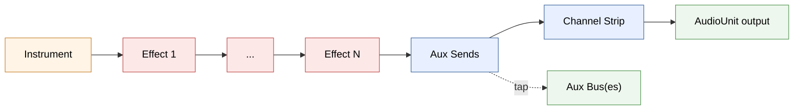

# Devices and Effects

> **Audience:** contributors to openDAW. This chapter is the device layer — instruments, audio effects, MIDI effects — and how they wire into the audio graph established in [Ch. 01](./01-engine-processor.md).
>
> **Prereqs:** [`01-engine-processor`](./01-engine-processor.md) for the `AudioUnit` / device chain frame, [`02-box-system`](./02-box-system.md) for box generation and adapters, [`03-cross-thread-protocols`](./03-cross-thread-protocols.md) for the engine's RPC and the shared WASM memory. Chapter 04 is helpful but not required.

A "device" in openDAW is anything that processes audio or MIDI inside an `AudioUnit`: instruments (Vaporisateur, Nano, Soundfont, …), audio effects (Compressor, Reverb, Delay, …), and MIDI effects (Arpeggio, Pitch, Velocity, …). Each one is a three-layer triple:

1. **Box** — generated by forge from a schema; persistent state, lives in the graph, main thread.
2. **Adapter** — typed TypeScript wrapper around the box; exposes parameters with `ValueMapping`/`StringMapping` for the UI and for automation. Main thread.
3. **Plugin** — a Rust crate compiled to a position-independent WebAssembly side module, linked into the engine and run on the audio thread.

The third layer is the one that changed shape: device DSP is Rust, shipped as `dist/wasm/plugins/device_*.wasm`, and the engine loads it as a side module against its own shared linear memory. There is no per-device TypeScript on the audio thread any more, and no visitor dispatch — a device box type is mapped to its plugin by a data table.

Adding a new device means adding all three layers plus three registration entries (the build script, the plugin table, and the menu factory). The rest of the system — wiring, automation, save/load, undo — just works because every device follows the same shape.

## How a track's audio chain wires up

Before diving into the plugin ABI, it helps to see what the chain itself looks like in motion. Every `AudioUnit`'s audio side wires its devices together like this:


```mermaid
flowchart LR
    Input["Instrument"]
    E1["Effect 1"]
    Edots["..."]
    EN["Effect N"]
    Send["Aux Sends"]
    CS["Channel Strip"]
    Out["AudioUnit output"]
    Bus["Aux Bus(es)"]

    Input --> E1
    E1 --> Edots
    Edots --> EN
    EN --> Send
    Send --> CS
    CS --> Out
    Send -. "tap" .-> Bus

    classDef src fill:#fff4e6,stroke:#c98a3a,color:#000
    classDef fx fill:#fde8e8,stroke:#c25555,color:#000
    classDef cs fill:#e8f0ff,stroke:#4a6fa5,color:#000
    classDef io fill:#eef7ee,stroke:#5a9a5a,color:#000
    class Input src
    class E1,Edots,EN fx
    class Send,CS cs
    class Out,Bus io
```

The instrument is the source. Effects run in their declared order. Aux sends tap the signal *after* the effects and *before* the fader, route copies to one or more aux buses, and pass the original through to the channel strip — which applies volume, pan and mute, and produces the unit's output. The MIDI device chain is symmetric but simpler: notes flow through MIDI effects directly into the instrument, with no sends and no channel strip.

The builder for all of this is `crates/engine/src/audio_unit/wiring.rs`, driven by the per-unit `AudioUnitBinding` in `crates/engine/src/audio_unit/mod.rs`. A unit's binding holds three ordered `IndexedCollection`s taken straight from the box graph — the `input` instrument, the `midi-effects` chain, and the `audio-effects` chain, each sorted by the device's `index` field — and rebuilds its processor cluster only when a chain reports dirty. Because the ordering comes from the boxes, "reorder an effect" is a box edit that arrives over the sync stream like any other; nothing in the engine tracks chain order separately.

Two wiring passes are deliberately **deferred** to the end of a reconcile — `resolve_outputs` and `resolve_sends` in `crates/engine/src/audio_unit/routing.rs`. Output routing and aux sends both name a target bus that may not have been built yet when the unit referencing it is processed, so resolving them last makes the whole reconcile order-independent. Feedback loops are rejected up front by a `would_cycle` check rather than discovered at render time.

One behaviour worth knowing before you touch a rebuild path: a chain edit **pools** the previous chain's members by UUID, so a device that survives the edit keeps its DSP state. Reordering an effect does not reset the compressor's ballistics or flush the delay's tail. Nodes that genuinely carry no state across a rebuild — the channel strip (its parameters live in the shared `StripParams`), the audio-region player (it reads its track sets live) — are rebuilt fresh instead.

## The device plugin ABI

A device plugin is a `no_std` Rust crate that exports a handful of `extern "C"` functions and imports a fixed list of host functions from the engine. The contract lives in `crates/abi/src/lib.rs`, which describes itself as "the ONE place that holds `unsafe` in the device path" — it turns the host-assigned shared-memory descriptor into safe slices and typed state, so device DSP is written entirely in safe Rust.

Rather than implement the raw exports, a device implements one of three traits and hands it to a render template:

```rust
// crates/abi/src/lib.rs
pub trait Instrument {
    type State;
    fn process_audio(state: &mut Self::State, output: [&mut [f32]; 2], block: &Block);
    fn handle_event(state: &mut Self::State, event: &EventRecord);
    fn init(state: &mut Self::State, sample_rate: f32) {}
    fn parameter_changed(state: &mut Self::State, id: u32, value: ParamValue) {}
    fn field_changed(state: &mut Self::State, id: u32, value: FieldValue) {}
    fn sample_changed(state: &mut Self::State, id: u32, sample: Option<u32>) {}
    fn soundfont_changed(state: &mut Self::State, id: u32, soundfont: Option<u32>) {}
    fn reset(state: &mut Self::State) {}
    fn finish(state: &mut Self::State, output: [&mut [f32]; 2]) {}
}

pub trait AudioEffect {
    type State;
    fn process_audio(state: &mut Self::State, output: [&mut [f32]; 2], block: &Block);
    fn init(state: &mut Self::State, sample_rate: f32) {}
    fn parameter_changed(state: &mut Self::State, id: u32, value: ParamValue) {}
    fn reset(state: &mut Self::State) {}
}

pub trait MidiEffect {
    type State;
    fn transform(state: &mut Self::State, input: &[EventRecord], output: &mut [EventRecord]) -> usize;
    fn init(state: &mut Self::State, sample_rate: f32) {}
    fn parameter_changed(state: &mut Self::State, id: u32, value: ParamValue) {}
}
```

`abi::render_instrument`, `abi::render_effect` and `abi::render_midi_effect` are the templates that adapt each trait to the exported entry point.

The same invariants as before drop out of the shapes, now enforced by the type system rather than by interface hygiene:

- **Instruments produce audio and consume notes.** `process_audio` writes *additively* into the stereo output; `handle_event` applies one note event at its sample offset.
- **Audio effects produce *and* consume audio.** An effect's inputs are *not* in the descriptor — it resolves them by port id through `abi::resolve_input(MAIN_INPUT)` for the through-signal, and through any `bind_sidechain` port for analysis. This port mechanism is what carries sidechain routing.
- **MIDI effects have no audio surface at all.** `transform` maps input events to output events, and the relationship is explicitly not one-to-one: an effect may drop events (a transpose ignores notes falling out of MIDI range rather than clamping them) or produce more than it consumed (an arpeggiator emits a stream from a held chord).

### State, and why there is no allocator

The engine allocates each device instance's state block, zeroed, sized by the device's own `state_size(sample_rate)` export. The device interprets that block as its `State` type. There is no `new` per voice and no allocator in the device path — polyphony is const-generic over fixed storage (see [Voicing](#voicing)).

`init` receives the sample rate once and stashes it; there is no per-call sample-rate argument and no global. This is why a device can be linked once and reused across engine reboots without carrying stale rate assumptions.

### Pull, don't push

The engine does not hand a device a pre-resolved event array. A device **pulls** its own input event stream for a pulse range through the `host_pull_events` import, into a scratch buffer the descriptor points at, and times its own sub-blocks over the quantum's `Block` list. That inversion is what lets a MIDI effect with automated parameters be pulled once per update sub-range rather than once per quantum.

### Linking

`packages/studio/core-wasm/src/device-linker.ts` owns the whole linking ritual — the `dylink.0` parse, the allocator base and stack, relocations, table installation, registration, and the box-type mapping — along with the single authoritative list of host imports a device may use. [Chapter 01 — Devices](./01-engine-processor.md#devices) walks through that mechanism and the raw export surface the linker looks for; this chapter picks up at the trait layer above it.

## Box type → plugin: a table, not a visitor

When the box graph says "there's a new effect in this chain," the engine needs a plugin for that box type. That mapping is **data**, declared in `packages/studio/core-wasm/src/engine-modules.ts`:

```typescript
export const DEVICES: ReadonlyArray<{ url: string, boxType: string }> = [
    {url: "/wasm/plugins/device_vaporisateur.wasm", boxType: "VaporisateurDeviceBox"}, // instrument
    {url: "/wasm/plugins/device_nano.wasm", boxType: "NanoDeviceBox"},                 // instrument (sampler)
    {url: "/wasm/plugins/device_compressor.wasm", boxType: "CompressorDeviceBox"},     // audio effect (sidechain)
    {url: "/wasm/plugins/device_arpeggio.wasm", boxType: "ArpeggioDeviceBox"},         // midi effect
    // ... one row per device
]
```

`loadEngineModules` fetches and compiles every entry alongside `engine.wasm`; `instantiateWasmEngine` (`packages/studio/core-wasm/src/boot.ts`) links each one with `linkDevice`, passing the box type so the engine can look it up. **Load order is irrelevant** — the engine reads each unit's chains from the box graph, ordered by the device `index` field.

Three things follow from this being a table rather than a dispatch function:

- **An unregistered box type falls through to silence, not to a crash.** `Engine::device_for_type` returns `Option`, and the instrument reconcile in `wiring.rs` ends with `_ => self.teardown_unit_wired(unit)`. There is no `asDefined` panic to forget — but there is also no loud failure, so a device you forgot to register presents as a track that simply makes no sound.
- **Not every instrument box is a plugin.** Before consulting the table, the reconcile checks four box types it handles itself: `AudioBusBox` (a submix bus), the registered composites, `TapeDeviceBox`, and `MIDIOutputBox`. Tape is the notable one — audio-region playback is engine-side, handled by `crates/engine/src/audio_region_player.rs` (the audio-track analog of the note sequencer), so `TapeDeviceBox` is deliberately absent from `DEVICES`.
- **The `boxType` strings are a cross-language contract.** They are matched against the box graph's box names. Renaming a box in the forge schema without updating this table silently unloads the device.

## Two factory layers (don't conflate)

There are still *two* things called "factory" in the device code, and they now sit on opposite sides of a language boundary:

| Layer | Lives in | Role |
|---|---|---|
| **`DEVICES` table** | `packages/studio/core-wasm/src/engine-modules.ts` | Box type → wasm plugin (audio thread) |
| **`EffectFactory` / `InstrumentFactory`** | `core` (effects), `adapters` (instruments) | Adds the device to the project (main thread) |

The main-thread factories are what the UI calls when the user clicks "+ Add Effect"; their job is to construct a new box, set its initial state, and wire its `host` pointer to the device chain. Neither one knows anything about DSP.

### `EffectFactory`

```typescript
// packages/studio/core/src/EffectFactory.ts
export interface EffectFactory extends DeviceFactory {
    readonly separatorBefore: boolean
    readonly external: boolean
    readonly type: "audio" | "midi"

    create(project: Project, host: Field<EffectPointerType>, index: int): EffectBox
}
```

Concrete factories are in `packages/studio/core/src/EffectFactories.ts`. The Compressor entry:

```typescript
export const Compressor: EffectFactory = {
    defaultName: "Compressor",
    defaultIcon: IconSymbol.Compressor,
    briefDescription: "Compressor",
    description: "Reduces the dynamic range by attenuating signals above a threshold",
    manualPage: DeviceManualUrls.Compressor,
    separatorBefore: false,
    external: false,
    type: "audio",
    create: ({boxGraph}, hostField, index): CompressorDeviceBox =>
        CompressorDeviceBox.create(boxGraph, UUID.generate(), (box) => {
            box.label.setValue("Compressor")
            box.index.setValue(index)
            box.host.refer(hostField)
        })
}
```

`hostField` is the chain's "slot" the box should point to ([chapter 02 — pointers and PointerHub](./02-box-system.md#pointers-and-pointerhub)) — that's how the chain knows the new box belongs to it. `EffectFactories.ts` exposes 20+ such factories grouped into `MidiNamed` / `AudioNamed` / etc. for the menu.

### `InstrumentFactory`

```typescript
// packages/studio/adapters/src/factories/InstrumentFactory.ts
export interface InstrumentFactory<A = any, INST extends InstrumentBox = InstrumentBox>
    extends DeviceFactory {

    trackType: TrackType
    create: (boxGraph: BoxGraph<BoxIO.TypeMap>,
             host: Field<Pointers.InstrumentHost | Pointers.AudioOutput>,
             name: string,
             icon: IconSymbol,
             attachment?: A) => INST
}
```

Slightly different because instruments are *track roots* — you create a track around them, not an effect into an existing track. The `trackType` tells the project what kind of track to create (audio, MIDI, etc.), and `attachment` carries any extra payload like a SoundFont file pointer.

## Worked example: Compressor end to end

Five artifacts, three languages. The pattern is identical for every audio effect.

**1. Schema** (`packages/studio/forge-boxes/src/schema/devices/audio-effects/CompressorDeviceBox.ts`):

A short forge schema declaring `host`, `index`, `label`, `enabled`, `minimized`, plus the DSP parameters (`threshold`, `ratio`, `attack`, `release`, `makeup`, `mix`, `inputgain`, `knee`, `lookahead`, `automakeup`, `autoattack`, `autorelease`) and a `sideChain` pointer.

**2. Generated box** (`packages/studio/boxes/src/CompressorDeviceBox.ts`):

Auto-generated by forge. Field accessors are typed:

```typescript
get threshold(): Float32Field { return this.getField(15) }
get ratio(): Float32Field { return this.getField(16) }
get attack(): Float32Field { return this.getField(18) }
// ...
get sideChain(): PointerField<Pointers.SideChain> { return this.getField(30) }
```

(Field numbers are stable forever — see [chapter 02 critical invariants](./02-box-system.md#critical-invariants).)

**3. Adapter** (`packages/studio/adapters/src/devices/audio-effects/CompressorDeviceBoxAdapter.ts`):

Wraps every box field with a `ParameterAdapter` carrying a `ValueMapping` (range/scale) and `StringMapping` (UI formatter):

```typescript
constructor(context: BoxAdaptersContext, box: CompressorDeviceBox) {
    this.#context = context
    this.#box = box
    this.#parametric = new ParameterAdapterSet(this.#context)
    this.namedParameter = {
        threshold: this.#parametric.createParameter(
            box.threshold, ValueMapping.linear(-60.0, 0.0),
            StringMapping.decible, "Threshold"),
        ratio: this.#parametric.createParameter(
            box.ratio, ValueMapping.exponential(1.0, 24.0),
            StringMapping.numeric({fractionDigits: 1}), "Ratio"),
        // ...
    }
}
```

The `StringMapping` is what the UI uses for "+0.0 dB" vs "-12.4 dB" formatting.

**4. Plugin** (`crates/stock-devices/device-compressor/src/lib.rs`):

A faithful port of the CTAGDRC compressor, implementing `AudioEffect`. Note that the *field keys* and the *value mappings* appear here too, in Rust:

```rust
const THRESHOLD_FIELD: [u16; 1] = [15];
const RATIO_FIELD: [u16; 1] = [16];
const SIDE_CHAIN_FIELD: [u16; 1] = [30];

const THRESHOLD_MAPPING: Linear = Linear {min: -60.0, max: 0.0};
const RATIO_MAPPING: Exponential = Exponential {min: 1.0, max: 24.0};
```

Parameters are bound once, in `init`, by field path — the device asks the host for an id and stores it:

```rust
fn init(state: &mut CompressorState, sample_rate: f32) {
    state.ballistics = LevelDetector::new(sample_rate);
    state.gain_computer = GainComputer::default();
    // ...
    state.threshold_id = abi::bind_parameter(&THRESHOLD_FIELD);
    state.ratio_id = abi::bind_parameter(&RATIO_FIELD);
    state.sidechain_id = abi::bind_sidechain(&SIDE_CHAIN_FIELD);
    state.editor_id = abi::bind_broadcast(&EDITOR_FIELD, 3);
}
```

`abi::bind_parameter(path)` is the direct successor to the old `bindParameter(adapter.namedParameter.x)`: it subscribes the device to that box field's automation and returns an id. `abi::bind_sidechain` registers an *audio input port* the device later resolves. `abi::bind_broadcast` allocates a telemetry slot — that's how the compressor's live gain-reduction meter reaches the UI, over the `engine-live-data` channel from [Ch. 03](./03-cross-thread-protocols.md#the-engines-rpc-channels).

Derived state is recomputed in `parameter_changed`, dispatched on the stored ids:

```rust
fn parameter_changed(state: &mut CompressorState, id: u32, value: ParamValue) {
    if id == state.threshold_id {
        state.gain_computer.set_threshold(float_value(value, &THRESHOLD_MAPPING));
    } else if id == state.ratio_id {
        state.gain_computer.set_ratio(float_value(value, &RATIO_MAPPING));
    } else if id == state.attack_id {
        state.attack_ms = float_value(value, &ATTACK_MAPPING);
        if !state.autoattack { state.ballistics.set_attack(state.attack_ms * 0.001); }
    }
    // ...
}
```

This is the **performance contract** ([chapter 01 — performance constraints](./01-engine-processor.md#performance-constraints-read-these-before-you-write-dsp)): heavy work (filter coefficient recomputation) lives in `parameter_changed`, called only when something actually changes. `process_audio` is a tight sample loop.

`ParamValue` carries the distinction that used to be implicit: `Unit` is the uniform `0..1` automation value the device maps through its own `ValueMapping`, while `Int` / `Float` / `Bool` are a box field's already-real value to use directly. `float_value(value, &MAPPING)` handles both.

`process_audio` resolves its inputs by port and works in absolute quantum coordinates:

```rust
fn process_audio(state: &mut CompressorState, output: [&mut [f32]; 2], block: &Block) {
    let Some(input) = abi::resolve_input(MAIN_INPUT) else {return};
    let sidechain = abi::resolve_input(state.sidechain_id);
    // ... block.s0 .. block.s1
}
```

DSP helpers come from the `dsp` crate — `dsp::ctagdrc` supplies `LevelDetector`, `GainComputer`, `DelayLine`, `LookAhead` and `SmoothingFilter`, mirroring the helper set the TypeScript implementation used.

**5. Three registrations**:

- **`device-compressor` in `DEVICE_CRATES`** (`packages/studio/core-wasm/build-wasm.sh`) — builds the crate and copies `device_compressor.wasm` into `dist/wasm/plugins/`.
- **The `DEVICES` entry** mapping `"CompressorDeviceBox"` to `device_compressor.wasm`.
- **`EffectFactories.Compressor`** (shown above) — the "Add Effect → Compressor" menu entry.

That's the entire surface. Save/load, undo/redo, automation, parameter UI rendering, drag-to-reorder — all handled by the generic infrastructure because the device follows the standard triple.

### The duplication is the contract

Field key `15` appears in the forge schema, in the generated box, and again in the Rust plugin as `THRESHOLD_FIELD`. The threshold's `-60..0` range appears in the TypeScript adapter's `ValueMapping.linear(-60.0, 0.0)` and again in Rust as `THRESHOLD_MAPPING`. Nothing checks that these agree.

That is worth knowing before you change either side. A mismatched field key binds the wrong parameter; a mismatched range makes an automation lane's displayed value disagree with what the DSP hears. Change them together.

## Channel strip and aux sends

`ChannelStripProcessor` (`crates/engine-env/src/channel_strip.rs`) sits at the end of every unit's audio chain and applies volume, panning and mute. It is deliberately a dumb DSP node: it holds no box knowledge and reads a shared `StripParams` the engine keeps in sync with the `AudioUnitBox`.

```rust
fn retarget(&mut self, volume_db: f32, panning: f32, muted: bool) {
    let gain = db_to_gain(volume_db);
    self.gain_left.set((1.0 - panning.max(0.0)) * gain, self.processing);
    self.gain_right.set((1.0 + panning.min(0.0)) * gain, self.processing);
    let silent = muted || self.params.forced_silent.get();
    self.mute_gain.set(if silent {0.0} else {1.0}, self.processing);
}
```

Four things to notice:

- **Pan is a linear balance law, not constant power.** `gain_left = (1 - max(0, pan)) * volume` reduces one side as the pan moves toward the other; centre is unity on both channels. Mean energy isn't preserved across the field, but it's cheap and predictable.
- **Mute, solo and automation collapse to one ramp.** Rather than branch per sample, the strip precomputes a single `silent` boolean into `mute_gain`. All three gains are `LinearRamp`s so parameter moves de-click, and `set` no-ops on an unchanged target.
- **Automation is a closure, not a poll.** `StripAutomation` holds an optional `Rc<dyn Fn(f64) -> f32>` per parameter, swapped in by the engine binding when a Value track attaches. `None` means "not automated, use the static field."
- **A paused transport holds, it doesn't re-read.** The update clock is gated on the transporting flag, so an automated parameter keeps its last resolved value rather than sampling the free-running paused position. Static edits (a mute click) still apply. `retarget_held` is that path.

The strip does **not** decide solo. Solo is a cross-unit fact — it silences *other* strips — so the strip only reads a `forced_silent` flag that the engine resolves for it.

`AuxSendProcessor` (`crates/engine-env/src/aux_send.rs`) is structurally the same node with a smaller surface: send gain (dB) plus send pan, no mute or solo, the same linear balance law and the same `LinearRamp` de-clicking. It taps the unit's post-effects, pre-fader buffer, and its output is summed into the target bus.

### Solo resolution

The global solo coordinator is `Engine::update_solo` in `crates/engine/src/audio_unit/mod.rs`. It runs off-render, when a `solo_dirty` flag is set by a field edit or by routing having changed, and it is O(units + routing edges).

The rule is not simply "silence everything unsoloed" — it's a graph walk in both directions:

- **Outputs.** A soloed unit keeps its output-bus chain audible, recursively. Solo a track and you still hear it through its submix bus.
- **Inputs.** A soloed *bus* keeps its feeders audible, recursively — both units routed to it and units aux-sending into it. Solo a reverb return and you still hear what's feeding it.

Units kept audible this way are marked `virtual_solo`. The final assignment is one line:

```rust
entry.params.forced_silent.set(has_solo && !(entry.solo || virtual_solo[index] || entry.is_output));
```

The terminal output unit is exempt by construction — it never joins `audio_units`. Automated solo is handled separately by `resolve_automated_solo`, called once per playing quantum, because solo can't resolve inside a single strip the way volume and mute can.

> Note for anyone grepping: `packages/studio/core/src/Mixer.ts` is a *different* `Mixer` — a main-thread registry that mirrors resolved silence into the mixer UI. It does not participate in rendering.

## AudioBus

`AudioBusProcessor` (`crates/engine-env/src/audio_bus_processor.rs`) is a summing node. It owns an output buffer and a list of shared source buffers added via `add_audio_source`; each render it clears its output and sums the sources into it. Topological ordering guarantees the sources are rendered before the bus runs.

Buses are how aux sends route: every send writes into a bus, the bus has its own device chain (effects + channel strip), and the bus output is routed onward. A bus can also be disabled, in which case it outputs silence while its children keep their state — that's how a composite device is bypassed.

This is also why an `AudioBusBox` shows up as a unit's *input* device alongside the real instruments: a bus *is* the source from the audio unit's perspective. It just happens to receive from sends and routed units instead of generating from notes.

## MIDI device chain

Symmetric to the audio chain but simpler — no sends, no channel strip, no buses. The note path is built by the same `wiring.rs` reconcile, from the unit's `midi-effects` collection ordered by device `index`.

The pieces live in `crates/engine-env/`:

- `note_sequencer.rs` — the unit's note source, reading the bound note regions. [Chapter 01 — Note scheduling](./01-engine-processor.md#notesequencer) covers how it resolves regions into events.
- `note_event_source.rs` / `note_event_instrument.rs` — the source/target glue between a note producer and an instrument.
- `clip_sequencer.rs` — clip-launch sequencing.

MIDI effect plugins sit between them, wired through `crates/engine/src/plugin_midi_effect.rs`. As described in the ABI section, the chain is **pull**-based: a downstream node asks its upstream for events over a pulse range, rather than the sequencer pushing a resolved array forward. An effect with automated parameters is therefore pulled once per update sub-range, which is what makes automated arpeggiator settings sample-accurate rather than quantum-accurate.

## Voicing

Polyphonic instruments need to manage multiple simultaneous voices. `crates/voicing/src/lib.rs` is a heap-free port of the voicing framework, const-generic over the polyphony so each device picks its own voice and stack counts:

| Item | Role |
|---|---|
| `Voice` (trait) | A single voice's per-note DSP — `start`, `stop`, `force_stop`, `start_glide`, `process` |
| `VoicingStrategy` (trait) | The allocation policy |
| `PolyphonicStrategy<V, VOICES>` | Fixed pool with free-slot search, voice stealing, and glide-from-released |
| `MonophonicStrategy<V, STACK>` | One voice plus a held-note stack with legato glide |
| `VoiceUnison<V, U>` | N detuned/spread sub-voices played as one note — itself a `Voice`, so it nests into either strategy |
| `Voicing<V, VOICES, STACK>` | The runtime dispatcher that switches strategies by `VoicingMode` |

The framework owns **fixed** voice storage inside the device's zeroed state block and allocates, steals and frees by index. There is no `new` per note and no allocator — which is the whole reason it can run in a `no_std` device.

`process` returns `true` once a voice has fully decayed, and the strategy uses that return to reclaim the slot. `start_glide` / `current_frequency` carry portamento across both legato and voice reuse.

`Voicing::set_mode` is what makes a mono ↔ poly switch possible without tearing down the instrument.

## Composites

A composite is a device box that hosts a *collection* of child devices rather than mapping to a single plugin. The engine learns these **as data** — no engine code is composite-specific, and no plugin exists for the container itself.

`CompositeSpec` (`packages/studio/core-wasm/src/engine-modules.ts`) describes an instrument composite: the child collection's host field, the child field its order and routing read, and optional per-child `enabled` / `mute` / `solo` keys. Two are registered:

- **`PlayfieldDeviceBox`** — direct children (self-hosting slots), routed by note index with choke groups. The slot's DSP *is* a normal plugin: `PlayfieldSampleBox` → `device_playfield_sample.wasm`.
- **`CompositeDeviceBox`** — a generic instrument bundle whose children are cells, each wrapping one instrument plus its own MIDI and audio effect chains.

`EffectCompositeSpec` describes an effect composite: an audio or MIDI effect hosting entries that each run their own chain **in parallel**, mixed back against the dry signal. The `distributor` field selects how the input reaches the entries, and three are registered:

| Box type | Distributor | Behaviour |
|---|---|---|
| `AudioEffectCompositeBox` | `Broadcast` | Input goes to every entry; outputs sum into the wet mix |
| `StereoCompositeBox` | `Stereo` | Entry 0 gets left, entry 1 gets right |
| `FrequencySplitBox` | `Frequency` | Linkwitz-Riley crossovers split into one band per entry, low to high |

The implementations are `crates/engine/src/composite.rs` and `crates/engine/src/effect_composite.rs`. Entries carry their own gain, pan, mute and solo, resolved across siblings by the same `forced_silent` mechanism the channel strip uses.

The payoff of the data-driven design: **a new parallel container is a registration, not engine code.** Adding one means a forge schema plus a spec entry — the engine hardcodes no box name and no field key.

## Script devices

Three devices — **Werkstatt** (audio effect), **Apparat** (instrument), **Spielwerk** (MIDI effect) — let the user write the DSP or note-sequencing code inside the box.

**Their box structure** carries the standard device fields plus:

- **`code`** — a `StringField` holding the user's script.
- **`parameters`** (key 11) and **`samples`** (key 12) — pointer hubs that child boxes (`WerkstattParameterBox`, `WerkstattSampleBox`, …) attach to, one per name the script declares.

`ScriptCompiler` (`packages/studio/adapters/src/ScriptCompiler.ts`) parses the script's header to extract declared parameter and sample names, then reconciles the box graph: adds missing parameter boxes, removes orphaned ones, ensures pointer links are correct. It does not execute the code.

`crates/engine/src/script_device.rs` is the engine's side of the dynamic declaration. It enumerates each hub's children and binds them through the *ordinary* parameter and sample machinery, keyed by declaration index — so automation, value mappings and sample residency behave identically to a fixed device. The only difference is the binding source: child boxes rather than the device's own field paths.

Execution is the interesting part. The three Rust device crates do **no DSP**. Per block they call `host_script_*` env imports implemented by `packages/studio/core-wasm/src/script-bridge.ts`, which runs the user's `Processor` — registered by the app at `globalThis.openDAW.<registry>[uuid]` — directly over the engine's shared linear memory. The bridge hot-swaps on the registry's `update` counter and validates output (NaN or overflow becomes silence).

This is the one place the engine's zero-JS-in-render rule is relaxed, and it is contained entirely to the bridge plus three thin device crates. If you are adding anything else that wants to call into JavaScript from the render path, this is the precedent to argue against, not the one to copy.

## NAM (Neural Amp Modeler)

`crates/stock-devices/device-neural-amp/src/lib.rs` does the wrapper DSP — input/output gains, mono downmix, dry/wet mix — and calls `host_nam_*` imports implemented by `packages/studio/core-wasm/src/nam-bridge.ts`. The bridge runs `@opendaw/nam-wasm` (NeuralAmpModelerCore) as its **own** WebAssembly instance beside the engine, because an Emscripten build cannot join the engine's shared memory. Per chunk it copies at most 128 samples per channel between the two memories — negligible against the inference cost.

Four patterns worth copying if you integrate other heavy WASM:

1. **Identity is the device box UUID.** `host_nam_create(uuidPtr)` returns a handle keyed by UUID, so a rebind reuses the existing instance and its already-prewarmed model rather than reloading.
2. **The module loads lazily, on first use.** Nothing is fetched until a model is actually delivered.
3. **Passthrough while loading.** Until the module is ready, `host_nam_process` reports not-loaded and the device passes audio through unchanged. Silence is not acceptable for an effect; passthrough is.
4. **Model JSON never becomes a JavaScript string.** It arrives as raw UTF-8 bytes out of the engine's memory (via `observe_target_string` on the device's model pointer) and is copied straight into the NAM heap — the worklet scope has no `TextDecoder`. Byte-identical redeliveries are skipped.

## Special processors

A few nodes don't fit the "device in a chain" model but are worth knowing:

**Frozen playback** (`crates/engine/src/frozen.rs`). A frozen unit plays pre-rendered PCM instead of running its instrument and effects. The freeze itself is a one-stem offline render with `skipChannelStrip`, so the unit's *live* channel strip still applies afterwards — you can keep riding the fader on a frozen track. The read position re-seats from the tempo map on any discontinuity, so seeks, loops and tempo automation stay sample-exact. The PCM is delivered over the `engine-frozen-audio` channel described in [Ch. 03](./03-cross-thread-protocols.md#the-engines-rpc-channels).

**Input monitoring** (`crates/engine/src/monitor.rs`). The worklet stages up to 8 live input channels into a shared buffer before each render. A unit in the monitoring map carries a `MonitorMix` node that adds its mapped channels into the unit's chain-*start* buffer — post-instrument, pre-effects — so the monitored input runs through the unit's own effect chain and strip. After the render the engine copies each mapped unit's strip output into a monitor output buffer, which the worklet forwards on its **second** output back to the main thread's `MonitoringRouter`.

That second output is why bare `engineWorklet.connect(destination)` is wrong: it routes both outputs. Always `connect(destination, 0)`.

**MIDI output** (`crates/engine/src/midi_output.rs`). Engine-side like the tape, producing no audio: it pulls the unit's note stream per block, converts note lifecycle events to raw MIDI messages, and queues them for the worklet to drain (`midi_out_count` / `midi_out_take`). From there they go into `packages/studio/core-processors/src/MIDISender.ts` — a single-producer, single-consumer ring over a `SharedArrayBuffer` — unchanged by the engine rewrite, because it only ever dealt in packed MIDI bytes.

The same Rust file carries the transport clock: scheduled Start / Stop / SongPosition on the engine's play, stop and seek paths, plus 24-PPQ clock ticks over transporting blocks, gated on the `MIDIOutputBox`es connected to `RootBox.outputMidiDevices` with `sendTransportMessages` set and a non-empty `id`.

## How to add a new effect (full walkthrough)

Adding `SidechainCompressor` as an audio effect:

1. **Add pointer types if needed.** If your effect introduces new addressable surfaces, declare them in `packages/studio/enums/`'s `Pointers` enum. Existing pointer types (`Pointers.AudioEffectHost`, `Pointers.SideChain`, `Pointers.Automation`) cover most cases.

2. **Schema** — `packages/studio/forge-boxes/src/schema/devices/audio-effects/SidechainCompressorDeviceBox.ts`:

    ```typescript
    export const SidechainCompressorDeviceBox: BoxSchema<Pointers> = {
        type: "box",
        class: {
            name: "SidechainCompressorDeviceBox",
            fields: {
                1: {type: "pointer", name: "host",
                    pointerType: Pointers.AudioEffectHost, mandatory: true},
                2: {type: "int32", name: "index"},
                3: {type: "string", name: "label", value: "Sidechain Compressor"},
                4: {type: "boolean", name: "enabled", value: true},
                5: {type: "boolean", name: "minimized", value: false},
                10: {type: "float32", name: "threshold", constraints: "any"},
                11: {type: "float32", name: "ratio", constraints: "non-negative"},
                12: {type: "float32", name: "attack", constraints: "non-negative", unit: "s"},
                13: {type: "float32", name: "release", constraints: "non-negative", unit: "s"},
                20: {type: "pointer", name: "sideChain",
                     pointerType: Pointers.SideChain, mandatory: false}
            }
        },
        pointerRules: {accepts: [], mandatory: false}
    }
    ```

3. **Run forge.** From `packages/studio/forge-boxes/`, `npm run build`. Inspect the generated `SidechainCompressorDeviceBox.ts` in `packages/studio/boxes/src/`.

4. **Adapter** — `packages/studio/adapters/src/devices/audio-effects/SidechainCompressorDeviceBoxAdapter.ts`. Wrap the box, declare automation parameters via `ParameterAdapterSet`. Copy the structure from `CompressorDeviceBoxAdapter.ts`.

5. **Plugin crate** — `crates/stock-devices/device-sidechain-compressor/`. The workspace picks it up automatically (`crates/Cargo.toml` lists `stock-devices/*` as a glob), so there is nothing to add there. Declare the field-key constants and value mappings to match the schema, implement `abi::AudioEffect`, and export the entry points via `abi::render_effect`. Bind parameters in `init` with `abi::bind_parameter` and the sidechain input with `abi::bind_sidechain`; recompute coefficients in `parameter_changed`; resolve inputs by port and run the DSP in `process_audio`. Copy `device-compressor` as the starting point.

6. **Add the crate to the build** — `DEVICE_CRATES` in `packages/studio/core-wasm/build-wasm.sh`. The artifact basename is the crate name with `-` replaced by `_`, so `device-sidechain-compressor` produces `device_sidechain_compressor.wasm` in `dist/wasm/plugins/`.

    Device crates are built as position-independent side modules and need the **nightly** toolchain (`-Zbuild-std=core` rebuilds `core` as PIC); the engine itself stays on stable. If your device is missing at runtime and everything else looks right, check that this step ran.

7. **Register the plugin** in `packages/studio/core-wasm/src/engine-modules.ts`:

    ```typescript
    {url: "/wasm/plugins/device_sidechain_compressor.wasm", boxType: "SidechainCompressorDeviceBox"}
    ```

    The `boxType` string must match the schema's class name exactly.

8. **Register the menu entry** in `packages/studio/core/src/EffectFactories.ts`:

    ```typescript
    export const SidechainCompressor: EffectFactory = {
        defaultName: "Sidechain Compressor",
        defaultIcon: IconSymbol.Compressor,
        briefDescription: "Sidechain-Compressor",
        description: "Compresses based on an external sidechain signal",
        manualPage: "...",
        separatorBefore: false,
        external: false,
        type: "audio",
        create: ({boxGraph}, hostField, index) =>
            SidechainCompressorDeviceBox.create(boxGraph, UUID.generate(), (box) => {
                box.label.setValue("Sidechain Compressor")
                box.index.setValue(index)
                box.host.refer(hostField)
            })
    }
    ```

    And add it to the `AudioNamed` export so it appears in the "Add Effect" menu.

9. **UI panel** (optional but expected). The Studio app has a per-effect inspector panel; add one matching the parameters. This lives in `packages/app/studio/` and is outside the engine codebase — but until you ship the panel the effect is invisible to users.

Save/load, undo, automation, drag-to-reorder and project export all work after step 8 — they're handled by the generic infrastructure that operates on the box graph, not on per-effect code.

## Critical invariants

1. **The box → adapter → plugin triple is the only contract.** If you find yourself wanting DSP without an adapter or a box, you have an architecture mistake.
2. **Field keys and value mappings are duplicated across the language boundary, and nothing checks them.** The forge schema, the TypeScript adapter and the Rust plugin must agree. Change them together.
3. **`boxType` strings in `DEVICES` are matched against box names.** Renaming a box in the schema without updating the table silently unloads the device.
4. **Parameter recomputation belongs in `parameter_changed`, not `process_audio`.** Audio threads have ~2.9 ms per quantum. Recomputing IIR coefficients per sample is a great way to burn it.
5. **Devices don't allocate.** State is one engine-allocated, zeroed block sized by `state_size(sample_rate)`; polyphony uses fixed const-generic storage. There is no allocator in the device path.
6. **Effects resolve inputs by port, never from the descriptor.** `abi::resolve_input(MAIN_INPUT)` for the through-signal, a `bind_sidechain` port for analysis. Return early when the input doesn't resolve.
7. **WASM-loaded processors must pass through until ready.** The NAM device passes audio through while its module loads. Silence isn't acceptable for an effect; passthrough is.
8. **Reset clears sounding state, not bindings.** `reset` on a transport stop drops voices, tails, filter history and detectors — but keeps parameter ids, resolved values and the sample rate.
9. **Solo is resolved by the engine, not by the strip.** A strip only reads `forced_silent`. Any new routing that can affect audibility must arm `solo_dirty` so the walk re-runs.
10. **Channel-strip and aux-send pan are a linear balance law.** If a contributor expects equal-power pan, it doesn't behave that way. Document any exceptions explicitly.
11. **MIDI effects have no audio surface.** `MidiEffect::transform` maps events to events; it's structurally a different chain, and the count relationship is not one-to-one.
12. **A new device is three registrations, not one.** The build script, the `DEVICES` table and the menu factory. Miss the build script and the plugin never exists; miss the table and the engine never finds it.

## Further reading

- **`crates/abi/src/lib.rs`** — the device boundary. The header comment documents the full descriptor layout; read it before writing any plugin.
- **`crates/stock-devices/device-compressor/src/lib.rs`** — the most thoroughly-implemented effect; the best reference for parameter binding, `parameter_changed` structure, and sidechain resolution.
- **`crates/engine/src/audio_unit/wiring.rs`** and **`routing.rs`** — how chains, sends, outputs and sidechains are actually built, plus the deferred-resolve ordering.
- **`crates/engine/src/audio_unit/tests.rs`** — a large whitebox suite over the wiring, solo walk and routing. The fastest way to confirm what the engine actually does in a corner case.
- **`packages/studio/core-wasm/src/device-linker.ts`** — the linking ritual and the host-import contract.
- **`packages/studio/adapters/src/ParameterAdapterSet.ts`** and **`ValueMapping`** / **`StringMapping`** — the parameter wrapping infrastructure; understanding these unlocks a lot of UI code too.
- **[Ch. 01 — Engine Processor](./01-engine-processor.md)** — for how the chains, phases and topological sort actually run the device graph.
- **[Ch. 11 — Effects](../11-effects.md)** — the same device layer from an SDK consumer's point of view.
