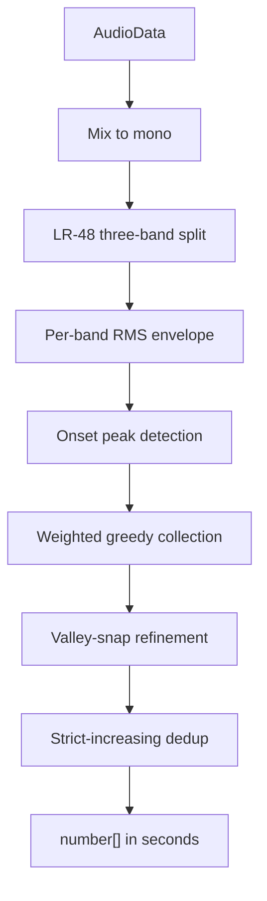
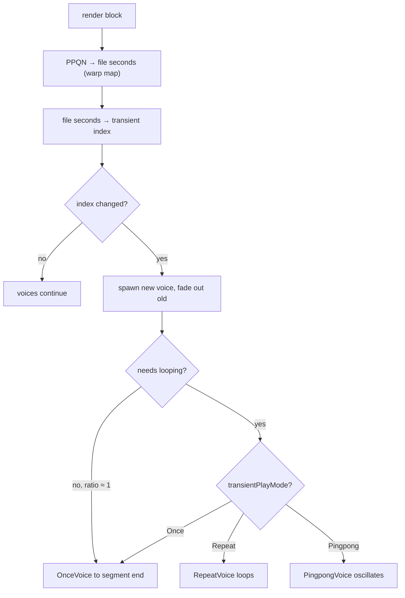
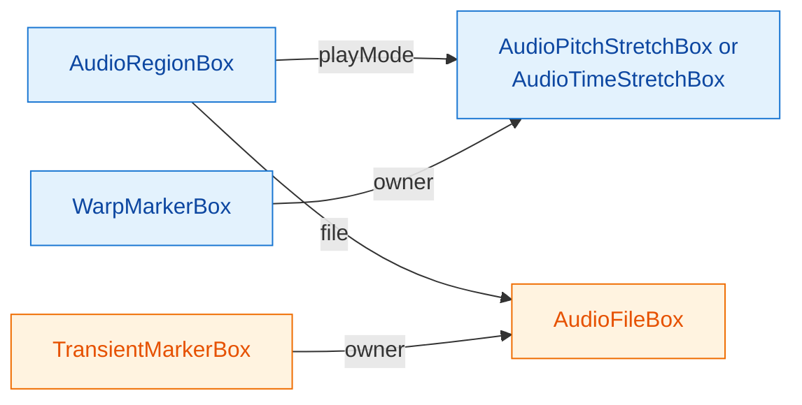

# Time & Pitch

> **Audience:** contributors to openDAW. This chapter is the full lifecycle of a time-stretched region: how transient markers get detected on import, how the engine consumes warp markers and transient markers at render time, and how mode flips are wired through `AudioContentModifier`.
>
> **Prereqs:** [`02-box-system`](./02-box-system.md) (so `AudioRegionBox.playMode` makes sense), [`03-cross-thread-protocols`](./03-cross-thread-protocols.md) (so `Workers.Transients` makes sense), [`04-sample-loading`](./04-sample-loading.md) (so `AudioFileBox.transientMarkers` makes sense). The SDK-surface view of all of this is [Core Handbook Ch. 18](../18-time-and-pitch.md) — read that first if you want the app-author perspective.

Time-stretching is the only place in the SDK where a single audio file gets read at a rate the user picks rather than its source rate — and the only place where a region's playback boundaries don't trivially align with file sample positions. The pipeline has to detect onsets so segments can splice cleanly, store those onsets per file (because they're a property of the audio, not the region), map timeline PPQN to file seconds through warp markers, pick a transient segment per render block, and crossfade between consecutive voices when segments loop or pingpong. This chapter walks all of that.

| Stage | Component | Thread | What it does |
|---|---|---|---|
| Detect | `TransientDetector.detect` | Worker | `AudioData` → onset positions in seconds |
| Persist | `TransientMarkerBox` children of `AudioFileBox` | Main | Onset positions live in the box graph |
| Trigger | `AudioContentModifier.toTimeStretch` | Main | Calls the worker on mode flip, writes markers |
| Render | `TimeStretchSequencer` | Worklet | Picks segments per transient, manages voices |
| Voice | `OnceVoice` / `RepeatVoice` / `PingpongVoice` | Worklet | Plays one segment with crossfade in/out |
| Interpolate | `warpPositionToSeconds` / `#secondsToPpqn` | Main + Worklet | PPQN ↔ file-seconds via linear warp-marker mapping |
| Rate | `AudioTimeStretchBoxAdapter.cents` | Main | Cents ↔ `playbackRate` with ±1 octave clamp |

## Transient detection algorithm

`TransientDetector` (`packages/lib/dsp/src/transient-detection.ts`) is a standalone class — no SDK dependencies, just `AudioData` in, `number[]` of seconds out. The full pipeline is six phases:



The weighted greedy collection step enforces both minimum separation and the density cap (see Phase 5 below).


Output is always `[0, ..., numberOfFrames / sampleRate]` — the file's start and end positions are unconditionally included as the first and last elements, so an "empty" detection still returns two anchors.

### Constants reference

Eleven module-level constants govern the entire algorithm. Treat this table as the source of truth — the rest of the chapter refers back to these by name:

| Constant | Value | Role |
|---|---|---|
| `LR_ORDER` | 48 | Linkwitz-Riley filter order for band-splitting (4 cascaded LR-12 sections). |
| `LOW_CROSSOVER_HZ` | 200 | Low-band ceiling / mid-band floor. |
| `HIGH_CROSSOVER_HZ` | 2000 | Mid-band ceiling / high-band floor. |
| `RMS_WINDOW_MS` | 20 | Window size for the per-band energy envelope. |
| `MIN_TRANSIENT_COUNT` | 2 | Lower bound the collector won't drop below (the two endpoints). |
| `ENERGY_DERIVATIVE_THRESHOLD` | 0.0003 | Onset trigger: envelope derivative must exceed this × `maxEnergy`. |
| `MAX_TRANSIENT_DENSITY_PER_SEC` | 40 | Upper bound on internal markers per second of audio. |
| `MIN_TRANSIENT_SEPARATION_MS` | 120 | No two markers within this window. |
| `VALLEY_BIAS` | 0.2 | Valley search starts at `prev + 0.2 × (curr - prev)`. |
| `MAX_VALLEY_SEARCH_MS` | 20 | Valley search can't extend further back than this. |
| `ONSET_ENERGY_RATIO` | 0.66 | Valley search early-exits when RMS drops below candidate × 0.66. |
| `VALLEY_RMS` | 0.006 | RMS window length in seconds during valley refinement (~6 ms). |

Band weights are a separate constant:

```typescript
const BAND_WEIGHTS: Record<Band, number> = {
    low:  1.0,
    mid:  4.0,
    high: 8.0
}
```

The 1/4/8 split biases the collector toward high-frequency transients (cymbal hits, consonants, plucked attacks) over low-frequency ones (kick fundamentals, sub bass). The reasoning: low-frequency onsets are usually *part of* a transient that also has high-frequency content (a kick has high-frequency click on its attack), so weighting the highs higher avoids double-marking the same event.

### Phase 1: Mix to mono

```typescript
// transient-detection.ts:152
#mixToMono(audio: AudioData): Float32Array {
    const {numberOfFrames, numberOfChannels, frames} = audio
    if (numberOfChannels === 0) {return panic("Invalid sample. No channels found.")}
    if (numberOfChannels === 1) {return new Float32Array(frames[0])}
    const mono = new Float32Array(numberOfFrames)
    for (let ch = 0; ch < numberOfChannels; ch++) {
        const channel = frames[ch]
        for (let i = 0; i < numberOfFrames; i++) {mono[i] += channel[i]}
    }
    const scale = 1.0 / numberOfChannels
    for (let i = 0; i < numberOfFrames; i++) {mono[i] *= scale}
    return mono
}
```

Stereo and multi-channel files are averaged to mono before anything else. Transient *position* is the same across channels (a snare hits at one moment whether you record it with one mic or two), so collapsing the analysis saves three passes through the band-split filters.

### Phase 2: Linkwitz-Riley three-band split

`#splitBands()` runs the mono signal through cascaded biquads to produce three frequency bands:

```typescript
#splitBands(): BandBuffers {
    const low         = this.#applyLRFilter(this.#mono,  LOW_CROSSOVER_HZ,  "lowpass",  LR_ORDER)
    const highFromLow = this.#applyLRFilter(this.#mono,  LOW_CROSSOVER_HZ,  "highpass", LR_ORDER)
    const mid         = this.#applyLRFilter(highFromLow, HIGH_CROSSOVER_HZ, "lowpass",  LR_ORDER)
    const high        = this.#applyLRFilter(highFromLow, HIGH_CROSSOVER_HZ, "highpass", LR_ORDER)
    return {low, mid, high}
}
```

`#applyLRFilter` runs `LR_ORDER / 12 = 4` cascaded biquad passes at the crossover frequency, with two biquads per pass (cascaded for sharper slope) — so each band edge is a true 48-dB/octave Linkwitz-Riley response. Sharper than necessary for transient detection, but Linkwitz-Riley has the property that the sum of the low-pass and high-pass equals the original signal at the crossover frequency (no spectral hole), which keeps each band's onset energy honest.

Crossover points (`200 Hz`, `2000 Hz`) carve the spectrum into perceptually distinct regions: sub/bass (kick fundamentals, low toms), midrange (snares, vocals, midrange synth attacks), and treble (hi-hats, cymbals, transients of plucked or struck sounds).

### Phase 3: Per-band RMS energy envelope

```typescript
#computeEnergyEnvelope(buffer: Float32Array): Float32Array {
    const envelope = new Float32Array(buffer.length)
    let sumSq = 0.0
    for (let i = 0; i < this.#windowSamples && i < buffer.length; i++) {
        sumSq += buffer[i] * buffer[i]
    }
    for (let i = 0; i < buffer.length; i++) {
        const windowStart = i - this.#halfWindow
        const windowEnd   = i + this.#halfWindow
        if (windowStart > 0 && windowStart - 1 < buffer.length) {
            const old = buffer[windowStart - 1]
            sumSq -= old * old
        }
        if (windowEnd < buffer.length) {
            const next = buffer[windowEnd]
            sumSq += next * next
        }
        const count = Math.min(windowEnd, buffer.length - 1) - Math.max(windowStart, 0) + 1
        envelope[i] = Math.sqrt(Math.max(0.0, sumSq) / count)
    }
    return envelope
}
```

A 20-ms (`RMS_WINDOW_MS`) running RMS, sliding-window optimised so each sample costs one square-add and one square-subtract instead of re-summing the whole window. Centered on each sample (`±halfWindow`), edge-clamped to the buffer.

The result is an envelope that's smooth on the order of 20 ms — too coarse to capture a single sample's spike, but fine enough to capture the *attack* phase of a percussive event (which always rises over more than 20 ms).

### Phase 4: Onset peak detection

```typescript
#detectOnsets(envelope: Float32Array): Onset[] {
    let maxEnergy = 0.0
    for (let i = 0; i < envelope.length; i++) {
        if (envelope[i] > maxEnergy) {maxEnergy = envelope[i]}
    }
    const threshold = maxEnergy * ENERGY_DERIVATIVE_THRESHOLD
    const onsets: Onset[] = []
    for (let i = 1; i < envelope.length - 1; i++) {
        const derivative     = envelope[i]     - envelope[i - 1]
        const nextDerivative = envelope[i + 1] - envelope[i]
        if (derivative > threshold && derivative > nextDerivative) {
            onsets.push({position: i, energy: envelope[i]})
        }
    }
    return onsets
}
```

A peak in the *derivative* of the envelope marks the moment the energy is rising fastest — the leading edge of a transient. Two conditions both have to hold:

1. **Derivative exceeds threshold** — `envelope[i] - envelope[i-1] > maxEnergy × 0.0003`. The threshold is relative to the loudest sample in the file (not absolute), so quiet files still have detectable onsets.
2. **Derivative is at a local maximum** — `derivative > nextDerivative`. Without this, every sample inside a rising slope would qualify; we want only the inflection point.

The threshold ratio of 0.0003 sounds tiny but it's deliberate: the loudest peak of a file is rarely the loudest onset (a sustained chord's peak energy can dwarf a snare hit's). A low threshold catches more candidates; the next phase prunes them.

Each candidate carries its band's *envelope value* (not derivative) as its `energy` — that's what the band-weighted collector ranks against.

### Phase 5: Weighted greedy collection

```typescript
#collectCandidates(): number[] {
    const bands = this.#splitBands()
    const allOnsets: Onset[] = []
    for (const band of ["low", "mid", "high"] as Band[]) {
        const buffer   = bands[band]
        const envelope = this.#computeEnergyEnvelope(buffer)
        const onsets   = this.#detectOnsets(envelope)
        const weight   = BAND_WEIGHTS[band]
        for (const onset of onsets) {
            allOnsets.push({position: onset.position, energy: onset.energy * weight})
        }
    }
    // Sort by energy descending and greedily collect respecting minimum separation
    const collected: number[] = [0, this.#numberOfFrames]
    const sorted = [...allOnsets].sort((a, b) => b.energy - a.energy)
    for (const onset of sorted) {
        if (collected.length >= this.#maxCount + 2 && collected.length >= MIN_TRANSIENT_COUNT + 2) {
            break
        }
        if (!this.#isTooClose(collected, onset.position)) {
            this.#insertSorted(collected, onset.position)
        }
    }
    return collected
}
```

Three rules in play:

1. **The endpoints `[0, numberOfFrames]` are seeded first.** Every transient list begins and ends with file boundaries — the engine needs anchors at both ends so segment selection has somewhere to land at PPQN 0 and at region duration.
2. **Onsets are ranked by `energy × band-weight`, descending.** The strongest high-band onset wins over a stronger low-band onset; the strongest low-band onset wins only when nothing in mid or high competes. This biases marker placement toward percussive material that has high-frequency content.
3. **Greedy fill with minimum-separation rejection.** Walk candidates strongest-first; insert each one if it's at least `MIN_TRANSIENT_SEPARATION_MS` from every existing marker (binary-searched via `#isTooClose`). Stop when `collected.length >= maxCount + 2` (the `+2` is for the endpoints).

The density cap `maxCount = floor(durationSeconds × 40)` is computed once in the constructor. For a 30-second file, that's 1,200 internal markers max plus 2 endpoints = 1,202 entries; for a 0.5-second sting, 20 + 2 = 22.

### Phase 6: Valley-snap refinement

The greedy collector returns positions at the *peak* of each transient's leading edge — which is several milliseconds *into* the attack, not at its onset. For splicing-without-clicks the marker wants to sit in the *valley before* the attack: that's where the signal energy is lowest, so a discontinuity inserted there is least audible.

```typescript
#refineToValleys(candidates: number[]): number[] {
    if (candidates.length < 2) {return candidates}
    const refined: number[] = [candidates[0]]
    const rmsWindow = Math.floor(this.#sampleRate * VALLEY_RMS)
    for (let i = 1; i < candidates.length - 1; i++) {
        const prev = candidates[i - 1]
        const curr = candidates[i]
        if (prev === 0) {
            refined.push(curr)
            continue
        }
        const gap = curr - prev
        const gapBasedStart    = prev + Math.floor(gap * VALLEY_BIAS)
        const windowBasedStart = curr - this.#maxValleySearchSamples
        const searchStart      = Math.max(gapBasedStart, windowBasedStart)
        // Compute RMS at candidate position (the transient energy)
        let candidateRms = 0.0
        for (let k = 0; k < rmsWindow && curr + k < this.#numberOfFrames; k++) {
            candidateRms += this.#mono[curr + k] * this.#mono[curr + k]
        }
        candidateRms = Math.sqrt(candidateRms / rmsWindow)
        const thresoldEnergy = candidateRms * ONSET_ENERGY_RATIO
        let minRms = Infinity
        let minPos = curr
        for (let j = curr - 1; j >= searchStart; j--) {
            let sum = 0.0
            for (let k = 0; k < rmsWindow && j + k < this.#numberOfFrames; k++) {
                sum += this.#mono[j + k] * this.#mono[j + k]
            }
            const rms = Math.sqrt(sum / rmsWindow)
            if (rms < minRms) {minRms = rms; minPos = j}
            if (rms < thresoldEnergy) {break}
        }
        refined.push(minPos)
    }
    refined.push(candidates[candidates.length - 1])
    return refined
}
```

Three subtle things:

- **Search starts at `max(prev + 0.2 × gap, curr - 20 ms)`.** The `VALLEY_BIAS` term protects the previous marker — never search back further than 80% of the way between consecutive transients, so the valley for one event can't collide with the next event's body. The `MAX_VALLEY_SEARCH_MS` cap prevents wandering too far back on widely-spaced events.
- **Early exit at `ONSET_ENERGY_RATIO`.** Once the RMS drops below 66% of the candidate's RMS, we've left the transient body. The minimum found so far is the valley. Stop searching; further samples are pre-transient silence we don't care about.
- **The 6 ms `VALLEY_RMS` window** (vs the 20 ms `RMS_WINDOW_MS` envelope window) is finer because we're looking for *the* lowest point, not a smooth running average. Coarser averaging would smear the valley.

The first and last entries (the endpoints) are passed through verbatim — they're anchors, not transients, and there's nothing to refine.

### Phase 7: Strict-increasing dedup

```typescript
const seconds = refined.map(x => x / this.#sampleRate)
return seconds.filter((value, index) => index === 0 || value > seconds[index - 1])
```

`EventCollection` (the box-graph collection that `TransientMarkerBox` lives in) sorts by position and panics on equal-position siblings. Degenerate inputs — zero-length audio, a valley search that doesn't advance — can produce equal samples; this final pass drops any that aren't strictly greater than their predecessor. The comment in source spells it out:

```typescript
// transient-detection.ts:74
// Strict-increasing invariant. Degenerate inputs (zero-length audio
// → candidates = [0, 0]) or valley searches that don't advance can
// produce equal samples; the downstream EventCollection panics on
// equal positions, so we collapse duplicates here at the source.
```

The conversion to seconds happens in the same pass — internal arithmetic is in sample frames (integer indices for clean buffer access), output is float seconds (the box-graph's storage unit).

### Performance note

The constructor measures and logs realtime factor on every call:

```typescript
// transient-detection.ts:39
static detect(audio: AudioData): number[] {
    const now = performance.now()
    const duration = audio.numberOfFrames / audio.sampleRate
    const result = new TransientDetector(audio).#detect()
    const took = (((performance.now() - now) / 1000.0) / duration * 100.0).toFixed(2)
    console.debug(`realtime factor: ${took}%`)
    return result
}
```

A realtime factor of 1% means analysis was 100× faster than playback — comfortably below the round-trip latency of the worker `Communicator` call, so detection of even a 4-minute song completes in low seconds and the worker channel isn't the bottleneck.

## Cross-thread wiring

The detector runs in a Web Worker so it doesn't block the main thread during long-file analysis. The handoff is plain `Communicator.sender` / `Communicator.executor` (see [Ch. 03](./03-cross-thread-protocols.md#communicator--typed-rpc)).

**Client side** (`packages/studio/core/src/Workers.ts`):

```typescript
@Lazy
static get Transients(): TransientProtocol {
    return Communicator
        .sender<TransientProtocol>(this.messenger.unwrap("Workers are not installed").channel("transients"),
            router => new class implements TransientProtocol {
                detect(audioData: AudioData): Promise<Array<number>> {
                    return router.dispatchAndReturn(this.detect, audioData)
                }
            })
}
```

**Worker side** (`packages/studio/core-workers/src/workers-main.ts`):

```typescript
Communicator.executor(messenger.channel("transients"), new class implements TransientProtocol {
    async detect(audioData: AudioData): Promise<Array<number>> {
        return TransientDetector.detect(audioData)
    }
})
```

`AudioData` crosses the worker boundary by structured-clone copy (the same as `Workers.Peak`, see [Ch. 04](./04-sample-loading.md#peaks-generation-workerspeakgenerateasync)) — there's no `Transferable` in flight, so the main thread keeps its frames intact while the worker gets its own copy. For a 30 MB stereo file the copy is the dominant cost, not the analysis.

The `@Lazy` decorator means the sender is constructed on first access only — projects that never use TimeStretch don't pay the channel setup cost.

## Mode-flip transactions

`AudioContentModifier` (`packages/studio/core/src/project/audio/AudioContentModifier.ts`) is the single entry point for changing a region's play mode. It is a namespace exposing three async members, all returning `Promise<Exec>`:

```typescript
export namespace AudioContentModifier {
  const toNotStretched: (adapters) => Promise<Exec>
  const toPitchStretch: (adapters) => Promise<Exec>
  const toTimeStretch:  (adapters) => Promise<Exec>
}
```

Each takes a batch of `AudioContentBoxAdapter` (so flipping ten regions at once is one transaction) and returns an `Exec` callback that performs all the box-graph writes. The caller wraps that callback in `editing.modify()`.

The split between "prepare async work outside the transaction" and "do the box-graph writes inside" is deliberate: transactions can't be async, but transient detection must be. `toTimeStretch` resolves the detection promises first, then returns a synchronous callback that uses the already-resolved results.

### `toTimeStretch` — the only built-in detection trigger

```typescript
export const toTimeStretch = async (adapters: ReadonlyArray<AudioContentBoxAdapter>): Promise<Exec> => {
    const audioAdapters = adapters.filter(adapter => adapter.asPlayModeTimeStretch.isEmpty())
    if (audioAdapters.length === 0) {return EmptyExec}
    const handler = RuntimeNotifier.progress({headline: "Detecting Transients..."})
    const tasks = await Promise.all(audioAdapters.map(async adapter => {
        if (adapter.file.transients.length() === 0) {
            return {
                adapter,
                transients: await Workers.Transients.detect(await adapter.file.audioData)
            }
        }
        return {adapter}
    }))
    handler.terminate()
    return () => tasks.forEach(({adapter, transients}) => {
        const optPitchStretch = adapter.asPlayModePitchStretch
        const boxGraph = adapter.box.graph
        const timeStretch = AudioTimeStretchBox.create(boxGraph, UUID.generate())
        adapter.box.playMode.refer(timeStretch)
        if (optPitchStretch.nonEmpty()) {
            const pitchStretch = optPitchStretch.unwrap()
            const numPointers = pitchStretch.box.pointerHub.filter(Pointers.AudioPlayMode).length
            if (numPointers === 0) {
                pitchStretch.warpMarkers.asArray()
                    .forEach(({box: {owner}}) => owner.refer(timeStretch.warpMarkers))
                pitchStretch.box.delete()
            } else {
                pitchStretch.warpMarkers.asArray()
                    .forEach(({box: source}) => WarpMarkerBox.create(boxGraph, UUID.generate(), box => {
                        box.position.setValue(source.position.getValue())
                        box.seconds.setValue(source.seconds.getValue())
                        box.owner.refer(timeStretch.warpMarkers)
                    }))
            }
        } else {
            const {ppqn, seconds} = sampleExtent(adapter)
            AudioContentHelpers.addDefaultWarpMarkers(boxGraph, timeStretch, ppqn, seconds)
        }
        if (isDefined(transients) && adapter.file.transients.length() === 0) {
            const markersField = adapter.file.box.transientMarkers
            transients.forEach(position => TransientMarkerBox.create(boxGraph, UUID.generate(), box => {
                box.owner.refer(markersField)
                box.position.setValue(position)
            }))
        }
        switchTimeBaseToMusical(adapter)
    })
}
```

Six things this function does, in order:

1. **Filter to adapters that aren't already TimeStretch.** Flipping a region into a mode it's already in is a no-op.
2. **Open a progress notification.** Transient detection can take several seconds on long files.
3. **Resolve detection promises in parallel.** Each adapter without existing transients gets a `Workers.Transients.detect` call; existing-transients adapters skip the worker round trip entirely. This is the first idempotency check.
4. **Return a synchronous `Exec` callback.** The caller does `editing.modify(() => exec())`.
5. **Per adapter inside the transaction:** create the `AudioTimeStretchBox`, point the region at it, migrate warp markers from any prior PitchStretch (re-own if exclusive, copy if shared), seed default markers if there was no prior stretch.
6. **Write transient markers** *only if the file still has none* — second idempotency check, defending against a race where two `toTimeStretch` calls for the same file ran in parallel and both wrote markers. The double-check is cheap and the alternative (duplicate-position panic from `EventCollection`) is fatal.

The `RuntimeNotifier.progress({headline: "Detecting Transients..."})` toast is studio-app surface; if you call `toTimeStretch` from another context the toast still fires through the notifier. If you don't want it, call `Workers.Transients.detect` directly and write `TransientMarkerBox` entries yourself — the chapter 18 demo does exactly this in `src/lib/transientDetection.ts`.

### `toPitchStretch` — no detection needed

```typescript
export const toPitchStretch = async (adapters: ReadonlyArray<AudioContentBoxAdapter>): Promise<Exec> => {
    const audioAdapters = adapters.filter(adapter => adapter.asPlayModePitchStretch.isEmpty())
    if (audioAdapters.length === 0) {return EmptyExec}
    return () => audioAdapters.forEach((adapter) => {
        const optTimeStretch = adapter.asPlayModeTimeStretch
        const boxGraph = adapter.box.graph
        const pitchStretch = AudioPitchStretchBox.create(boxGraph, UUID.generate())
        adapter.box.playMode.refer(pitchStretch)
        if (optTimeStretch.nonEmpty()) {
            const timeStretch = optTimeStretch.unwrap()
            const numPointers = timeStretch.box.pointerHub.filter(Pointers.AudioPlayMode).length
            if (numPointers === 0) {
                timeStretch.warpMarkers.asArray()
                    .forEach(({box: {owner}}) => owner.refer(pitchStretch.warpMarkers))
                timeStretch.box.delete()
            } else {
                timeStretch.warpMarkers.asArray()
                    .forEach(({box: source}) => WarpMarkerBox.create(boxGraph, UUID.generate(), box => {
                        box.position.setValue(source.position.getValue())
                        box.seconds.setValue(source.seconds.getValue())
                        box.owner.refer(pitchStretch.warpMarkers)
                    }))
            }
        } else {
            const {ppqn, seconds} = sampleExtent(adapter)
            AudioContentHelpers.addDefaultWarpMarkers(boxGraph, pitchStretch, ppqn, seconds)
        }
        switchTimeBaseToMusical(adapter)
    })
}
```

Symmetric to `toTimeStretch` minus the transient detection: PitchStretch uses warp markers only, so the only async-able work is missing. The function is synchronous-in-spirit but still returns a `Promise<Exec>` to match the shared signature.

### `toNotStretched` — restore source playback

```typescript
export const toNotStretched = async (adapters: ReadonlyArray<AudioContentBoxAdapter>): Promise<Exec> => {
    const audioAdapters = adapters.filter(adapter => !adapter.isPlayModeNoStretch)
    if (audioAdapters.length === 0) {return EmptyExec}
    return () => audioAdapters.forEach((adapter) => {
        const audibleDuration = adapter.optWarpMarkers
            .mapOr(warpMarkers => warpMarkers.last()?.seconds ?? 0, 0)
        const loopOffsetSeconds = isInstanceOf(adapter, AudioRegionBoxAdapter)
            ? adapter.optWarpMarkers.mapOr(warpMarkers => warpPositionToSeconds(warpMarkers, adapter.loopOffset), 0)
            : 0
        if (loopOffsetSeconds !== 0) {
            adapter.box.waveformOffset.setValue(adapter.waveformOffset.getValue() + loopOffsetSeconds)
        }
        adapter.box.playMode.defer()
        adapter.asPlayModeTimeStretch.ifSome(({box}) => {
            if (box.pointerHub.filter(Pointers.AudioPlayMode).length === 0) {box.delete()}
        })
        adapter.asPlayModePitchStretch.ifSome(({box}) => {
            if (box.pointerHub.filter(Pointers.AudioPlayMode).length === 0) {box.delete()}
        })
        switchTimeBaseToSeconds(adapter, audibleDuration)
    })
}
```

Going back to NoStretch is more delicate because the region's loop and waveform offsets are stored in the warp space — they have to be re-projected into source-file seconds before the stretch box is dropped, or playback jumps. The order is:

1. **Read the current `loopOffset` through the warp mapping** to get its equivalent in file seconds.
2. **Bake that offset into `waveformOffset`** — the source-file pointer that NoStretch reads directly.
3. **`defer()` the `playMode` pointer** (don't `refer(null)` — `defer` is the explicit "no target" form).
4. **Delete the old stretch box** only if no other region still points at it. Stretch boxes can be shared in principle, though in practice the modifier always creates a fresh one per region.
5. **Flip the time base to seconds** — NoStretch durations are stored in seconds, not PPQN.

### Why single-transaction mode flips work

Each of the three functions does its full set of pointer updates and box mutations inside one `editing.modify()` callback. This is fine because **`pointerField.refer(newTarget)` replaces the existing target atomically** — there's no observable intermediate state where the region has two play modes or none. The pattern is the inverse of the `createInstrument` race documented in [Ch. 04 (reactivity)](../04-box-system-and-reactivity.md): `createInstrument` *internally* `refer`s a pointer during its transaction, and an outer `refer` in the same transaction can step on that internal write. Mode flips don't have that shape — they operate on a pointer that's already wired and unchanging until the modifier writes to it.

The general rule: **don't `defer()` first and then `refer(newBox)` later in the same transaction.** That recreates the createInstrument race. `refer()` alone is the atomic swap.

## TimeStretchSequencer — the engine processor

`TimeStretchSequencer` (`packages/studio/core-processors/src/devices/instruments/Tape/TimeStretchSequencer.ts`) is the audio-thread component that consumes warp markers and transient markers to produce stretched output. It lives inside the Tape instrument processor; non-TimeStretch playback (NoStretch and PitchStretch) takes a different code path entirely.

The high-level shape per render block:



### Segment selection

```typescript
const transientIndexShifted = transients.floorLastIndex(shiftedFileSeconds)
if (transientIndexShifted < this.#currentTransientIndex) {this.reset()}
if (transientIndexShifted > this.#currentTransientIndex && transientIndexShifted >= 0) {
    const transient = transients.optAt(transientIndexShifted)
    if (isNotNull(transient)) {
        this.#handleTransientBoundary(
            output, data, transients, warpMarkers, transientPlayMode, effectivePlaybackRate,
            waveformOffset, bpm, sampleRate, transientIndexShifted, transient.position
        )
        this.#currentTransientIndex = transientIndexShifted
    }
}
```

`transients.floorLastIndex(shiftedFileSeconds)` returns the index of the latest transient at or before the current file position — the segment we're currently inside. Two transitions matter:

- **Going backwards (timeline scrub, loop wrap)** → `reset()`, drop all voices, start fresh on the next iteration.
- **Going forward across a transient boundary** → call `#handleTransientBoundary` to spawn a voice for the new segment and fade out the previous one.

`shiftedFileSeconds` accounts for the `VOICE_FADE_DURATION` lookahead — see "voice crossfading" below.

### transientPlayMode branching

```typescript
if (transientPlayMode !== TransientPlayMode.Once) {
    const segmentInfo = this.#getSegmentInfo(transients, this.#currentTransientIndex, data)
    if (isNotNull(segmentInfo)) {
        const {startSamples, endSamples, hasNext, nextTransientFileSeconds} = segmentInfo
        const segmentLengthSamples = endSamples - startSamples
        let outputSamplesUntilNext: number = Number.POSITIVE_INFINITY
        if (hasNext) {
            const currentTransient = transients.optAt(this.#currentTransientIndex)
            if (isNotNull(currentTransient)) {
                const transientWarpSeconds = currentTransient.position - waveformOffset
                const transientPpqn = this.#secondsToPpqn(transientWarpSeconds, warpMarkers)
                const nextWarpSeconds = nextTransientFileSeconds - waveformOffset
                const nextPpqn = this.#secondsToPpqn(nextWarpSeconds, warpMarkers)
                const ppqnDelta = nextPpqn - transientPpqn
                const secondsUntilNext = PPQN.pulsesToSeconds(ppqnDelta, bpm)
                outputSamplesUntilNext = secondsUntilNext * sampleRate
            }
        }
        const audioSamplesNeeded = outputSamplesUntilNext * effectivePlaybackRate
        const speedRatio = segmentLengthSamples / audioSamplesNeeded
        const closeToUnity = speedRatio >= 0.99 && speedRatio <= 1.01
        const needsLooping = !closeToUnity && audioSamplesNeeded > segmentLengthSamples
        if (needsLooping) {
            voice.startFadeOut(0)
            const newVoice = this.#createVoice(
                output, data, startSamples, endSamples,
                effectivePlaybackRate, 0, sampleRate,
                transientPlayMode, true, readPos
            )
            if (isNotNull(newVoice)) {this.#voices.push(newVoice)}
            continue
        }
    }
}
```

The "do we need looping?" check is the crux of TimeStretch. Per segment, the engine computes:

- **`segmentLengthSamples`** — how many sample frames the source segment contains (transient[i+1] - transient[i] in file samples).
- **`outputSamplesUntilNext`** — how many sample frames must be produced before the next transient on the timeline (derived from the warp-marker-mapped PPQN delta between consecutive transients).
- **`audioSamplesNeeded`** — how many *source* sample frames the current `playbackRate` would consume to produce that output.
- **`speedRatio`** — `segmentLength / audioSamplesNeeded`. A ratio of 1.0 means source rate matches needed rate (no stretching needed); >1 means the segment is longer than needed; <1 means shorter.

If `speedRatio` is within 1% of unity, the segment plays through once at the requested rate — no looping. If it's outside that window *and* the segment is too short to fill the time-until-next, the segment needs to loop, and the voice is recreated with `needsLooping = true`. The 1% tolerance is what avoids spurious loop voices on segments where rate and length already match — common at `playbackRate = 1.0` with no warp slope.

### Voice instantiation by mode

```typescript
if (transientPlayMode === TransientPlayMode.Once || !needsLooping) {
    return new OnceVoice(output, data, startSamples, endSamples, playbackRate, blockOffset, sampleRate)
}
if (transientPlayMode === TransientPlayMode.Repeat) {
    return new RepeatVoice(output, data, startSamples, endSamples, playbackRate, blockOffset, sampleRate, initialReadPosition)
}
if (isDefined(initialReadPosition)) {
    return new PingpongVoice(output, data, startSamples, endSamples, playbackRate, blockOffset, sampleRate, {
        position: initialReadPosition,
        direction: 1.0
    })
}
return new PingpongVoice(output, data, startSamples, endSamples, playbackRate, blockOffset, sampleRate)
```

Three voice classes, all in the same Tape instrument processor folder. They differ only in how they handle the end of a segment:

- **`OnceVoice`** — play `startSamples` → `endSamples` at `playbackRate`, then output silence. Used for `Once` mode and for any mode when `!needsLooping` (which is the common case at `playbackRate = 1.0` with no time stretch).
- **`RepeatVoice`** — same range, but on hitting `endSamples`, wrap back to `startSamples` and continue. Used for `Repeat` mode when looping is needed.
- **`PingpongVoice`** — same range, but reverse direction at `endSamples` and again at `startSamples`. The optional `initialReadPosition` and `direction: 1.0` argument is used when handing off mid-segment (e.g. a voice spawned by `needsLooping` reuses the previous voice's read head so the crossfade is seamless).

### Voice crossfading: `VOICE_FADE_DURATION = 0.020`

```typescript
// packages/studio/core-processors/src/devices/instruments/Tape/constants.ts:1
export const VOICE_FADE_DURATION: number = 0.020
```

20 ms is the fixed crossfade length applied when voices hand off at a transient boundary. It shows up in two places in `TimeStretchSequencer`:

```typescript
// Shift the segment lookup forward by the fade length so the new voice
// has time to fade in before it should be audible.
const transientShiftSeconds = VOICE_FADE_DURATION * fileToOutputRatio * playbackRate * (data.sampleRate / sampleRate)

// When creating a voice, back its read position up by the fade length
// so the fade-in covers material that would otherwise be missed.
const fadeSamplesInFile = VOICE_FADE_DURATION * sampleRate * playbackRate
const voiceStartSamples = transientIndex === 0
    ? startSamples
    : Math.max(0, startSamples - fadeSamplesInFile)
```

The pattern: every voice has a 20 ms fade-in *and* the segment lookup is shifted forward by 20 ms (scaled by playback rate and sample rate conversion) so the fade-in completes before the new segment should actually start being heard. The previous voice plays through that same 20 ms with a fade-out, so the sum stays at unity gain. The fade is linear; it's short enough that the linearity vs equal-power distinction is inaudible on real material.

The trade-off this constant encodes: shorter fade → more audible discontinuity if the splice doesn't land exactly on a zero-crossing; longer fade → more smearing of the attack of the next transient. 20 ms is roughly the duration of a single human-perceptible "click" event, which is the right scale.

For very short segments (<40 ms — twice the fade length), the fade can soften the attack audibly. The Core handbook flags this in [Ch. 18's quality table](../18-time-and-pitch.md#quality-and-limits). The workaround is to thin transient markers (manually delete ones inside dense passages) or use `Once` mode (which doesn't fade between segments — the segment just plays through and stops).

## Warp-marker interpolation

Warp markers map timeline PPQN to file seconds via piecewise linear interpolation. Two directions of the same map are used in different places.

### PPQN → file seconds (forward)

Used by main-thread code that needs to know "what file second corresponds to this timeline beat?" — most notably in `AudioContentModifier.toNotStretched` when computing the loop offset for the mode flip.

```typescript
// AudioContentModifier.ts
const warpPositionToSeconds = (warpMarkers: EventCollection<WarpMarkerBoxAdapter>, position: ppqn): seconds => {
    const length = warpMarkers.length()
    if (length === 0) {return 0}
    const first = warpMarkers.first()
    const last = warpMarkers.last()
    if (!isNotNull(first) || !isNotNull(last)) {return 0}
    if (position <= first.position) {return first.seconds}
    if (position >= last.position) {return last.seconds}
    for (let i = 0; i < length - 1; i++) {
        const left = warpMarkers.optAt(i)
        const right = warpMarkers.optAt(i + 1)
        if (isNotNull(left) && isNotNull(right) && position >= left.position && position < right.position) {
            const alpha = (position - left.position) / (right.position - left.position)
            return left.seconds + alpha * (right.seconds - left.seconds)
        }
    }
    return last.seconds
}
```

Endpoint clamping plus linear interpolation between consecutive markers. The "endpoint clamp" branches (`position <= first.position`, `position >= last.position`) mean a warp curve doesn't extrapolate — outside its anchored range, position stays at the boundary marker's seconds value. This is what makes warp markers feel like physical anchors rather than control points of an unbounded curve.

### File seconds → PPQN (inverse)

Used by the worklet — every render block needs to know "how many PPQN does this transient (at known file seconds) correspond to on the timeline?" so it can compute `secondsUntilNext` for the segment loop check.

```typescript
// TimeStretchSequencer.ts
#ppqnToSeconds(ppqn: number, warpMarkers: EventCollection<WarpMarkerBoxAdapter>): Nullable<number> {
    for (let i = 0; i < warpMarkers.length() - 1; i++) {
        const left = warpMarkers.optAt(i)
        const right = warpMarkers.optAt(i + 1)
        if (!isNotNull(left) || !isNotNull(right)) {continue}
        if (ppqn >= left.position && ppqn < right.position) {
            const alpha = (ppqn - left.position) / (right.position - left.position)
            return left.seconds + alpha * (right.seconds - left.seconds)
        }
    }
    return null
}

#secondsToPpqn(seconds: number, warpMarkers: EventCollection<WarpMarkerBoxAdapter>): number {
    for (let i = 0; i < warpMarkers.length() - 1; i++) {
        const left = warpMarkers.optAt(i)
        const right = warpMarkers.optAt(i + 1)
        if (!isNotNull(left) || !isNotNull(right)) {continue}
        if (seconds >= left.seconds && seconds < right.seconds) {
            const alpha = (seconds - left.seconds) / (right.seconds - left.seconds)
            return left.position + alpha * (right.position - left.position)
        }
    }
    const last = warpMarkers.last()
    if (isNotNull(last) && seconds >= last.seconds) {return last.position}
    return 0.0
}
```

Same linear-interp shape, sample-equivalent on both sides of the boundary. The worklet copy is `#`-prefixed because it's a per-sequencer state container, but the math is identical to the main-thread `warpPositionToSeconds`.

**Two markers minimum** is the invariant both functions depend on: without a left + right pair, the for-loop never executes a single iteration, and the function falls through to its boundary return (0, or `last.seconds`). That's why the Core handbook says PitchStretch and TimeStretch both need ≥2 warp markers — anything less is degenerate at this layer.

## Adapter math: cents ↔ playbackRate

`AudioTimeStretchBoxAdapter` (`packages/studio/adapters/src/audio/AudioTimeStretchBoxAdapter.ts`) wraps the underlying box. Three exposed fields, plus the `cents` accessor that's the recommended write path:

```typescript
get playbackRate(): number {return this.#box.playbackRate.getValue()}
get cents(): number {return Math.log2(this.#box.playbackRate.getValue()) * 1200.0}
set cents(value: number) {this.#box.playbackRate.setValue(clamp(2.0 ** (value / 1200.0), 0.5, 2.0))}

get transientPlayMode(): TransientPlayMode {
    return asEnumValue(this.#box.transientPlayMode.getValue(), TransientPlayMode)
}

get warpMarkers(): EventCollection<WarpMarkerBoxAdapter> {return this.#warpMarkers}
```

Three things this does:

1. **`cents` getter** — `1200 × log₂(playbackRate)`. Standard equal-temperament conversion: 1200 cents per octave, octave = 2× ratio.
2. **`cents` setter** — `2^(cents/1200)` for the inverse, then `clamp(..., 0.5, 2.0)` for the ±1 octave limit. The clamp lives in the *adapter*, not the box schema — the box's `playbackRate` field has only a `"positive"` constraint:

   ```typescript
   // packages/studio/forge-boxes/src/schema/std/timeline/AudioTimeStretchBox.ts
   3: Float32Field.create(
     {parent: this, fieldKey: 3, fieldName: "playbackRate", ...},
     "positive",   // ← box-level constraint, no upper bound
     "ratio",
     1,
   ),
   ```
3. **`transientPlayMode` getter** — `asEnumValue` rejects out-of-range integers (the field is `Int32Field`, so anything from `Int32` is storable; the adapter narrows to the three legal enum values).

Bypassing the clamp by writing `box.playbackRate.setValue(5.0)` directly is *accepted* by the box graph and persists across save/load. The engine will faithfully play the file at 5× rate; the adapter's `cents` getter will then return ~2787, which is far outside the ±1200 range any UI would offer. The Core handbook warns against this; the box-schema "positive" constraint is what permits it.

`AudioPitchStretchBoxAdapter` is by comparison trivial — pitch is implicit in the warp curve, so there's no separate rate to expose:

```typescript
get box(): AudioPitchStretchBox {return this.#box}
get warpMarkers(): EventCollection<WarpMarkerBoxAdapter> {return this.#warpMarkers}
```

## Box schema reference

The three play-mode-related boxes summarised:

```typescript
// packages/studio/forge-boxes/src/schema/std/timeline/AudioPitchStretchBox.ts
export type AudioPitchStretchBoxFields = {
  1: Field<Pointers.WarpMarkers>;   // warpMarkers — collection target for WarpMarkerBox.owner
};

// packages/studio/forge-boxes/src/schema/std/timeline/AudioTimeStretchBox.ts
export type AudioTimeStretchBoxFields = {
  1: Field<Pointers.WarpMarkers>;   // warpMarkers — same shape as PitchStretch
  2: Int32Field;                    // transientPlayMode — enum value, default 2 (Pingpong)
  3: Float32Field;                  // playbackRate — "positive" constraint, default 1.0
};

// packages/studio/enums/src/TransientPlayMode.ts
export enum TransientPlayMode { Once, Repeat, Pingpong }   // 0, 1, 2
```

And the persistence shape:



Blue: per-region — `AudioRegionBox`, its stretch box, and the `WarpMarkerBox` entries that anchor PPQN to file seconds (each marker stores `position: PPQN` and `seconds: file-sec`). Orange: per-file — `AudioFileBox` and its `TransientMarkerBox` entries (each marker stores `position: file-sec`), shared by every region pointing at the file.

## Critical invariants

1. **Transient detection output is always non-empty.** Even silent files return `[0.0, duration]`. Code that consumes the output can rely on at least two entries.
2. **Strict-increasing positions.** The detector itself filters duplicates before returning; downstream code never has to defend against `position[i] === position[i+1]`. `EventCollection`'s panic on equal-position siblings is the contract being protected.
3. **Idempotency check before detection.** Both the SDK's `toTimeStretch` and the demo's `ensureTransientMarkers` guard before calling the worker: the SDK tests `file.transients.length() === 0`, while the demo helper skips only when the file already has ≥ 2 markers (the engine minimum) and re-detects past a single stale marker. Re-detection produces identical results but wastes seconds on long files.
4. **Markers are file-scoped, not region-scoped.** `TransientMarkerBox.owner` points at `AudioFileBox.transientMarkers`. Every region using that file shares the markers; deleting one region's stretch doesn't invalidate them.
5. **Warp-marker minimum is two.** PPQN ↔ seconds interpolation needs a left + right pair to compute an alpha. Without it the functions return their boundary defaults (0 or `last.seconds`) and the engine produces no useful output.
6. **`refer()` is atomic.** Mode flips work in a single transaction because pointer replacement doesn't pass through a "no target" state. Don't pre-`defer()` before a swap — that recreates the `createInstrument` race.
7. **`cents` clamp lives in the adapter.** Writing `playbackRate` through the box bypasses the ±1 octave limit. Studio UI always goes through the adapter; SDK consumers should too unless they explicitly want extreme rates.
8. **`VOICE_FADE_DURATION` is fixed at 20 ms.** Not user-tunable, not project-scoped, not per-region. Every voice handoff at every transient pays this 20 ms. Segments shorter than 40 ms therefore have audible attack softening.
9. **Segment-rate ±1% deadband.** `speedRatio` between 0.99 and 1.01 plays a segment through once at request rate without looping. Outside that band, the segment loops to fill the time until the next transient. This is what avoids spurious loop voices at `playbackRate ≈ 1.0` with mostly-flat warp.
10. **Backwards transient-index transitions reset the sequencer.** Scrubbing the timeline or looping back to an earlier point drops all in-flight voices. The user never hears a partially-stale segment after a seek.

## Further reading

- **`packages/lib/dsp/src/transient-detection.ts`** — the standalone detector. No SDK dependencies; safe to read in isolation.
- **`packages/lib/dsp/src/biquad-coeff.ts`** + **`biquad-processor.ts`** — the LR-48 filter primitives used by band splitting.
- **`packages/studio/core/src/project/audio/AudioContentModifier.ts`** — all three mode-flip functions plus the `warpPositionToSeconds` helper.
- **`packages/studio/core-processors/src/devices/instruments/Tape/TimeStretchSequencer.ts`** — segment selection, voice handoff, the looping decision.
- **`packages/studio/core-processors/src/devices/instruments/Tape/`** — sibling files: `OnceVoice.ts`, `RepeatVoice.ts`, `PingpongVoice.ts`, `constants.ts`.
- **`packages/studio/adapters/src/audio/AudioTimeStretchBoxAdapter.ts`** — the cents↔playbackRate math.
- **[Core Handbook Ch. 18](../18-time-and-pitch.md)** — the SDK-surface view: when to use each play mode, how to write transient markers from app code, how to flip modes through `editing.modify()`.
- **[Ch. 03 — Cross-Thread Protocols](./03-cross-thread-protocols.md)** — the `Communicator` pattern that `Workers.Transients` uses.
- **[Ch. 04 — Sample Loading](./04-sample-loading.md)** — `AudioFileBox` lifecycle and the `AudioData` type that detection consumes.
